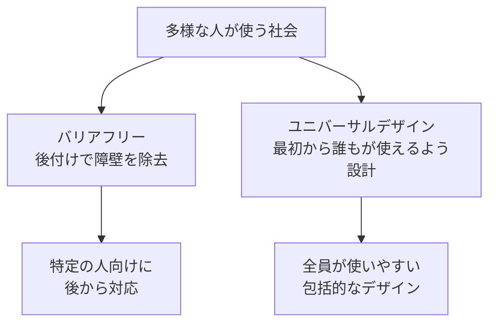
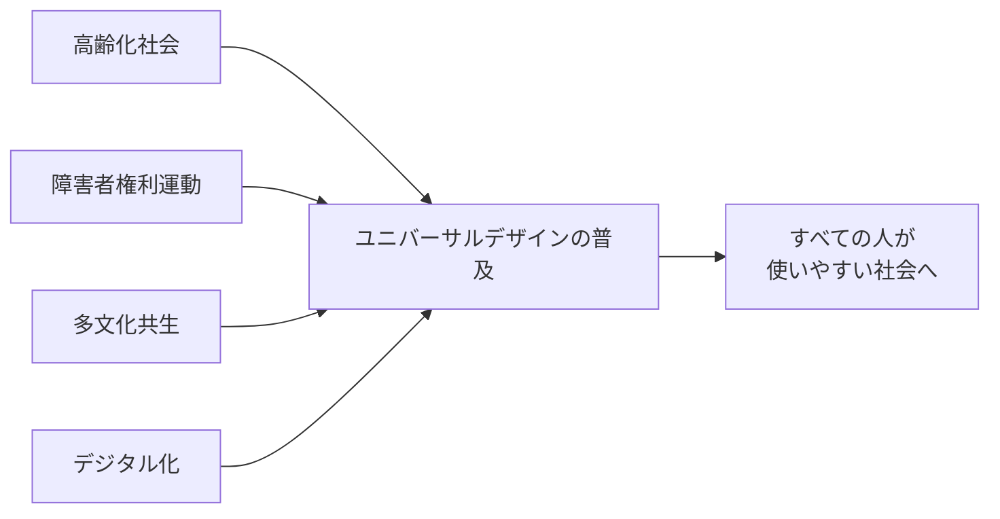

# lesson01: ユニバーサルデザインとは何か

## このレッスンで学ぶこと

- ユニバーサルデザイン（UD）の定義と背景を理解する
- バリアフリーとUDの違いを説明できるようになる
- UDの7原則の内容を把握する
- 色のUD（UC級）とUDの7原則の関係を理解する
- UDが社会に広まった背景を知る

## ユニバーサルデザインとは

ユニバーサルデザイン（UD）とは、**「年齢・性別・障害の有無を問わず、最初からできるだけ多くの人が使いやすいよう設計されたデザイン」**のことです。

この考え方を提唱したのは、アメリカのノースカロライナ州立大学の建築家・ロン・メイス（Ronald Mace）です。メイス自身は幼少期のポリオにより車いすを使用しており、自らの経験から「特定の人だけが使えるデザインではなく、最初からすべての人が使えるデザインを作るべきだ」という思想にたどり着きました。1985年に「ユニバーサルデザイン」という言葉を提唱し、1980年代以降この概念を広めました。

::: info ロン・メイス（Ronald Mace）について
1942年生まれ・1998年没のアメリカ人建築家。ノースカロライナ州立大学にユニバーサルデザインの研究拠点（のちの Center for Universal Design）を設立しました。UD7原則は、メイスを中心とするこの研究センターのチームが1997年にまとめたものです。UD分野の先駆者として広く知られています。
:::

## バリアフリーとの違い

ユニバーサルデザインとよく比較されるのが「バリアフリー」です。両者は似ていますが、アプローチが根本的に異なります。

| 観点 | バリアフリー | ユニバーサルデザイン |
|------|-------------|---------------------|
| 対象者 | 主に障害のある人・高齢者 | すべての人 |
| 設計タイミング | 問題が生じてから後付けで対応 | 最初から多様な人を想定して設計 |
| 発想の方向 | 「障壁を取り除く」 | 「最初から障壁を作らない」 |
| 例 | 既存の建物に後からスロープを設置する | 設計段階からスロープを組み込んだ建物にする |

::: tip まとめると
バリアフリーは「障害のある人のために障壁を除去する（後付け対応）」、ユニバーサルデザインは「最初から誰もが使えるように設計する（包括的設計）」です。
:::

## UDの7原則

メイスを中心とするノースカロライナ州立大学の研究チームは、1997年、ユニバーサルデザインを実践するための指針として**7つの原則**をまとめました。それぞれの内容を確認しましょう。

### 第1原則：公平な利用

誰でも同じように使えること。障害のある人・ない人が同一の方法で使用でき、特定のグループだけが不利になったり不快に感じたりしない設計を目指します。

### 第2原則：利用の際の柔軟性

多様な個人の好みや能力に対応できること。利き手の違い、動作スピードの違いなど、個人差に柔軟に対応します。

### 第3原則：単純で直感的な利用

使い方がわかりやすく、複雑な説明なしに直感的に操作できること。経験・知識・言語能力・集中力に関係なく理解できます。

### 第4原則：認知できる情報

必要な情報が確実に伝わること。視覚・聴覚・触覚など複数の手段で情報を提供し、感覚能力に差があっても情報が届くようにします。

::: warning 色のUDはここ！
**色のユニバーサルデザイン（UC級）は、この「第4原則：認知できる情報」と特に深く関係します。** 色だけで情報を伝えると、色が見えにくい人には情報が届きません。色以外の手段も組み合わせることが重要です。
:::

### 第5原則：ミスに対する寛大さ

偶然の操作ミスや意図しない行動による危険や不都合を最小限に抑えること。誤操作しても取り返せる設計にします。

### 第6原則：身体的努力の少なさ

疲労なく効率的に使えること。自然な姿勢で使用でき、無理な力を必要としません。

### 第7原則：接近や利用のための大きさと空間

体格・姿勢・移動のしやすさに関係なく、誰もが使いやすい大きさと空間を確保すること。

::: info 7原則の覚え方
「公平・柔軟・単純・認知・寛大・効率・空間」と頭文字でまとめると記憶しやすいです。試験では番号と内容の対応が問われることがあります。
:::

## UDが広まった社会的背景

ユニバーサルデザインの考え方が世界的に広まったのは、1980年代以降のさまざまな社会変化があったからです。

- **高齢化社会の進展**: 特に日本では急速な高齢化が進み、高齢者でも使いやすいデザインへの需要が高まりました
- **障害者権利運動の広まり**: バリアフリーから一歩進んで、最初から誰もが参加できる社会を目指す動きが強まりました
- **多文化共生社会の進展**: 言語や文化の異なる人々が共存する中で、言語に頼らない伝達手段の重要性が増しました
- **デジタル社会の進展**: ウェブやアプリなどデジタル製品でもアクセシビリティへの関心が高まっています

## キーワード

| 用語 | 説明 |
|------|------|
| ユニバーサルデザイン（UD） | 年齢・性別・障害の有無を問わず、最初からできるだけ多くの人が使いやすいよう設計されたデザイン |
| ロン・メイス | ノースカロライナ州立大学の建築家。1985年にUDを提唱。7原則は1997年に同大学の研究チームがまとめた |
| バリアフリー | 障害のある人のために、後付けで障壁（バリア）を取り除くアプローチ |
| 包括的設計 | 最初から多様な人を想定して設計するUDの考え方 |
| UD7原則 | 公平な利用・柔軟性・単純さ・情報の認知・ミスへの寛大さ・身体的省力・大きさと空間 |
| 第4原則（認知できる情報） | 視覚・聴覚・触覚など複数の手段で情報を伝えること。色のUDと最も関係の深い原則 |

## 試験のポイント

- **UDの定義**を正確に覚える：「年齢・性別・障害の有無を問わず、最初からできるだけ多くの人が使いやすいよう設計されたデザイン」
- **バリアフリーとの違い**：バリアフリーは「後付け対応」、UDは「最初から包括的に設計する」
- **ロン・メイスが提唱者**であること（ノースカロライナ州立大学、1980年代）
- **7原則の番号と内容**の対応を押さえておく（特に第1〜4原則は頻出）
- **色のUDは第4原則（認知できる情報）**と関係することを覚える
- UDはバリアフリーの「上位概念」ではなく「別のアプローチ」という点に注意
