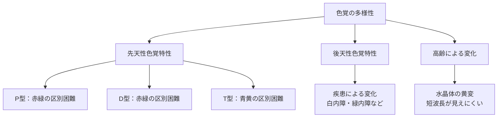
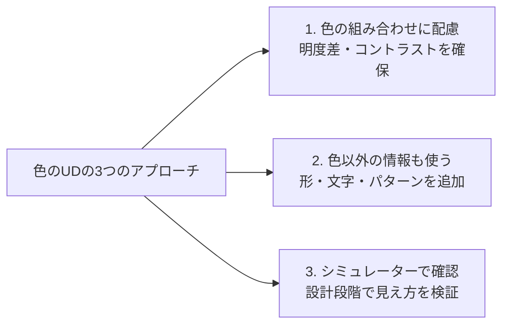

# lesson02: 色のユニバーサルデザイン（色のUD）とは

## このレッスンで学ぶこと

- 色のUD（カラーユニバーサルデザイン）の定義を正確に覚える
- 色覚の多様性とはどういうことかを理解する
- 色のUDが必要とされる理由と対象となる人々を把握する
- 色のUDを実現するための3つのアプローチを知る
- 色のUDが「特定の人だけのもの」ではないことを理解する

## 色のUDとは

色のUD（カラーユニバーサルデザイン、CUD）とは、**「色覚の多様性に配慮した、誰もが見やすい色使い」**のことです。

この定義は試験でそのまま問われることがあります。「色覚の多様性」と「誰もが見やすい」という2つのキーワードをしっかり押さえておきましょう。

::: tip 色のUDの定義（そのまま覚える）
**「色覚の多様性に配慮した、誰もが見やすい色使い」**

UC級の試験ではこの定義が直接出題されることがあります。
:::

## 色覚の多様性とは

「色覚の多様性」とは、**色の見え方は人によって異なる**という事実を指します。

私たちは「見えている色が人によって違う」ということを普段あまり意識しませんが、実は色の見え方には大きな個人差があります。その主な要因は以下の通りです。

### 先天性色覚特性

生まれつき色の見え方が異なる状態です。網膜の錐体（色を感じる細胞）の一部が機能しない、または異なる感度を持っていることで起きます。

医学的には「色覚異常」と呼ばれますが、本コンテンツでは多様性を尊重する観点から「色覚特性」と呼びます。

色覚特性には主にP型（1型、Protanopia）、D型（2型、Deuteranopia）、T型（3型、Tritanopia）、A型（Achromatopsia）の型があります。

| 型 | 特徴 |
|----|------|
| P型（1型） | 赤・緑の区別が困難 |
| D型（2型） | 赤・緑の区別が困難（P型と似ているが光の感度が異なる） |
| T型（3型） | 青・黄の区別が困難（比較的まれ） |
| A型 | すべての錐体が働かず、色がほとんど分からない（非常にまれ） |

::: info 日本人男性の約5%
先天性色覚特性は**日本人男性の約5%（20人に1人）**、**女性の約0.2%（500人に1人）**に見られます。クラスに1〜2人はいる計算です。決してまれな特性ではありません。
:::

### 後天性色覚特性

疾患や加齢によって後から色覚が変化する状態です。

- **加齢**: 水晶体が黄変することで、青・紫などの短波長の色が見えにくくなります
- **白内障**: 水晶体が濁り、視力・色覚ともに低下します
- **緑内障・糖尿病網膜症**: 網膜や視神経への影響で色覚に変化が生じます

### 高齢者の色覚変化

高齢になると水晶体の透明度が低下し、光の透過量が減ります。特に短波長（青・紫系）の光が通りにくくなるため、青みがかった色の識別が難しくなります。また、明暗のコントラストへの感受性も低下します。

## 色のUDが必要な理由

色には情報を伝える力があります。地図の凡例、グラフの系列、案内表示など、私たちの身の回りでは色が「情報の区別」に使われています。

しかし、**色だけで情報を伝えると、色が見えにくい人には情報が届きません。**

たとえば次のような状況を想像してください。

- 赤と緑の折れ線グラフ → P型・D型の人には2本の線の区別が難しい
- 青いボタンと緑のボタンで操作を指示 → T型の人には区別できない
- コントラストの低い配色の案内板 → 高齢者・弱視者には読めない

これらは「悪意のない設計ミス」として起きがちですが、特定の人を情報から排除してしまいます。

::: warning 色のUDが必要な理由
色は便利な情報伝達手段ですが、**色だけに頼ると色覚特性を持つ人や高齢者に情報が届かない**ことがあります。色のUDはこの問題を解消するための取り組みです。
:::

## 色のUDの3つのアプローチ

色のUDを実現するためのアプローチは主に3つです。

### アプローチ1：色の組み合わせに配慮する

見分けやすい配色を選ぶことが基本です。

- 明度差（明るさの差）を意識した配色にする
- 彩度が高い同士の組み合わせ（赤×緑など）を避ける
- 背景と文字・図形のコントラストを十分に確保する

### アプローチ2：色以外の情報も合わせて使う

色だけで情報を区別するのではなく、別の視覚的手段を追加します。

- 形・記号・アイコンを組み合わせる（例：危険→赤＋×マーク）
- 文字ラベルを付ける（グラフの凡例に色だけでなく文字も入れる）
- パターン・テクスチャを使う（地図のハッチングなど）
- 太さ・点線・実線など線種で区別する

### アプローチ3：事前にシミュレーターで確認する

実際の色覚特性者の見え方をソフトウェアでシミュレーションし、設計段階で確認します。代表的なツールにAdobe ColorやUD Checkerなどがあります。

## 色のUDは「全員のため」のデザイン

重要なのは、**色のUDは「特定の人だけのもの」ではない**という点です。

- 色のUDを実践した配色は、色覚特性のない人にとっても「見やすい」デザインです
- 視覚的なコントラストや情報の重複は、疲れにくく直感的な理解を助けます
- 「色覚特性がある人でも見やすい＝すべての人にとって見やすい」ということが多いです

::: tip 色のUDの本質
色のUDは「特定の人を救済する」取り組みではなく、「すべての人にとってより良い情報伝達を実現する」取り組みです。これはUDの第7原則「包括的設計」の精神そのものです。
:::

## キーワード

| 用語 | 説明 |
|------|------|
| 色のUD（カラーユニバーサルデザイン・CUD） | 色覚の多様性に配慮した、誰もが見やすい色使い |
| 色覚の多様性 | 色の見え方は人によって異なるという事実 |
| 先天性色覚特性 | 生まれつき色の見え方が異なる状態。P型・D型・T型がある |
| P型（1型）・D型（2型） | 赤と緑の区別が難しい色覚特性。日本人男性の約5%（20人に1人）に見られる |
| T型（3型） | 青と黄の区別が難しい色覚特性。比較的まれ |
| 後天性色覚特性 | 疾患や加齢によって後から色覚が変化した状態 |
| 水晶体の黄変 | 加齢により水晶体が黄みを帯び、青・紫系が見えにくくなる現象 |
| シミュレーター | 色覚特性者の見え方を再現するソフトウェアツール |

## 試験のポイント

- **色のUDの定義を正確に覚える**：「色覚の多様性に配慮した、誰もが見やすい色使い」
- **先天性色覚特性の型と特徴**：P型・D型（赤緑）、T型（青黄）の違いを押さえる
- **日本人男性の約5%（20人に1人）・女性の約0.2%（500人に1人）**が先天性色覚特性を持つことを覚える
- **後天性色覚特性の原因**：加齢・白内障・緑内障など
- **3つのアプローチ**の内容を整理しておく（配色への配慮・色以外の手段・シミュレーター確認）
- 色のUDは「障害者だけのもの」ではなく「すべての人のためのデザイン」という考え方
