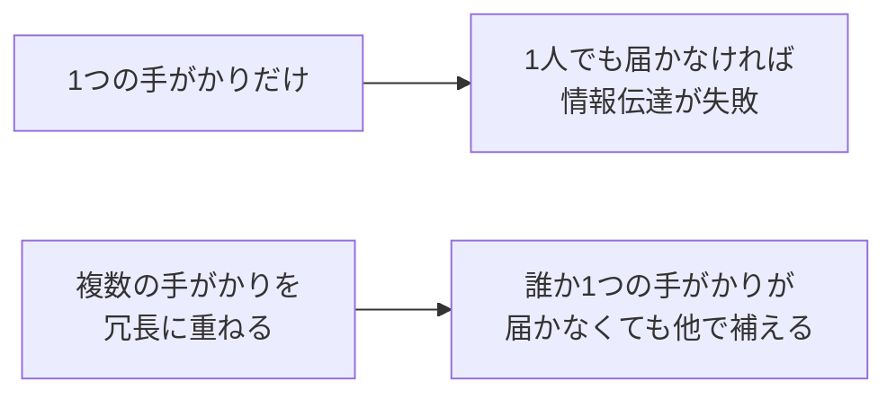
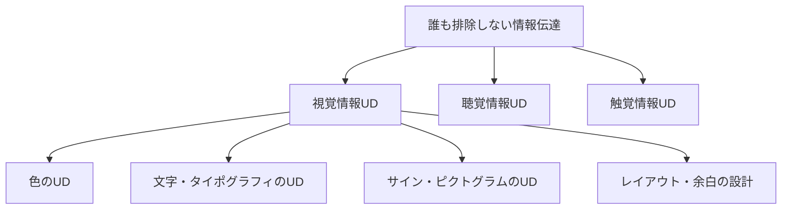

# lesson03: 視覚情報にかかわるユニバーサルデザイン

## このレッスンで学ぶこと

- 視覚情報UDが対象とする人と状況の幅を理解する
- 視覚情報の手がかり（色・形・文字・配置・明度・パターン）の役割を理解する
- **冗長性（redundancy）の原則**と**マルチモーダル**の考え方を理解する
- 公共空間で実装されている視覚情報UDの典型例を知る
- 色のUDが視覚情報UD全体の中でどこに位置づくかを理解する

[lesson02](/lessons/lesson02/) では「色のUD」の定義と3つのアプローチを学びました。本レッスンではその一段上の枠組みである「**視覚情報のUD**」を扱います。色は視覚情報を伝える1つの手段にすぎず、他の手がかりと組み合わせて初めて多くの人に届く、という点を掘り下げます。

## 視覚情報UDが対象とする人と状況

視覚情報UDは、**特性のある人**だけでなく**状況的に視覚が制約される人**も対象にします。設計の出発点は「誰も排除しない」ことです。

### 特性による視覚の違い

| 区分 | 例 |
|------|------|
| 色覚特性 | P型・D型・T型・A型（[lesson13](/lessons/lesson13/)） |
| ロービジョン | 視野狭窄・中心暗点・霞み（[lesson24](/lessons/lesson24/)） |
| 全盲 | 視覚情報を直接利用できない |
| 加齢による変化 | 黄変・コントラスト感度低下・グレア（[lesson21](/lessons/lesson21/)〜[lesson23](/lessons/lesson23/)） |
| 言語・文化の違い | 漢字・かな・英語が読みにくい外国人 |
| 子ども | 細かい文字・複雑な記号の読みづらさ |

### 状況による視覚の違い

- 屋外の強い直射日光下でディスプレイがほぼ見えない
- 薄暗い室内・夜間で色や細部が判別しづらい
- モノクロ印刷で配色情報が失われる
- 視聴距離が遠く文字が小さく見える
- 急いでいる・疲れていて細部に注意が向かない

::: tip 「特性」と「状況」を分けない
UDの設計は、特定の属性をもつ人だけに向けるのではなく、**誰でも陥り得る一時的な制約**も含めて考えます。眼鏡を忘れた日、急ぎ足で見る案内、屋外でまぶしくて読めない案内表示。これらはすべて視覚情報UDの対象です。
:::

## 視覚情報の手がかり

視覚情報UDでは、伝えたい内容を**1つの手がかり**だけに載せません。それぞれの手がかりが補完し合うように設計します。

| 手がかり | 担える役割 | 典型例 |
|---------|-----------|--------|
| 色 | 区別・強調・分類 | 警告の赤、安全の青緑 |
| 形・記号 | 意味の固定・即時認識 | ピクトグラム、警告マーク |
| 文字・テキスト | 厳密な意味の伝達 | ラベル、注釈、見出し |
| 配置・位置 | 関係性・順序の表現 | 縦型信号機、表組み |
| 明度・コントラスト | 視認性そのもの | 背景と文字の明度差 |
| パターン・テクスチャ | 系統の区別（モノクロでも残る） | グラフのハッチング |
| 大きさ・太さ | 重要度・階層 | 見出し、強調文字 |

色は強力な手がかりですが、それぞれの手がかりは**得意な仕事が違う**点に注目してください。色は分類が得意で厳密な意味の伝達は苦手、文字は厳密でも瞬時の認識には向かない、形は直感的でも微妙な区別は難しい。**手がかりは役割が異なるからこそ、組み合わせる意味がある**のです。

## 冗長性（redundancy）の原則

視覚情報UDで最も重要な考え方が**冗長性**です。同じ情報を**2つ以上の手がかり**で重ねて伝えることで、どれか1つが届かなくても情報が失われないようにします。

### 冗長性のある設計とない設計

| ケース | 設計 | どこかでつまずく人 |
|--------|------|-------------------|
| ❌ 色だけ | 「赤いボタンを押してください」 | 色覚特性者、モノクロ印刷 |
| ❌ 文字だけ | 小さな日本語注意書きのみ | 外国人、ロービジョン、急ぎの人 |
| ❌ 形だけ | 抽象的なアイコンのみ | 意味が文化依存だと伝わらない |
| ✅ 冗長 | 「赤＋⚠マーク＋『危険』のテキスト」 | ほぼ全員に届く |

::: warning 「冗長」は無駄ではない
日常会話では「冗長」はネガティブな響きですが、UDの文脈では**情報の確実な伝達を支える積極的な設計手段**です。冗長性のない情報伝達は、どこかで誰かを取りこぼします。
:::

## マルチモーダルへの広がり

視覚情報UDをさらに広げると、**視覚以外の感覚**も組み合わせる**マルチモーダル設計**につながります。視覚で届かない人にも情報が届くように、聴覚・触覚を補助手段として用います。

| 感覚 | 例 |
|------|------|
| 聴覚 | 駅の発車音、家電のビープ、音声案内、スクリーンリーダー |
| 触覚 | 点字、点字ブロック、シャンプー容器のギザギザ、紙幣の識別マーク |
| 振動 | スマートフォンの通知、ハプティクスフィードバック |

視覚情報UDの設計でも、最終的に**音声や触覚で補える前提**を意識しておくと、後付けの対応コストが下がります。マルチモーダルへの具体的な配慮は [lesson24](/lessons/lesson24/) で扱います。

## 公共空間で実装されている例

抽象的な原則だけでなく、私たちが日常で見ている**実装例**を知ると視覚情報UDの感覚がつかめます。

### 信号機

- **色**：赤・黄・青（緑）で意味を区別
- **位置**：縦型は上＝赤・下＝青と固定。色だけに頼らず位置で判別できる
- **形**：歩行者用は人型の絵で表現
- **音声**：視覚障害者向けに鳥の鳴き声型の音響信号機

### ピクトグラム（絵記号）

- トイレ・非常口・エレベーターなど、**言語を超えて意味が伝わる**設計
- JISで標準化されたものは色・形・配置に一定の規則がある
- 国際的にも近い記号が使われ、外国人にも届く

### 駅・空港のサイン

- **大きな文字・高コントラスト**で視認性を確保
- **色＋形＋文字**の冗長性（出口は緑＋矢印＋「出口/EXIT」）
- 視点の高さ・距離に応じた**サイズ階層**

### 点字ブロック

- **触覚情報**として誘導線と警告点を区別
- 黄色が標準色（**色＋触覚**の冗長設計）
- 公共空間における視覚情報UDの代表例

::: tip 身近な視覚情報UDを観察する
通勤・通学路、駅、商業施設のサインを意識して見てみると、**色・形・文字・配置**がどう組み合わされているかが見えてきます。「もしこの手がかりが1つ消えたら情報が伝わるか？」と問うと、UDの完成度が判定できます。
:::

## 色のUDの位置づけ

ここまでの整理を踏まえると、色のUDは**視覚情報UDという大枠の中の一部**です。

色のUDだけを完璧にしても、文字が小さすぎたり、レイアウトが混乱していたり、コントラストが弱かったりすれば情報は伝わりません。逆に、視覚情報UD全体が整っていれば、色のUDがやや弱くても情報は届きます。

::: info 本コンテンツの主題は「色のUD」
UC級の中心テーマは色のUDですが、それは視覚情報UDという広い文脈の中で機能するものだ、という認識が出発点です。本レッスン以降は色のUDに焦点を絞っていきますが、常に「色だけに頼っていないか」を意識してください。
:::

## キーワード

| 用語 | 説明 |
|------|------|
| 視覚情報UD | 見ることに関わる情報伝達全般のUD。色のUDを含む上位の枠組み |
| 冗長性（redundancy） | 同じ情報を2つ以上の手がかりで重ねて伝え、1つが届かなくても伝達が失敗しないようにする原則 |
| マルチモーダル | 視覚・聴覚・触覚など複数の感覚で情報を伝える設計 |
| 視覚情報の手がかり | 色・形・文字・配置・明度・パターン・大きさなど |
| ピクトグラム | 言語に頼らず意味を伝える絵記号。公共サインの代表例 |
| 状況による視覚制約 | 屋外・夜間・モノクロ印刷・遠距離など、特性に関係なく誰でも陥る制約 |

## 試験のポイント

- 視覚情報UDは**色覚特性者だけでなく**、ロービジョン・全盲・高齢者・外国人・子ども、さらに**状況的に視覚が制約される人**も対象にする
- **冗長性**：同じ情報を**複数の手がかりで重ねて伝える**ことが基本原則
- 視覚情報UDの主な手がかりは**色・形・文字・配置・明度・パターン・大きさ**
- 視覚情報UDは**マルチモーダル設計**（音声・触覚との併用）に広がる
- **色のUDは視覚情報UDの一部**であり、他の手がかりと組み合わせて機能する
- 代表的な実装例：**ピクトグラム・縦型信号機・点字ブロック・駅のサイン**
