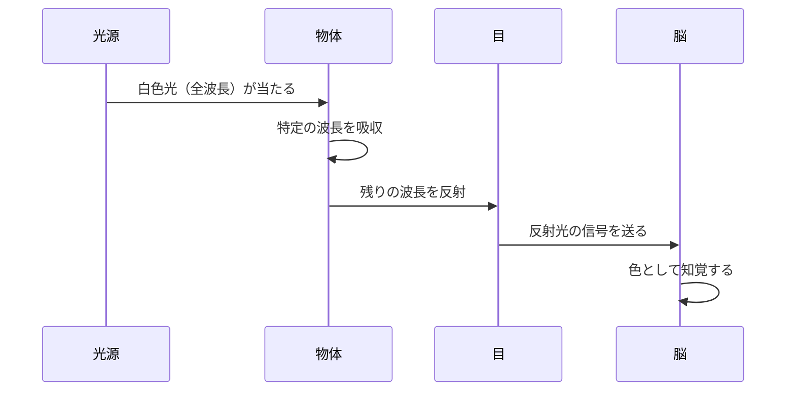

# lesson04: 光と可視光線

## このレッスンで学ぶこと

- 色が「光」によって生まれることを理解する
- 電磁波の種類と可視光線の位置づけを把握する
- 可視光線の波長範囲（380〜780nm）と色の対応を覚える
- プリズムによる分光の仕組みを理解する
- 物体の色がどのように見えるのかを説明できるようになる

---

## 色は「光」から生まれる

色を理解するには、まず「光」について知る必要があります。なぜなら、**光がなければ色は存在しない**からです。

暗闇の中では何も見えません。光が当たってはじめて、私たちは物体の色を知覚できます。このことから、色とは「光の性質」と「それを受け取る人間の目・脳の働き」によって生じるものだとわかります。

::: info 色の3要素
色が見えるためには次の3つが必要です。
1. **光源**（光を発するもの：太陽・蛍光灯・LEDなど）
2. **物体**（光を反射・吸収・透過するもの）
3. **視覚**（光を受け取る目と、色を認識する脳）
:::

---

## 光は電磁波の一種

光は**電磁波**の一種です。電磁波とは、電気と磁気の振動が波として空間を伝わるもので、波長（波の長さ）によって種類が分かれます。

電磁波は波長が短いほどエネルギーが高く（X線やγ線）、長いほどエネルギーが低く（ラジオ波）なります。

---

## 可視光線とは

人間の目で見える電磁波の範囲を**可視光線**といいます。その波長の範囲は**約380nm〜780nm（ナノメートル）**です。

::: tip 可視光線の範囲は必ず覚える
**約380nm〜780nm（ナノメートル）**

この数値は試験に頻出です。「380〜780」という数字をしっかり記憶しましょう。
:::

可視光線の中でも、波長の違いによって異なる色として知覚されます。

| 波長（おおよそ） | 色 |
|----------------|----|
| 380〜400nm | 紫（バイオレット） |
| 400〜450nm | 青紫 |
| 450〜500nm | 青 |
| 500〜560nm | 緑 |
| 560〜590nm | 黄 |
| 590〜620nm | 橙 |
| 620〜780nm | 赤 |

**覚え方**: 短波長側が「紫・青」、長波長側が「赤・橙」です。上の表のとおり、波長が短い側から「紫→青→緑→黄→橙→赤」と並びます。虹の色の順番（紫→赤）と同じと覚えると便利です。

---

## プリズムによる分光

白色光（太陽光など）をガラスのプリズムに通すと、虹のような色の帯（**スペクトル**）に分かれます。

これは、光がガラスを通過するときに「屈折」するためです。波長によって屈折する角度が異なり（短波長ほど大きく屈折）、その結果、色ごとに分かれて見えます。

::: info プリズムとスペクトル
白色光は実は様々な波長の光が混ざり合っています。プリズムはその混合物を波長ごとに分解して見せてくれます。この現象は17世紀にアイザック・ニュートンが実験で明らかにしました。
:::

虹が見えるのも同じ原理です。雨粒がプリズムの役割を果たし、太陽光を分光して私たちの目に届けています。

---

## 物体の色の見え方

では、なぜリンゴは赤く、葉っぱは緑に見えるのでしょうか。

物体に光が当たると、物体は**一部の波長を吸収し、残りを反射**します。私たちの目に届くのは「反射された光」です。その波長が、脳で色として認識されます。

**例：赤いリンゴ**
- 赤の波長（約620〜780nm）を反射
- 青・緑の波長を吸収
- 目に赤の波長が届き、「赤い」と知覚される

**例：黒いもの**
- ほぼすべての波長を吸収
- 反射する光がほとんどない
- 光が目に届かず「黒い」と知覚される

**例：白いもの**
- ほぼすべての波長を反射
- すべての光が目に届く
- 「白い」と知覚される

::: tip 光の色（加法混色）と物体の色
光自体の色（モニターや照明など）は「加法混色」といい、光を足すほど明るくなります（赤＋緑＋青＝白）。物体の色（絵の具・印刷など）は「減法混色」といい、色を混ぜるほど暗くなります。これらは別の仕組みです。
:::

---

## 光源の種類と色の見え方（演色性）

同じ物体でも、照らす光源によって色の見え方が変わります。これを**演色性**といいます。

| 光源 | 特徴 | 色の見え方 |
|------|------|-----------|
| 太陽光（昼光） | 全波長をバランスよく含む | 最も自然な色に見える |
| 白熱灯 | 長波長（赤・橙）が多い | 全体的に暖かみ（赤みがかって）見える |
| 蛍光灯 | 特定の波長が強い | やや青白い、または緑みがかって見える |
| LED | 種類により異なる | 昼光色・電球色など用途に合わせて選べる |

::: warning 色のUDと演色性
印刷物や看板の配色を設計するときは、実際に使用される照明環境での見え方を確認する必要があります。光源が変わると色のコントラストや識別性も変化します。
:::

---

## キーワード

| 用語 | 説明 |
|------|------|
| 電磁波 | 電気と磁気の振動が空間を伝わる波。波長によって種類が分かれる |
| 可視光線 | 人間の目で見える電磁波の範囲。約380〜780nm |
| ナノメートル（nm） | 波長を表す単位。1nm＝10億分の1メートル |
| スペクトル | プリズムなどで白色光を分光したときに現れる虹状の色の帯 |
| 分光 | 白色光を波長ごとに分けること。プリズムや雨粒によって起きる |
| 演色性 | 光源の種類によって物体の色の見え方が変わる性質 |
| 反射 | 光が物体に当たり跳ね返ること。反射された波長が色として見える |
| 吸収 | 光が物体に当たり取り込まれること。吸収されなかった波長が色になる |

---

## 試験のポイント

- **可視光線の範囲「約380〜780nm」**は必ず覚える（数字での出題が多い）
- **短波長側が紫・青、長波長側が橙・赤**という対応関係を押さえる
- **物体の色は「反射した光の波長」で決まる**ことを理解する
- プリズムによる分光は「屈折率の違い」が原因であることを知っておく
- **演色性**の概念：光源の違いで同じ物体の色が違って見える
- 赤・緑・青（RGB）は光の三原色で加法混色、黄・赤・青（CMY）は絵の具・印刷の三原色で減法混色
