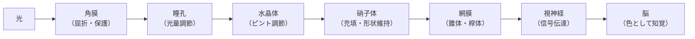
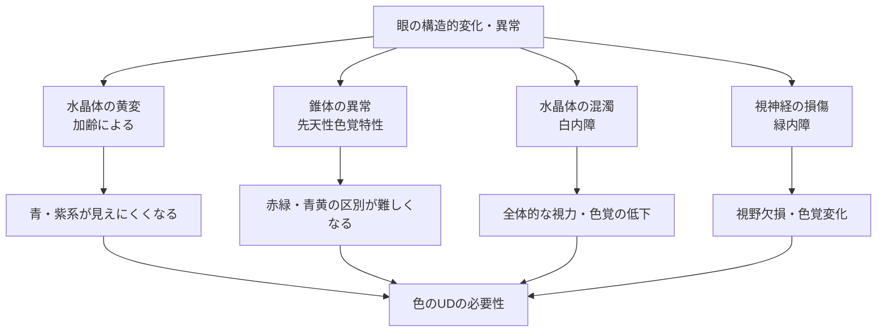

# lesson05: 眼の構造

## このレッスンで学ぶこと

- 光が色として知覚されるまでの経路を順番に説明できるようになる
- 眼の各部位の名称と役割を把握する
- 網膜にある錐体と桿体の違いを理解する
- 黄斑・盲点の位置と役割を覚える
- 眼の構造と色覚特性・加齢の関係をつかむ

---

## 光が「色」として見えるまで

[lesson04](/lessons/lesson04/)で「色は光から生まれる」と学びました。では、その光はどのように「色」として認識されるのでしょうか。光を受け取り、色として知覚するのが**眼**です。

光が色として知覚されるまでの経路は次の通りです。

この流れを「光の旅」としてイメージすると、各部位の役割が理解しやすくなります。

---

## 眼の各部位と役割

### 角膜（かくまく）

眼球の最前面を覆う透明な薄い膜です。光を最初に屈折させる役割を担います。また、外界からの衝撃・異物から眼球を保護するバリアの役割もあります。

::: info 角膜の特徴
角膜は血管を持たず、涙から酸素を供給されています。コンタクトレンズを長時間使用すると酸素不足になるのはこのためです。
:::

### 瞳孔（どうこう）

眼の中央にある黒く見える穴です。虹彩の中央に位置し、眼に入る光の量を調節します。

- **明るい場所**: 瞳孔が小さくなる（縮瞳）→ 光の量を減らす
- **暗い場所**: 瞳孔が大きくなる（散瞳）→ 光の量を増やす

カメラの「絞り（F値）」に相当する機能を持っています。

### 虹彩（こうさい）

瞳孔を囲む筋肉の膜で、瞳孔の大きさを調節します。人種によって色が異なります（日本人は茶・黒、ヨーロッパ系では青・緑・灰色など）。

### 水晶体（すいしょうたい）

眼の中にあるレンズです。厚みを変えることでピントを調節します（カメラのズームレンズに相当）。

- **近くを見るとき**: 水晶体が厚くなる（毛様体筋が収縮）
- **遠くを見るとき**: 水晶体が薄くなる（毛様体筋が弛緩）

::: warning 老眼と水晶体
加齢とともに水晶体の**弾力が低下**し、ピント調節がしにくくなります。これが**老眼（老視）**の原因です。また、高齢になると水晶体が**黄変（黄みがかる）**することで、青・紫系の色が見えにくくなります。これは色のUDに深く関係します。詳しくは[lesson18](/lessons/lesson18/)で学びます。
:::

### 硝子体（しょうしたい）

水晶体の後方から網膜の前面を満たす**透明なゼリー状の組織**です。眼球の形状を維持する役割を持ちます。加齢とともに変性し、視野に「飛蚊症（飛んでいる虫のような影）」が現れることがあります。

### 網膜（もうまく）

光を受け取る感光細胞が並ぶ重要な組織です。眼球の内側全体を覆っており、カメラの「フィルム（または撮像素子）」に相当します。

網膜には2種類の感光細胞があります。ここでは概要をつかみ、詳しくは[lesson06](/lessons/lesson06/)で学びます。

| 細胞 | 名称 | 特徴 |
|------|------|------|
| 錐体（すいたい） | 明所視に働く細胞 | 明るい場所で機能。色を感じる。黄斑に密集 |
| 桿体（かんたい） | 暗所視に働く細胞 | 暗い場所でも機能。明暗のみ感じ、色は感じない |

::: tip 錐体が3種類ある
錐体にはさらにL錐体（長波長＝赤系）・M錐体（中波長＝緑系）・S錐体（短波長＝青系）の3種類があり、それぞれ異なる波長の光に反応します。先天性色覚特性は、これらの錐体のうちいずれかが機能しない・異常であることで起きます。詳しくは[lesson06](/lessons/lesson06/)で学びます。
:::

### 黄斑（おうはん）と中心窩（ちゅうしんか）

網膜の中央部分にある、最も視力が高い領域です。錐体が密集しており、細部の識別・色の識別に優れています。

私たちが何かをじっと見るとき、その像は黄斑の中央（中心窩）に結ばれます。

::: info 加齢黄斑変性
高齢者に多い疾患で、黄斑が変性することで視野の中央が歪んだり見えにくくなったりします。色の識別にも影響することがあります。
:::

### 盲点（もうてん）

視神経が眼球の外に出る部分（視神経乳頭）には感光細胞がなく、ここに映った像は見えません。これを**盲点**といいます。

普段は両眼視や脳の補完機能によって盲点の存在を意識することはほとんどありません。

### 視神経（ししんけい）

網膜で変換された電気信号を脳に伝える神経です。視神経が損傷すると視野欠損や色覚変化が起きることがあります（緑内障はこれが原因のひとつ）。

---

## 眼の部位まとめ

| 部位 | 機能 | カメラに例えると |
|------|------|----------------|
| 角膜 | 光の屈折・眼球保護 | レンズの外側ガラス |
| 瞳孔 | 光量の調節 | 絞り（F値） |
| 虹彩 | 瞳孔を調節する筋肉 | 絞り羽根 |
| 水晶体 | ピント調節（厚みを変える） | ズームレンズ |
| 硝子体 | 眼球の形状維持 | 筐体（ケース） |
| 網膜 | 光の受容（感光細胞が並ぶ） | フィルム／撮像素子 |
| 黄斑 | 最も鮮明に見える中心部 | 中央の高解像度エリア |
| 盲点 | 視神経の出口（見えない） | 欠け |
| 視神経 | 信号を脳に伝達 | ケーブル |

---

## 眼の構造と色のUDの関係

眼の構造を学ぶことは、なぜ色のUDが必要なのかを理解するための基礎になります。

::: warning 色のUDとの関係を押さえる
- **水晶体の黄変（加齢）** → 高齢者は青・紫が見えにくい → 青系を使う際は特に注意が必要
- **錐体の異常（先天性色覚特性）** → 色の見え方が異なる → 赤×緑などの組み合わせを避ける
- これらはすべて「光の信号が正常に伝わらない」ことで起きています
:::

---

## キーワード

| 用語 | 説明 |
|------|------|
| 角膜 | 眼の最前面を覆う透明な膜。光を屈折させ、外界から眼を守る |
| 瞳孔 | 虹彩の中央にある穴。光量を調節する |
| 虹彩 | 瞳孔の大きさを調節する筋肉の膜 |
| 水晶体 | 厚みを変えてピントを調節するレンズ。老眼や黄変の原因となる部位 |
| 硝子体 | 眼球内を満たすゼリー状の組織。眼球の形状を維持する |
| 網膜 | 感光細胞（錐体・桿体）が並ぶ組織。光を電気信号に変換する |
| 錐体（すいたい） | 明るい場所で働く感光細胞。色の識別を担う。黄斑に密集 |
| 桿体（かんたい） | 暗い場所でも働く感光細胞。明暗のみ感知し、色は感じない |
| 黄斑（おうはん） | 網膜中央の最も視力が高い領域。錐体が密集する |
| 盲点（もうてん） | 視神経乳頭の部分。感光細胞がなく像が見えない |
| 視神経 | 網膜の信号を脳へ伝える神経 |
| 水晶体の黄変 | 加齢による水晶体の黄みがかり。青・紫系の色が見えにくくなる |

---

## 試験のポイント

- **光が色として見えるまでの経路の順番**を覚える：角膜→瞳孔→水晶体→硝子体→網膜→視神経→脳
- **各部位の役割**を正確に覚える（特に水晶体・網膜・黄斑は頻出）
- **錐体と桿体の違い**を整理する：錐体＝明所・色の識別、桿体＝暗所・明暗のみ
- **錐体が3種類（L・M・S）**あり、先天性色覚特性はこの異常で起きることを覚える
- **黄斑**は網膜の中央で錐体が密集する「最も鮮明に見える部分」
- **水晶体の黄変**（加齢）→ 青・紫が見えにくくなる、という関係を押さえる
- カメラのアナロジーで整理すると覚えやすい（瞳孔＝絞り、水晶体＝レンズ、網膜＝フィルム）
