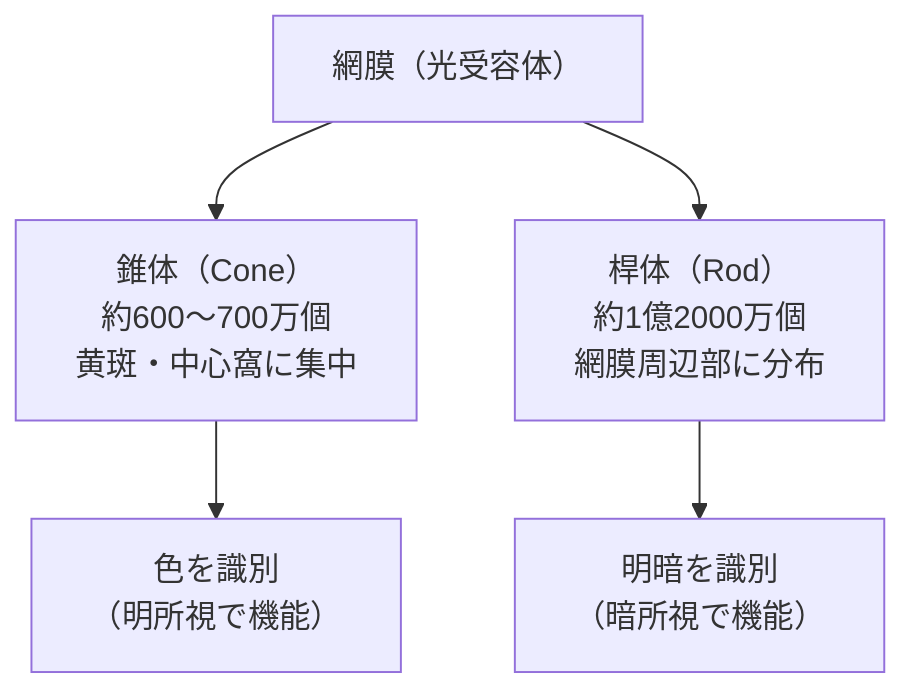
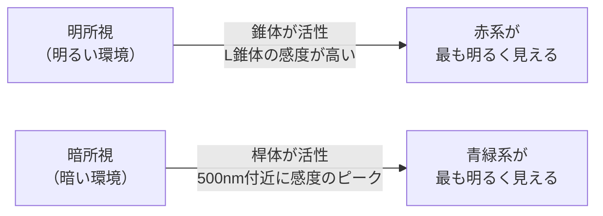

# lesson07: 錐体と桿体 ― 色と明暗を感じる受容体

## このレッスンで学ぶこと

- 網膜にある2種類の光受容細胞（錐体・桿体）の役割を理解する
- 錐体（S・M・L）と桿体のそれぞれの特徴を説明できるようになる
- 明所視・暗所視・薄明視の3つの視環境を区別する
- プルキニェ現象の意味とその原因を理解する
- 3種類の錐体が色知覚にどのように関与するかを知る

[lesson06](/lessons/lesson06/) では、目の構造と網膜の働きを概観し、光を受け取る細胞として「錐体」と「桿体」があることに触れました。本レッスンでは、その錐体が実は 3 種類あり、それぞれ異なる波長の光に反応していることを詳しく見ていきます。桿体との比較や、明所視・暗所視・薄明視の使い分けもあわせて整理します。

## 目で「色」を感じる仕組み

私たちが物の色を見ることができるのは、目の奥にある**網膜（もうまく）**に光を受け取る細胞があるからです。この細胞のことを**視細胞（光受容細胞）**といいます。

視細胞には大きく分けて2種類があります。それが**錐体（すいたい）**と**桿体（かんたい）**です。錐体と桿体はそれぞれ異なる役割を担っており、どちらが欠けても私たちの視覚は成り立ちません。

::: info 網膜とは
網膜は眼球の内側を覆う薄い膜で、カメラでいえばフィルム（センサー）に相当します。光が水晶体で屈折して網膜上に像を結び、視細胞がその光を電気信号に変換して脳に送ります。
:::

## 錐体（すいたい、Cone）― 色を識別する視細胞

**錐体**は、色を識別するための視細胞です。円錐（コーン）のような形をしていることからこの名前がついています。

### 錐体の主な特徴

- **位置**: 主に網膜の中央部にある**黄斑（おうはん）**、特にその中心の**中心窩（ちゅうしんか）**に集中して分布しています
- **機能**: 色を識別し、細かな形の違いも認識します
- **活性条件**: **明るい場所（明所視）**でよく機能します
- **数**: 網膜全体で約**600〜700万個**
- **感度**: 桿体に比べると光への感度は低く、ある程度の明るさが必要です

### 3種類の錐体

錐体はさらに3種類に分類されます。それぞれ感じ取りやすい光の波長（色）が異なります。

| 錐体の種類 | 感受する波長 | 対応する色 |
|------------|-------------|-----------|
| S錐体（Short） | 短波長（約420nm付近） | 青系の光 |
| M錐体（Medium） | 中波長（約530nm付近） | 緑系の光 |
| L錐体（Long） | 長波長（約560nm付近） | 赤〜黄系の光（特に黄系に感度が高い） |

[lesson04](/lessons/lesson04/)で学んだ可視光線（約380〜780nm）と対応させると、S錐体は短波長側（青）、L錐体は長波長側（赤〜黄）を担当します。M錐体はその中間です。

M錐体とL錐体は感度のピークが近く、重なりが大きいのが特徴です。この2つのバランスで赤〜緑の細かな違いを見分けています。

::: tip 「SML」で覚えよう
S=Short（短波長・青）、M=Medium（中波長・緑）、L=Long（長波長・赤〜黄）。「SML＝青・緑・赤」と対応させて覚えておきましょう。
:::

## 桿体（かんたい、Rod）― 明暗を識別する視細胞

**桿体**は、明るさと暗さを識別するための視細胞です。棒（ロッド）のような細長い形をしていることが名前の由来です。

### 桿体の主な特徴

- **位置**: 網膜の**周辺部**に広く分布しています（中心窩にはほとんど存在しない）
- **機能**: 明暗のみを識別します。色の識別はしません
- **活性条件**: **暗い場所（暗所視）**でよく機能します
- **数**: 約**1億2000万個**と、錐体の約20倍近くあります
- **感度**: 光への感度が非常に高く、わずかな光でも反応します

::: warning 桿体は色を識別できない
暗い場所では桿体が主に働くため、色の識別ができなくなります。夜道では物の形はわかっても色がわかりにくい、というのはこのためです。
:::

## 錐体と桿体の比較

| 特徴 | 錐体（すいたい、Cone） | 桿体（かんたい、Rod） |
|------|------------|------------|
| 機能 | 色覚・形の精密な識別 | 明暗の識別 |
| 主な分布場所 | 黄斑・中心窩（網膜中央部） | 網膜周辺部 |
| 活性する環境 | 明るい場所（明所視） | 暗い場所（暗所視） |
| 個数 | 約600〜700万個 | 約1億2000万個 |
| 光への感度 | 低い（明るさが必要） | 高い（わずかな光でも反応） |

## 3種類の視環境

光の明るさによって、どの視細胞が主に働くかが変わります。これを**視環境**と呼び、3つに分類されています。

### 明所視（photopic vision）

昼間や明るい室内など、十分な明るさがある環境です。**錐体**が活発に働き、色がはっきりと見えます。細かな形の識別も得意です。

### 暗所視（scotopic vision）

夜間や暗い場所など、光がほとんどない環境です。**桿体**が主に働き、明暗のみを識別します。色は見えず、世界が白黒のように感じられます。

### 薄明視（mesopic vision）

夕暮れ時や薄暗い室内など、明所視と暗所視の中間の明るさです。**錐体と桿体の両方**が機能します。このため、色の見え方が変化する「プルキニェ現象」が起きやすい環境です。

::: info 薄明視は日常的によく起こる
薄明視は特殊な状況ではなく、夕暮れ・早朝・薄暗い店内など、日常生活でよく経験する視環境です。
:::

## プルキニェ現象

**プルキニェ現象（Purkinje phenomenon）**は、薄明視〜暗所視への移行に伴って色の明るさの感じ方が変わる現象です。

- **明所視（昼）**: 長波長（赤系）の色が最も明るく見える
- **暗所視（夜）**: 短〜中波長（青緑系）の色が最も明るく見える

わかりやすい例として、夕暮れ時の庭を想像してください。明るいうちは**赤いバラ**が鮮やかに目立ちますが、薄暗くなるにつれて赤いバラは暗く沈み、代わりに**青い花**の方が明るく見えてきます。これがプルキニェ現象です。

::: tip プルキニェ現象の原因
明所視では錐体（特にL錐体）が活発なため赤系が明るく見えます。暗所視では桿体が主に働き、桿体が最も感度が高い波長（約500nm付近・青緑）の光が明るく見えます。
:::

::: tip 色のUD実務への含意
プルキニェ現象は、薄暗い照明下では**赤系の色が見えにくく、青系の色が相対的に目立つ**というデザイン上の意味を持ちます。夜間の屋外サイン・薄暗い室内表示・避難誘導表示などで、赤だけに重要情報を載せると視認性が落ちることがあります。高齢者のグレア・暗順応の話と合わせて [lesson22](/lessons/lesson22/) でも触れます。
:::

[lesson08](/lessons/lesson08/) では、S・M・L錐体のいずれかがうまく働かない場合の色の見え方（P型・D型・T型）を学びます。

## キーワード

| 用語 | 説明 |
|------|------|
| 錐体（すいたい、Cone） | 色と形を識別する視細胞。黄斑・中心窩に集中し、明所視で機能する |
| 桿体（かんたい、Rod） | 明暗を識別する視細胞。網膜周辺部に分布し、暗所視で機能する。色は識別しない |
| S錐体 | 短波長（約420nm）に感受性をもつ錐体。青系の光に反応する |
| M錐体 | 中波長（約530nm）に感受性をもつ錐体。緑系の光に反応する |
| L錐体 | 長波長（約560nm）に感受性をもつ錐体。赤〜黄系の光に反応する |
| 黄斑・中心窩 | 錐体が集中する網膜中央部の領域。最も解像度が高く色覚が鋭い |
| 明所視 | 明るい環境での視覚。錐体が活性し、色が見える |
| 暗所視 | 暗い環境での視覚。桿体が活性し、色が見えない（白黒）|
| 薄明視 | 明所視と暗所視の中間の明るさ。錐体と桿体の両方が機能する |
| プルキニェ現象 | 薄明視→暗所視への移行で、赤系が暗く・青緑系が明るく見える現象 |

## 試験のポイント

- **錐体＝色覚、桿体＝明暗**の対応を必ず覚える
- 錐体は**黄斑・中心窩**に集中、桿体は**網膜周辺部**に分布
- **S・M・L錐体**の波長域の対応（S=短波長・青、M=中波長・緑、L=長波長・赤）
- **明所視・暗所視・薄明視**の3分類とそれぞれ働く視細胞を区別する
- **プルキニェ現象**：明所視では赤が明るく、暗所視では青緑が明るく見える
- 桿体の数（約1億2000万個）は錐体（約600〜700万個）の約20倍近くあることも押さえておく
