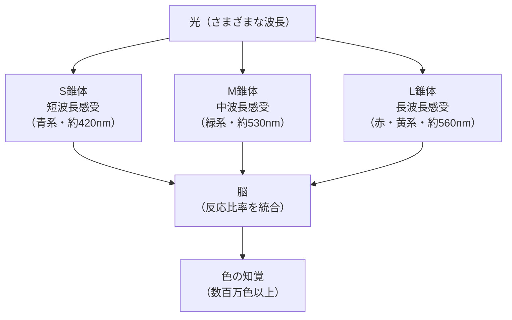
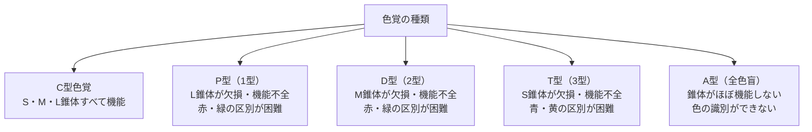

# lesson07: 3色型色覚のしくみ — S・M・L錐体と色の感知

## このレッスンで学ぶこと

- 3色型色覚（トリクロマシー）の仕組みを理解する
- S・M・L錐体の刺激比率によって色が知覚される過程を説明できる
- 対立色説（ヘリング）の概要を把握する（参考）
- 色覚特性の種類（P型・D型・T型・A型）と欠損する錐体の対応を理解する
- 色の恒常性の意味を知る（参考）

---

## 人間の色覚は3種類の錐体によって成り立つ

前のレッスンで、網膜には3種類の錐体（S・M・L）があることを学びました。このレッスンでは、それら3種類の錐体がどのように組み合わさって「色の知覚」を生み出しているかを詳しく見ていきます。

一般的な人間は3種類の錐体をすべて持っており、これを**3色型色覚（トリクロマシー、trichromacy）**と呼びます。3種類の錐体の反応の組み合わせによって、私たちは数百万色以上の色を識別できると言われています。

::: info 3色型色覚はC型色覚とも呼ばれる
色覚の分類では、一般的な3色型色覚を「C型色覚（Conventional type）」と呼ぶことがあります。日本人男性の約95%、女性の約99%以上がC型色覚です。
:::

---

## S・M・L錐体の反応比率が「色」を作る

3種類の錐体はそれぞれ異なる波長の光に敏感に反応しますが、どの錐体も光の波長に対して一定範囲の感度をもっています。つまり、ある波長の光は3種類の錐体をそれぞれ異なる比率で刺激します。脳はその**刺激比率の組み合わせ**を「色」として解釈します。

### 具体的な例

**赤いリンゴを見たとき**

赤いリンゴは主に長波長（赤系）の光を反射します。このとき：
- **L錐体**: 強く反応する（長波長に感度が高い）
- **M錐体**: 少し反応する
- **S錐体**: ほとんど反応しない

この組み合わせを脳が「赤」と解釈します。

**青い空を見たとき**

青い空は主に短波長（青系）の光を反射します。このとき：
- **S錐体**: 強く反応する（短波長に感度が高い）
- **M錐体**: あまり反応しない
- **L錐体**: あまり反応しない

この組み合わせを脳が「青」と解釈します。

::: tip 色は「比率」で決まる
重要なのは各錐体が「どのくらい強く反応するか」という相対的な比率です。同じ比率であれば、同じ色として知覚されます。
:::

---

## 対立色説（ヘリング）【参考・発展】

::: info この節は発展的な内容です
対立色説や色の恒常性は、UC級試験では出題頻度が低い発展内容です。試験対策としては、まず **P型=L錐体、D型=M錐体** の対応を押さえれば十分です。余裕があれば読み進めてください。
:::

3種類の錐体の信号が脳に届いた後、さらに**対立色（反対色）**の信号に変換される処理が行われます。これを**対立色説（opponent-color theory）**といい、19世紀ドイツの生理学者エワルト・ヘリング（Ewald Hering）が提唱しました。

脳の視覚処理では、錐体からの信号が次の3対の対立する信号に変換されます：

| 対立する信号 | 内容 |
|------------|------|
| 赤 ← → 緑 | 赤みを感じるか、緑みを感じるか |
| 青 ← → 黄 | 青みを感じるか、黄みを感じるか |
| 白 ← → 黒 | 明るさ（白黒）の信号 |

::: info なぜ「赤みがかった緑」は見えないのか
この対立色説が理由です。赤と緑は同時に存在できない対立信号なので、「赤みがかった緑」という色は私たちには知覚できません。同様に「青みがかった黄色」も存在しません。
:::

---

## 色覚特性のしくみ

3種類の錐体のいずれかが欠損・機能不全になると、色の見え方が一般的なC型色覚とは異なります。これを**色覚特性**（医学用語では「色覚異常」）といいます。本サイトでは色覚の多様性を尊重し、原則として「色覚特性」と表記します。

::: warning 「異常」という言葉について
「色覚異常」は医学的・検定試験上の用語です。実際の生活では多くの方がほとんど不便なく暮らしており、近年は「色覚特性」「色覚の多様性」という言葉も使われます。UC級では配慮ある設計を学ぶことが目的です。
:::

### P型色覚（1型・赤色盲/赤色弱）

- **欠損する錐体**: **L錐体**
- **特徴**: 赤〜緑系の波長域で識別が困難。赤と緑の区別がつきにくい
- **頻度**: 日本人男性の約1.5%

### D型色覚（2型・緑色盲/緑色弱）

- **欠損する錐体**: **M錐体**
- **特徴**: P型と同様に赤と緑の区別が困難。P型より緑側にずれた感受性の変化
- **頻度**: 日本人男性の約3.5%（P型より多い）

### T型色覚（3型・青色盲/青色弱）

- **欠損する錐体**: **S錐体**
- **特徴**: 青と黄の区別が困難
- **頻度**: 非常にまれ（P型・D型に比べてずっと少ない）

### A型色覚（全色盲）

- **欠損する錐体**: すべての錐体が機能しない（または1種類だけ機能する）
- **特徴**: 色の識別がほとんどできない。明暗（桿体）のみで視覚情報を得る
- **頻度**: 非常にまれ

### 色覚特性の頻度（日本人）

日本人男性の約5%（20人に1人）、女性の約0.2%（500人に1人）が色覚特性に相当します。つまり、ある程度の人数が集まった会議室や電車の中には、色覚特性をもつ人がいると考えるべきです。色のUD（ユニバーサルデザイン）を実践する理由がここにあります。

---

## 色の恒常性【参考・発展】

::: info この節も発展的な内容です
色の恒常性も試験での出題頻度は低めです。仕組みのイメージをつかむ程度で十分です。
:::

同じ物体でも、照明の色が変わると反射する光の波長成分は変わります。蛍光灯の下で見た白い紙と、夕日の下で見た白い紙では、目に届く光は全く異なります。それでも私たちは「どちらも白い紙」として知覚します。

この**照明条件が変わっても物体の色が同じように見える現象**を**色の恒常性（color constancy）**といいます。脳が照明の影響を無意識に補正しているためです。

::: tip 色の恒常性の実例
スーパーで野菜や肉を見るとき、店内照明が変わっても「赤いトマト」「緑のレタス」として認識できるのは色の恒常性のおかげです。
:::

---

P型（1型）・D型（2型）はどちらも赤と緑の区別が困難ですが、色の見え方の歪み方には違いがあります。詳しくは [lesson13](/lessons/lesson13/)・[lesson14](/lessons/lesson14/) で学びます。

---

## キーワード

| 用語 | 説明 |
|------|------|
| 3色型色覚（トリクロマシー） | S・M・L3種類の錐体すべてをもつ一般的な色覚。C型色覚ともいう |
| S錐体 | 短波長（約420nm付近）に感受性をもつ錐体。青系の光に反応する |
| M錐体 | 中波長（約530nm付近）に感受性をもつ錐体。緑系の光に反応する |
| L錐体 | 長波長（約560nm付近）に感受性をもつ錐体。赤〜黄系の光に反応する |
| 対立色説（ヘリング） | 脳の視覚処理で「赤-緑」「青-黄」「白-黒」の3対の対立信号に変換されるという学説 |
| P型色覚（1型） | L錐体が欠損・機能不全。赤と緑の区別が困難 |
| D型色覚（2型） | M錐体が欠損・機能不全。赤と緑の区別が困難 |
| T型色覚（3型） | S錐体が欠損・機能不全。青と黄の区別が困難 |
| A型色覚（全色盲） | 錐体がほぼ機能しない。色の識別がほとんどできない |
| 色の恒常性 | 照明条件が変わっても物体の色が同じように見える脳の補正機能 |

---

## 試験のポイント

- **S・M・L錐体**の名称と対応する波長域（S=短・青、M=中・緑、L=長・赤）を確実に覚える
- 色覚特性の種類と欠損する錐体の対応：**P型=L錐体、D型=M錐体、T型=S錐体**
- P型とD型はどちらも「赤・緑の区別が困難」、T型は「青・黄の区別が困難」
- 色覚特性の頻度：男性の約5%（20人に1人）、女性の約0.2%（500人に1人）
- **対立色説（ヘリング）**は参考・発展。試験ではまず錐体と各型の対応を優先する
- 3色型色覚（トリクロマシー）の別名「C型色覚」も覚えておく
