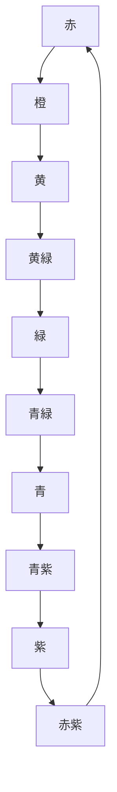
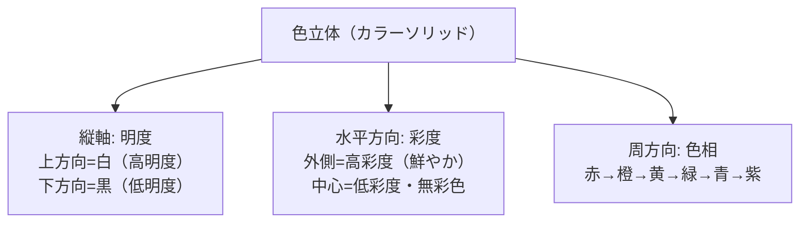

# lesson08: 色の三属性 — 色相・明度・彩度

## このレッスンで学ぶこと

- 色の三属性（色相・明度・彩度）の定義を正確に理解する
- 色相環の仕組みと「補色」の意味を説明できる
- 明度と彩度の違いを区別できるようになる
- 色立体（カラーソリッド）の構造を把握する
- ユニバーサルデザインにおいて「明度差」が最も重要な理由を理解する

---

## すべての色は3つの属性で表せる

私たちが目にするあらゆる色は、**色相（しきそう）**・**明度（めいど）**・**彩度（さいど）**の3つの要素（属性）の組み合わせで表すことができます。これを**色の三属性**といいます。

たとえば「鮮やかな赤」「暗い赤」「くすんだ赤」はどれも「赤」ですが、三属性が異なります。この3つを理解することで、色を体系的に扱えるようになります。

::: info 三属性はあらゆる色の表現システムの基盤
マンセル表色系（Munsell color system）など、色を数値で表すシステムも三属性をベースに構築されています。
:::

---

## 1. 色相（Hue）― 色みの違い

**色相**とは、赤・橙・黄・緑・青・紫といった**色みの違い**のことです。「どんな色か」を表す属性です。

### 色相環

色相を環状に並べたものを**色相環（カラーホイール）**といいます。隣り合う色は互いに近く、対角に位置する色は最も遠い関係になります。

::: tip 色相環のイメージ
色相環は「虹の端と端をつなげて円にしたもの」と考えるとイメージしやすいです。赤→橙→黄→緑→青→紫と並び、最後にまた赤に戻ります。
:::

### 補色（ほしょく）

色相環で**正反対に位置する2色**を**補色（補色関係）**といいます。

代表的な補色の例：
- 赤 ↔ 緑
- 青 ↔ 橙
- 黄 ↔ 紫

補色を**並べて使う**と互いの色を引き立て合い、より鮮やかに見える効果があります（**補色対比**）。一方、補色を**混ぜると**無彩色（灰〜黒）に近づきます。

::: warning 補色対比はUCデザインで注意が必要
補色同士は互いの彩度が高く見える効果がある反面、組み合わせによっては色覚特性のある方には区別しにくい場合があります。明度差の確保も合わせて行うことが重要です。
:::

---

## 2. 明度（Value / Lightness）― 色の明るさ

**明度**とは、色の**明るさと暗さの度合い**のことです。白に近いほど高明度（明るい）、黒に近いほど低明度（暗い）になります。

### 明度の特徴

- 白が最高明度、黒が最低明度
- 白・灰・黒（無彩色）は明度だけで区別されます（色みがないため、色相・彩度は無関係）
- 同じ色相・彩度でも、明度が変わると色の印象は大きく変わります

### UD（ユニバーサルデザイン）における明度の重要性

色のユニバーサルデザインにおいて、**明度差は最も重要な要素**です。その理由は：

1. **色覚特性のある方でも明度（明暗）は識別できる**: P型・D型色覚の方でも、明るさ・暗さの違いは識別できます
2. **視認性・可読性を左右する**: テキストと背景の明度差が大きいほど読みやすくなります
3. **アクセシビリティ基準も明度ベース**: Webアクセシビリティ基準（WCAG）のコントラスト比も明度に基づいています

::: warning 色相・彩度だけの差は伝わらない場合がある
「赤と緑で区別する」など、色相や彩度だけに頼った設計は、色覚特性のある方には伝わらない可能性があります。必ず**明度差を確保**することが重要です。
:::

---

## 3. 彩度（Chroma / Saturation）― 色の鮮やかさ

**彩度**とは、色の**鮮やかさ・くすみの度合い**のことです。純粋な色（純色）に近いほど高彩度（鮮やか）、灰色に近いほど低彩度（くすんだ）になります。

### 彩度の特徴

- **純色（じゅんしょく）**: その色相で最も彩度が高い状態。最も鮮やかで力強い印象
- 白・黒・灰色などの**無彩色は彩度が0**（色みがないため）
- 純色に白を混ぜると明度が上がり彩度が下がります（パステル調）
- 純色に黒を混ぜると明度が下がり彩度も下がります（ダーク調）
- 純色に灰色を混ぜると彩度が下がります（くすみ調）

| 状態 | 混ぜるもの | 印象 |
|------|-----------|------|
| 純色 | （何も混ぜない最高彩度） | 鮮やか・力強い |
| 白を加える | 純色＋白 | 淡い・柔らかい（パステル） |
| 黒を加える | 純色＋黒 | 暗い・重い・深み |
| 灰を加える | 純色＋灰 | くすんだ・落ち着いた |

---

## 色立体（カラーソリッド）

色の三属性を3次元の空間で表したモデルを**色立体（カラーソリッド）**といいます。三属性の位置関係を視覚的に理解するのに役立ちます。

色立体の中心軸（縦軸）は白から黒への無彩色の軸で、そこから外側に向かうほど彩度が高くなり、周方向に回るほど色相が変わります。

::: info マンセル表色系
代表的な色立体の一つが**マンセル表色系**です。色相（H）・明度（V）・彩度（C）を H V/C という記号で表します（例：5R 4/14 = 色相5R、明度4、彩度14）。
:::

---

## 三属性の比較まとめ

| 属性 | 意味 | 高い状態 | 低い状態 | UDでの重要性 |
|------|------|---------|---------|------------|
| 色相 | 色みの種類 | — | — | 色相差だけでは不十分 |
| 明度 | 明るさ・暗さ | 白に近い | 黒に近い | **最重要**（誰でも識別可能） |
| 彩度 | 鮮やかさ・くすみ | 純色に近い | 灰色に近い | 補助的な役割 |

---

## キーワード

| 用語 | 説明 |
|------|------|
| 色の三属性 | 色相・明度・彩度の3要素。あらゆる色はこの3つで表せる |
| 色相（Hue） | 色みの違い（赤・橙・黄・緑・青・紫など） |
| 色相環 | 色相を環状に配置したもの。対角が補色の関係になる |
| 補色 | 色相環で正反対に位置する2色。並べると互いを引き立て合う |
| 補色対比 | 補色を並べることで互いの彩度が高く見える視覚効果 |
| 明度（Value） | 色の明るさ・暗さの度合い。白＝高明度、黒＝低明度 |
| 彩度（Chroma） | 色の鮮やかさの度合い。純色＝高彩度、灰色＝低彩度（0） |
| 純色 | ある色相で最も彩度が高い状態。最も鮮やか |
| 無彩色 | 白・灰・黒など色みのない色。彩度は0、明度のみで区別 |
| 色立体（カラーソリッド） | 三属性を3次元空間に配置したモデル |

---

## 試験のポイント

- **三属性の定義**を正確に覚える：色相＝色み、明度＝明るさ、彩度＝鮮やかさ
- **UDで最も重要なのは明度差**：色相・彩度だけの差では色覚特性者には伝わらないことがある
- **補色**の定義：色相環で正反対に位置する2色（赤↔緑、青↔橙、黄↔紫）
- **無彩色（白・灰・黒）の彩度は0**、明度のみで区別される
- テキストと背景の明度差が大きいほど視認性・可読性が高い（WCAG などのアクセシビリティ基準も明度ベース）
- 色立体の構造：縦軸＝明度、外周方向＝彩度、周方向＝色相
