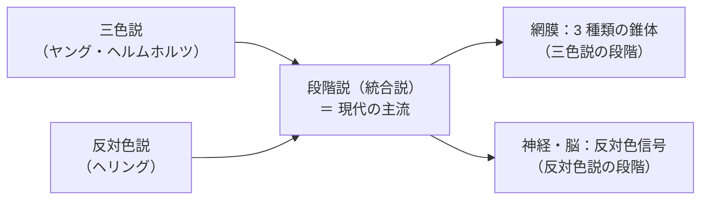
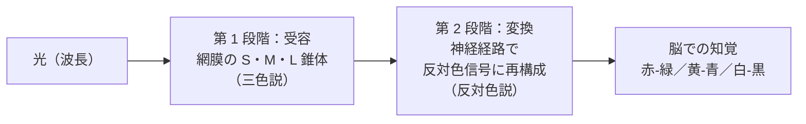
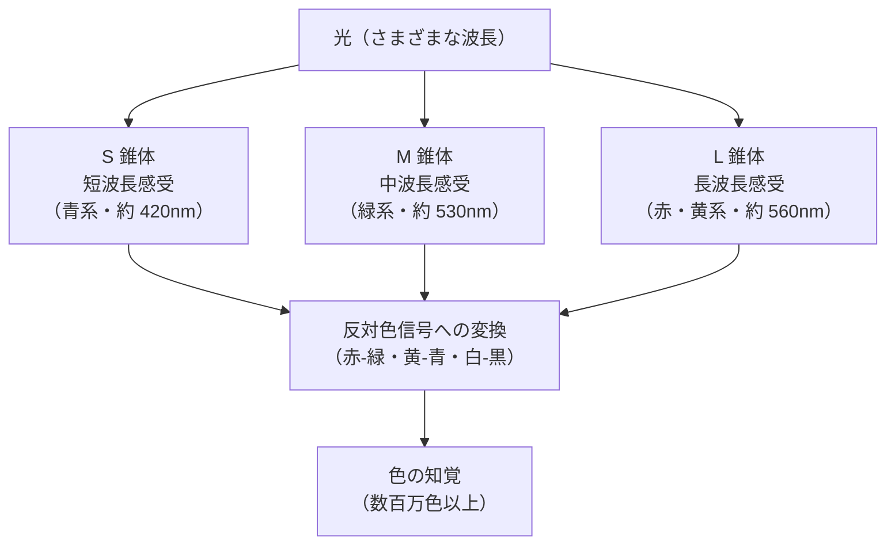
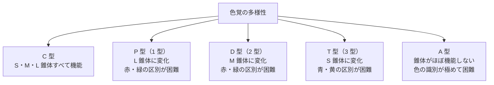

# lesson08: 色覚説と色覚の多様性 — 三色説・反対色説と多様性の理解

## このレッスンで学ぶこと

- 古典理論の三色説と反対色説の主張を整理する
- 現代の**段階説（統合説）**として両者が統合されていることを理解する
- 3 色型色覚（C 型）のしくみを S・M・L 錐体の刺激比率で説明できる
- 色覚タイプ（P・D・T・A 型）と対応する錐体を覚える
- 色覚を「異常」ではなく「**多様性**」として捉える

## 色覚を説明する 2 つの古典理論

「私たちはなぜ色を感じられるのか」という問いに対して、19 世紀から 2 つの理論が提唱されてきました。**三色説**と**反対色説**です。長く対立する学説とされてきましたが、現代では**どちらも正しく、視覚の異なる段階を説明している**ことが分かっています。

### 三色説（ヤング・ヘルムホルツ）

**三色説**は、目には**3 種類の異なる感受性をもつ受容体**があり、それぞれの反応の比率で色を感じるという考え方です。19 世紀初頭に**トマス・ヤング**が提案し、後に**ヘルマン・フォン・ヘルムホルツ**が発展させたため、**ヤング・ヘルムホルツの三色説**と呼ばれます。

- 主張：すべての色は **3 つの原刺激の組み合わせ**で説明できる
- 根拠：3 色の光を混ぜればあらゆる色を作れる（**加法混色**）
- 現代の裏付け：網膜に S・M・L の 3 種類の**錐体**が存在することが確認された

### 反対色説（ヘリング）

**反対色説（対立色説）**は、19 世紀後半にドイツの生理学者**エワルト・ヘリング**が提唱しました。「赤みがかった緑」「青みがかった黄」が知覚できない事実から、色は**対立する 2 つの感覚の組**として処理されるという考え方です。

反対色説では、色は次の 3 対の信号で表されます。

| 反対色の組 | 内容 |
|----------|------|
| 赤 ←→ 緑 | 赤みを感じるか、緑みを感じるか |
| 黄 ←→ 青 | 黄みを感じるか、青みを感じるか |
| 白 ←→ 黒 | 明るさ（明暗） |

::: info なぜ「赤みがかった緑」は見えないのか
赤と緑は同じ信号の両端なので同時には感じられません。同様に「青みがかった黄」も知覚できません。これが反対色説の最大の根拠です。
:::

### 段階説（統合説）

20 世紀になり、視覚の神経経路の研究が進むと、**三色説と反対色説は対立するものではなく、視覚の異なる段階を説明している**ことが分かってきました。これを**段階説（統合説）**といいます。

- **第 1 段階（網膜）**：S・M・L の 3 種類の錐体が光を受け取る → **三色説**
- **第 2 段階（神経・脳）**：3 種類の信号が、赤緑・黄青・明暗の**反対色信号**に再構成される → **反対色説**

つまり、目に入った光はまず三色の信号に変換され、その後の脳の処理で反対色の信号に作り変えられて知覚されています。

もう少し具体的に流れを追うと、網膜の錐体（S・M・L）が 3 つの波長帯に反応した段階では三色説が成立し、その信号が網膜内の双極細胞・神経節細胞、外側膝状体（がいそくしつじょうたい）を経て大脳の視覚野に伝わるまでに「赤-緑」「黄-青」「白-黒」の 3 対の対立信号に変換されます。この**「受容（三色）→ 変換（反対色）」**という 2 段階で色が知覚される、というのが段階説の核心です。

::: tip 試験で問われる視点
「三色説と反対色説のどちらが正しいか」ではなく「**段階説として両方が正しい**」が現代の答えです。三色説＝網膜、反対色説＝脳の処理、と覚えると整理しやすいです。
:::

## 3 色型色覚のしくみ

[lesson07](/lessons/lesson07/)で、網膜には 3 種類の錐体（S・M・L）があることを学びました。一般的なヒトの色覚は、これら 3 種類の錐体すべてが機能している**3 色型色覚（トリクロマシー、trichromacy）**です。**C 型色覚（Common type）**とも呼ばれます。

### 刺激比率が「色」を作る

3 種類の錐体はそれぞれ異なる波長帯に感度をもち、ある波長の光は 3 種類の錐体を**異なる比率**で刺激します。脳はその**刺激比率の組み合わせ**を「色」として解釈します。

| 見ているもの | S 錐体 | M 錐体 | L 錐体 | 知覚される色 |
|-----------|--------|--------|--------|-----------|
| 赤いリンゴ | ほぼ反応せず | 少し反応 | 強く反応 | 赤 |
| 青い空 | 強く反応 | 弱く反応 | 弱く反応 | 青 |
| 黄色いレモン | ほぼ反応せず | 強く反応 | 強く反応 | 黄 |

::: tip 色は「比率」で決まる
重要なのは各錐体の絶対的な反応量ではなく、**相対的な比率**です。同じ比率であれば同じ色として知覚されます。
:::

## 色覚の多様性

3 種類の錐体のうちいずれかが**欠けている、または分光感度がずれている**と、色の見え方は C 型とは異なります。これを医学的には「色覚異常」と呼びますが、本来は治療すべき病気ではなく、**人の色覚にはバリエーション（多様性）がある**という見方が国際的にも広がっています。本サイトでは原則「**色覚特性**」「**色覚の多様性**」と表記します。

::: info 用語について
色覚タイプの呼び方には「**色覚異常**」「**色覚特性**」「**色覚の多様性**」があり、いずれも公式テキストに登場します。本サイトでも併用します。「**色盲**」「**色弱**」はかつて使われた呼称で、現在の公式テキストや日本眼科学会では使われていません。
:::

### 色覚タイプと対応する錐体

色覚タイプは、どの錐体に変化があるかで分類されます。

| 型 | 別名 | 変化する錐体 | 区別が難しい色 |
|----|------|-----------|--------------|
| **C 型** | 一般色覚（Common） | なし | — |
| **P 型（1 型）** | 第 1 色覚（Protan） | **L 錐体** | 赤と緑 |
| **D 型（2 型）** | 第 2 色覚（Deutan） | **M 錐体** | 赤と緑 |
| **T 型（3 型）** | 第 3 色覚（Tritan） | **S 錐体** | 青と黄 |
| **A 型** | 全色覚（Achromat） | 錐体がほぼ機能しない | 色のほとんど |

### 日本人での頻度（概要）

色覚特性の出現頻度は、日本人男性で **約5%（20人に1人）**、女性で **約0.2%（500人に1人）** とされます。内訳ではD型が最多です。

P型・D型は X 染色体上の遺伝子の変化によって生じ、男性は X 染色体を 1 本しか持たないため発現しやすくなります。タイプ別の詳しい内訳と遺伝のしくみは [lesson13](/lessons/lesson13/)・[lesson18](/lessons/lesson18/) で扱います。

### 「多様性」として捉える意義

ある程度の人数が集まる場所（学校のクラス、会社の部署、電車の車両）には、ほぼ確実に色覚特性のある人がいます。設計の最初から「色の見え方には多様性がある」という前提に立てば、特別な配慮を後付けで追加する必要がなくなります。これが**色のUD**（カラーユニバーサルデザイン、CUD）の出発点です。

::: tip このレッスンは「概論」
色覚の多様性は本サイトの第 4 章（[lesson13](/lessons/lesson13/) 〜 [lesson20](/lessons/lesson20/)）で詳しく扱います。本レッスンでは「色覚説」とセットで概論として押さえてください。
:::

## キーワード

| 用語 | 説明 |
|------|------|
| 三色説 | 3 種類の感受性をもつ受容体の反応比で色を感じるとする学説。ヤング・ヘルムホルツが提唱 |
| 反対色説（対立色説） | 色は「赤-緑」「黄-青」「白-黒」の 3 対の反対信号で処理されるとする学説。ヘリングが提唱 |
| 段階説（統合説） | 三色説（網膜）と反対色説（神経・脳）を視覚の異なる段階として統合した現代の主流説 |
| 3 色型色覚（トリクロマシー） | S・M・L 3 種類の錐体すべてをもつ一般的な色覚。**C 型色覚**ともいう |
| C 型色覚 | Common type の略。3 色型色覚の一般的な状態 |
| P 型（1 型） | L 錐体に変化。赤と緑の区別が困難。日本人男性の約 1.5% |
| D 型（2 型） | M 錐体に変化。赤と緑の区別が困難。日本人男性の約 3.5%（最多） |
| T 型（3 型） | S 錐体に変化。青と黄の区別が困難。非常にまれ |
| A 型 | 錐体がほぼ機能せず、色の識別がほぼできない。非常にまれ |
| 色覚特性／色覚の多様性 | 「色覚異常」に代わる中立的な呼称。見え方の個性として捉える |

## 試験のポイント

- **三色説＝ヤング・ヘルムホルツ／反対色説＝ヘリング**の対応を確実に覚える
- 現代では**段階説（統合説）**として両理論が統合されている：**網膜は三色説、神経・脳は反対色説**
- 反対色の 3 対：**赤-緑／黄-青／白-黒**。「赤みがかった緑」が知覚できないのが根拠
- 錐体と色覚タイプの対応：**P 型 = L 錐体、D 型 = M 錐体、T 型 = S 錐体**
- 頻度：男性の**約 5%（20 人に 1 人）**、女性の**約 0.2%（500 人に 1 人）**
- 内訳は **P 型 約 1.5%・D 型 約 3.5%（D 型が最多）・T 型 非常にまれ・A 型 非常にまれ**
- C 型は **Common type** の略
- 「色盲」「色弱」は使わず、**色覚特性／色覚の多様性**を基本表記とする
