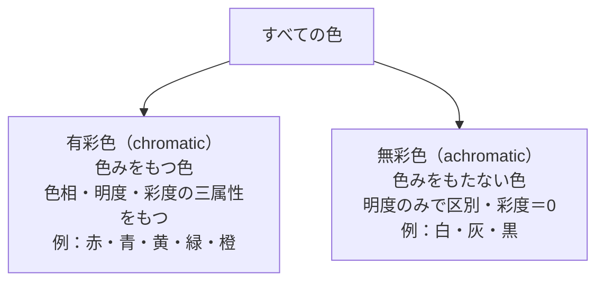
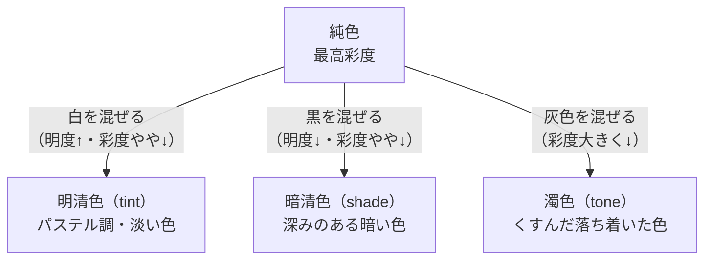

# lesson09: 有彩色と無彩色 — 色の分類を知る

## このレッスンで学ぶこと

- 有彩色と無彩色の違いを定義できるようになる
- 純色・清色（明清色・暗清色）・濁色の分類と特徴を理解する
- 補色関係と補色対比の効果を説明できる
- 色の混合（加法・減法）の基本的な考え方を把握する
- 色のUDにおいて有彩色・無彩色の組み合わせが重要な理由を理解する

---

## 色の大分類：有彩色と無彩色

[lesson08](/lessons/lesson08/)では色の三属性（色相・明度・彩度）を学びました。このレッスンでは、三属性をもとに色がどう分類されるかを見ていきます。

すべての色は大きく**有彩色（ゆうさいしょく）**と**無彩色（むさいしょく）**の2つに分けられます。

### 有彩色（chromatic color）

**色みをもつ色**のことです。赤・青・黄・緑・橙・紫など、色相（Hue）を持つすべての色が有彩色です。色相・明度・彩度の三属性をすべてもちます。

### 無彩色（achromatic color）

**色みをもたない色**のことです。白・灰・黒が無彩色です。無彩色には色相がなく、**彩度は0**です。明度だけで区別されます。

::: info 「グレー」の幅広さ
無彩色のグレーは、白と黒の中間で、明度の段階によって「ライトグレー」「ミディアムグレー」「ダークグレー」などと呼ばれます。すべて無彩色であり彩度は0です。
:::

---

## 有彩色のさらなる分類

有彩色はさらに「純色」「清色」「濁色」に分類できます。これは純色に何を混ぜるかによって決まります。

### 純色（じゅんしょく / pure color）

**ある色相で最も彩度が高い状態**の色です。白・黒・灰色を一切混ぜていない最も鮮やかな色で、力強く生き生きとした印象を与えます。

- 例：絵の具の赤・青・黄をそのまま使った状態
- 各色相の「代表色」とも言えます

### 清色（せいしょく / clear color）

**純色に白または黒だけを混ぜた色**です。灰色を含まないため「清（きよ）らか」な色調をもちます。清色はさらに2つに分けられます。

#### 明清色（めいせいしょく / tint）

**純色に白を混ぜた色**です。明度が上がり、彩度はやや下がります。柔らかく、淡い、爽やかな印象を与えます。パステルカラーが代表例です。

- 例：純色の赤に白を混ぜる → ピンク（パステルピンク）
- 例：純色の青に白を混ぜる → 水色

#### 暗清色（あんせいしょく / shade）

**純色に黒を混ぜた色**です。明度が下がり、彩度もやや下がります。深みがあり、落ち着いた、重厚な印象を与えます。

- 例：純色の赤に黒を混ぜる → ワインレッド
- 例：純色の青に黒を混ぜる → ネイビー

### 濁色（だくしょく / tone）

**純色に灰色を混ぜた色**です。彩度が大きく下がり、くすんだ落ち着いた印象になります。「トーン」という言葉で表されることもあります。

- 例：純色の緑に灰色を混ぜる → カーキ・くすみグリーン
- 例：純色の赤に灰色を混ぜる → テラコッタ・こなれた赤

::: tip 清色と濁色の違いを覚えるコツ
**清色＝純色＋白または黒**（灰色は混じらない）、**濁色＝純色＋灰色**。「濁（にご）る」というイメージで、灰色が入ってくすむのが濁色と覚えましょう。
:::

---

## 色の分類まとめ表

| 分類 | 作り方 | 印象 | 代表例 |
|------|--------|------|--------|
| 有彩色 | — | 色みをもつ | 赤・青・黄・緑 |
| 無彩色 | — | 色みをもたない | 白・灰・黒 |
| 純色 | 何も混ぜない最高彩度 | 鮮やか・力強い | ビビッドレッド・コバルトブルー |
| 明清色 | 純色＋白 | 淡い・柔らかい・爽やか | パステルピンク・水色 |
| 暗清色 | 純色＋黒 | 深い・重厚・落ち着いた | ワインレッド・ネイビー |
| 濁色 | 純色＋灰 | くすんだ・落ち着いた | カーキ・テラコッタ |

---

## 補色関係と補色対比

**補色（complementary color）**とは、色相環で正反対に位置する2色のことです（lesson08で学んだ内容の復習）。

### 代表的な補色の組み合わせ

| 色 | 補色 |
|----|-----|
| 赤 | 緑 |
| 青 | 橙 |
| 黄 | 紫 |
| 赤紫 | 黄緑 |

### 補色の2つの特性

**補色を並べる（補色対比）**: 互いの彩度が高く見える効果があります。例えば、赤と緑を並べるとどちらもより鮮やかに見えます。

**補色を混ぜる（色の中和）**: 混ぜると互いの色みが打ち消し合い、無彩色（灰〜黒）に近づきます。

ただし、色のUDの観点では注意が必要です。色相環で離れた関係にある赤と緑は、P型（1型）・D型（2型）には区別しにくい組み合わせです。詳しくは [lesson21](/lessons/lesson21/) で学びます。

::: warning 補色対比は色覚特性者に注意
P型・D型色覚の方は赤と緑の区別が困難です。「赤と緑を補色対比で使う」デザインは、これらの方には区別できない可能性があります。明度差の確保が必要です。
:::

---

## 色のUDへの応用

色の分類を理解した上で、ユニバーサルデザインの観点でどう活用するかを整理します。

### 視認性・可読性で最も重要：明度差

色のUDで最も重視されるのは**明度差の確保**です。

- **最も視認性が高い組み合わせ**: 無彩色同士（白地に黒文字、または黒地に白文字）
- 有彩色を使う場合でも、背景と文字の**明度差を大きく取る**ことが必要
- 色相（有彩色同士）の差だけに頼ると、色覚特性者には区別できないことがある

### 高彩度の注意点

純色や高彩度の有彩色を大量に使うデザインは、視覚的に疲れやすく、色覚特性者には識別しにくい場合があります。**彩度を落として明度差を確保する**方が伝わりやすいことがあります。

### 実践例

::: tip 悪い例と良い例
**悪い例**: 赤い文字を緑の背景に書く（補色対比で鮮やかに見えるが、明度差が低く・色覚特性者には区別できない）

**良い例**: 黒い文字を白い背景に書く（無彩色の組み合わせで最大の明度差・誰でも読める）
または: 濃い色（低明度）の文字を薄い色（高明度）の背景に書き、明度差を確保する
:::

---

## キーワード

| 用語 | 説明 |
|------|------|
| 有彩色（chromatic color） | 色みをもつ色。色相・明度・彩度の三属性をすべてもつ |
| 無彩色（achromatic color） | 色みをもたない色（白・灰・黒）。彩度は0、明度のみで区別される |
| 純色（pure color） | ある色相で最も彩度が高い状態。白・黒・灰を含まない最も鮮やかな色 |
| 清色（clear color） | 純色に白または黒だけを混ぜた色。明清色と暗清色がある |
| 明清色（tint） | 純色＋白。明るく淡い色調。パステルカラーが代表例 |
| 暗清色（shade） | 純色＋黒。暗く深みのある色調。ワインレッド・ネイビーなど |
| 濁色（tone） | 純色＋灰。くすんだ落ち着いた色調。カーキ・テラコッタなど |
| 補色 | 色相環で正反対に位置する2色（例：赤↔緑、青↔橙） |
| 補色対比 | 補色を並べることで互いの彩度が高く見える視覚効果 |
| 明度差 | 色の明るさの差。色のUDにおいて視認性確保のため最も重要な要素 |

---

## 試験のポイント

- **有彩色と無彩色の定義**：有彩色＝色みあり、無彩色＝色みなし（彩度0）
- **純色・清色（明清色/暗清色）・濁色の区別**：何を混ぜるかで決まる（白→明清色、黒→暗清色、灰→濁色）
- **清色と濁色の違い**：清色＝灰を含まない（白か黒だけ）、濁色＝灰を含む
- **補色の定義**：色相環で正反対の2色。並べると彩度が高く見え、混ぜると無彩色に近づく
- **色のUDで最重要：明度差**。色相・彩度の差だけでは色覚特性者には伝わらない場合がある
- 最も視認性が高い組み合わせは**無彩色同士（白地に黒文字）**
