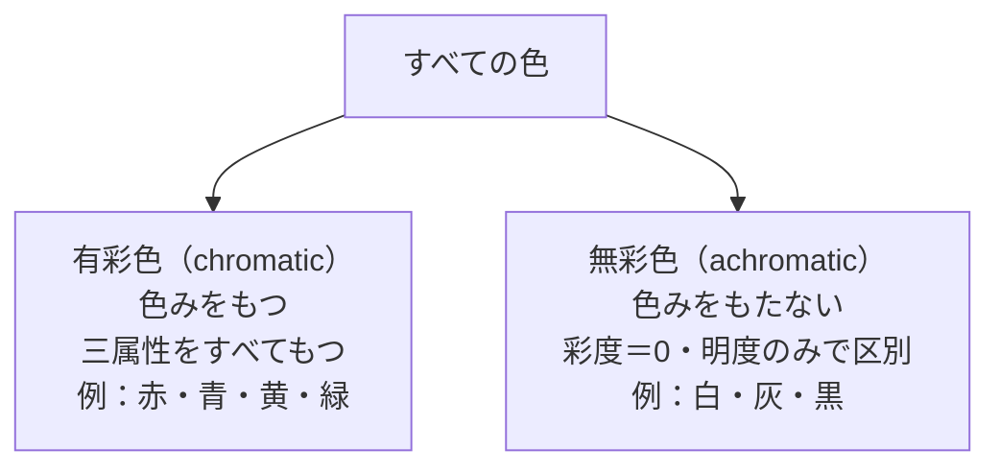

# lesson09: 色の三属性 — 色相・明度・彩度と色の分類

## このレッスンで学ぶこと

- 色の三属性（色相・明度・彩度）の定義を理解する
- 色相環と補色の意味を理解する
- 色を**有彩色／無彩色**、**純色／清色／濁色**に分類できる
- 色のUDで「明度差」が最も重要な理由を理解する

## すべての色は3つの属性で表せる

私たちが目にするあらゆる色は、**色相（しきそう）**・**明度（めいど）**・**彩度（さいど）**の3つの要素の組み合わせで表せます。これを**色の三属性**といいます。

「鮮やかな赤」「暗い赤」「くすんだ赤」はどれも「赤」ですが、三属性のどれかが異なります。3つを理解することで、色を体系的に扱えるようになります。

::: info 三属性は表色系の基盤
マンセル表色系やPCCSなど、色を体系的に表すしくみはすべて三属性をベースにしています。
:::

## 色相（Hue）― 色みの違い

**色相**とは、赤・橙・黄・緑・青・紫といった**色みの違い**のことです。「どんな色か」を表す属性です。

### 色相環

色相を環状に並べたものを**色相環（カラーホイール）**といいます。隣り合う色は互いに近く、対角に位置する色は最も遠い関係になります。

::: tip 色相環のイメージ
色相環は「虹の端と端をつなげて円にしたもの」と考えるとイメージしやすいです。赤→橙→黄→緑→青→紫と並び、最後にまた赤に戻ります。
:::

### 補色（ほしょく）

色相環で**正反対に位置する2色**を**補色**といいます。

代表的な補色の例：

| 色 | 補色 |
|----|-----|
| 赤 | 緑 |
| 青 | 橙 |
| 黄 | 紫 |
| 赤紫 | 黄緑 |

補色には次の2つの性質があります。

- **並べる（補色対比）**：互いの彩度が高く見える。鮮やかな印象が強まる
- **混ぜる（色の中和）**：互いの色みが打ち消し合い、無彩色（灰〜黒）に近づく

::: warning 補色対比はUDで注意
赤と緑は補色ですが、P型（1型）・D型（2型）には区別しにくい組み合わせです。補色対比だけに頼らず、**明度差**を合わせて確保することが重要です。
:::

::: info 補色の正確な定義は表色系で異なる
補色の厳密な定義は表色系によって少しずつ違います。マンセル表色系では「色相環で正反対」（混ぜると無彩色になる物理補色の考え方に近い）、PCCSでは「色相番号が12離れた色（24色相環の正反対）」を補色と定義します。詳しくは [lesson10](/lessons/lesson10/)・[lesson11](/lessons/lesson11/) で扱います。本レッスンでは「色相環で離れた関係」という一般的な意味で使います。
:::

## 明度（Value / Lightness）― 色の明るさ

**明度**とは、色の**明るさ・暗さの度合い**です。白に近いほど高明度、黒に近いほど低明度になります。

### 明度の特徴

- 白が最高明度、黒が最低明度
- 白・灰・黒（無彩色）は明度だけで区別される
- 同じ色相・彩度でも、明度が変わると色の印象は大きく変わる

### UDにおける明度の重要性

色のUDにおいて、**明度差は最も重要な要素**です。理由は次の3つです。

1. **色覚特性のある人でも明暗は識別できる**：P型・D型・T型のいずれの方も、明るさ・暗さの違いは識別できる
2. **視認性・可読性を左右する**：テキストと背景の明度差が大きいほど読みやすい
3. **アクセシビリティ基準も明度ベース**：WCAG AAのコントラスト比（標準テキスト4.5:1以上、大きな文字3:1以上）は明度の差を基準にしている

::: warning 色相・彩度だけの差では伝わらない
「赤と緑で区別」「鮮やかな色とくすんだ色で区別」など、色相や彩度だけに頼った設計は色覚特性者には伝わらないことがあります。必ず**明度差**を確保してください。
:::

## 彩度（Chroma / Saturation）― 色の鮮やかさ

**彩度**とは、色の**鮮やかさ・くすみの度合い**です。純粋な色（純色）に近いほど高彩度、灰色に近いほど低彩度になります。

### 彩度の特徴

- **純色**：その色相で最も彩度が高い状態。最も鮮やかで力強い
- 白・黒・灰色などの**無彩色は彩度が0**
- 純色に白を混ぜると明度が上がり彩度が下がる（パステル調）
- 純色に黒を混ぜると明度が下がり彩度も下がる（ダーク調）
- 純色に灰色を混ぜると彩度が下がる（くすみ調）

## 色の分類：有彩色と無彩色

三属性をふまえると、すべての色はまず**有彩色**と**無彩色**に大きく分けられます。

### 有彩色（chromatic color）

**色みをもつ色**です。赤・青・黄・緑・橙・紫など、色相をもつすべての色が有彩色で、色相・明度・彩度の三属性をすべてもちます。

### 無彩色（achromatic color）

**色みをもたない色**です。白・灰・黒が無彩色で、色相がなく**彩度は0**。明度だけで区別されます。

::: info 「グレー」の幅広さ
無彩色のグレーは明度の段階によって「ライトグレー」「ミディアムグレー」「ダークグレー」などと呼ばれます。すべて無彩色であり彩度は0です。
:::

## 有彩色のさらなる分類：純色・清色・濁色

有彩色は「純色に何を混ぜるか」で **純色／清色／濁色** に分類できます。

| 分類 | 作り方 | 印象 |
|------|--------|------|
| 純色（pure color） | 何も混ぜない最高彩度 | 鮮やか・力強い |
| 明清色（tint） | 純色 ＋ 白 | 淡い・柔らかい（パステル）|
| 暗清色（shade） | 純色 ＋ 黒 | 深い・重厚 |
| 濁色（tone） | 純色 ＋ 灰 | くすんだ落ち着き |

清色は **「白か黒だけ」を混ぜた色**（灰を含まない）、濁色は **灰が入る色**、と区別します。色を整理する基本的な枠組みなので、用語と作り方の対応だけ覚えておきましょう。

## 三属性の比較まとめ

| 属性 | 意味 | 高い状態 | 低い状態 | UDでの重要性 |
|------|------|---------|---------|------------|
| 色相 | 色みの種類 | — | — | 色相差だけでは不十分 |
| 明度 | 明るさ・暗さ | 白に近い | 黒に近い | **最重要**（誰でも識別可能） |
| 彩度 | 鮮やかさ・くすみ | 純色に近い | 灰色に近い | 補助的 |

## キーワード

| 用語 | 説明 |
|------|------|
| 色の三属性 | 色相・明度・彩度の3要素。あらゆる色はこの3つで表せる |
| 色相（Hue） | 色みの違い（赤・橙・黄・緑・青・紫など） |
| 色相環 | 色相を環状に配置したもの。対角が補色の関係になる |
| 補色 | 色相環で正反対に位置する2色。並べると引き立て合い、混ぜると無彩色に近づく |
| 明度（Value） | 色の明るさ・暗さの度合い。白＝高明度、黒＝低明度 |
| 彩度（Chroma） | 色の鮮やかさの度合い。純色＝高彩度、無彩色＝彩度0 |
| 有彩色 | 色みをもつ色。三属性をすべてもつ |
| 無彩色 | 色みをもたない白・灰・黒。彩度0・明度のみで区別 |
| 純色 | ある色相で最も彩度が高い状態。白・黒・灰を含まない |
| 清色 | 純色に白または黒だけを混ぜた色。明清色と暗清色がある |
| 明清色（tint） | 純色 ＋ 白。パステル調 |
| 暗清色（shade） | 純色 ＋ 黒。深みのある暗色 |
| 濁色（tone） | 純色 ＋ 灰。くすんだ落ち着いた色 |

## 試験のポイント

- **三属性の定義**：色相＝色み、明度＝明るさ、彩度＝鮮やかさ
- **補色**は色相環で正反対の2色（赤↔緑、青↔橙、黄↔紫）
- **有彩色＝色みあり、無彩色＝色みなし（彩度0）**
- **清色 = 純色 ＋ 白or黒**（灰を含まない）／**濁色 = 純色 ＋ 灰**
- **明清色 = 純色 ＋ 白（tint）／暗清色 = 純色 ＋ 黒（shade）**
- **無彩色は彩度0**、明度のみで区別される
- **UDで最も重要なのは明度差**：色相・彩度だけの差では色覚特性者には伝わらないことがある
- WCAG AA：標準テキスト**4.5:1**以上、大きな文字 **3:1** 以上（明度差ベース）
