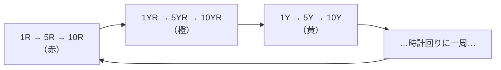
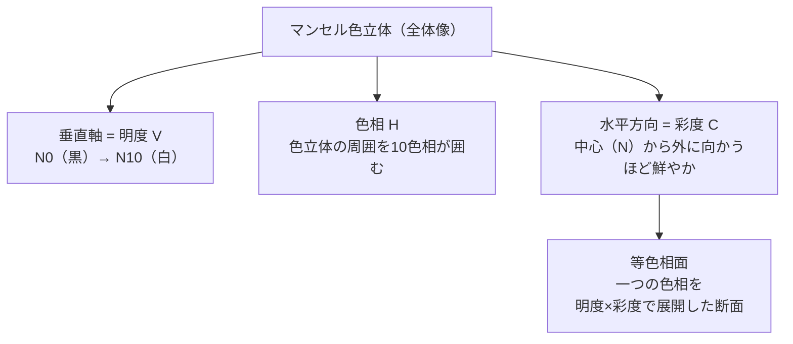

# lesson10: マンセル表色系 — 色を記号で表す

## このレッスンで学ぶこと

- マンセル表色系の成り立ちと日本での位置づけを理解する
- H（色相）・V（明度）・C（彩度）の3属性の読み方を覚える
- マンセル記号「H V/C」の表記ルールを正確に理解する
- 無彩色の表記「N（ニュートラル）」を理解する
- 10色相・100色相の体系と等色相面の概念を把握する

---

## マンセル表色系とは

**マンセル表色系（Munsell Color System）**は、アメリカの画家・美術教師であった **A・H・マンセル（Albert Henry Munsell）**が20世紀初頭に考案した色の表し方です。マンセルは「色を正確に・誰でも同じように伝えられる言葉（記号）が必要だ」という思想から、色を数値と記号で体系的に表す方法を開発しました。

この表色系は現在、**日本工業規格（JIS）**に採用されており、日本における色の標準的な表記方法として塗料・印刷・デザインなど幅広い産業で使われています。

::: info A・H・マンセル（1858–1918）
ボストン美術館付属学校の教授でもあったマンセルは、美術教育の中で「色の伝え方の曖昧さ」を痛感し、色の記号体系の開発に取り組みました。1905年に最初の著作を発表し、没後も研究が継続されて現在の体系が完成しました。
:::

---

## 色の3属性と表記記号

マンセル表色系では、すべての有彩色を **H V/C**（色相 明度/彩度）という形式で表します。3つの属性それぞれの意味を押さえましょう。

### H（Hue）= 色相

色の「種類」を表します。赤・黄・緑・青・紫などの色名を記号で示します。

マンセル表色系では、基本となる**5つの基本色相**と**5つの中間色相**の計10色相が設定されています。

| 記号 | 色名（英語） | 色名（日本語） |
|------|------------|------------|
| R | Red | 赤 |
| YR | Yellow-Red | 橙（黄赤） |
| Y | Yellow | 黄 |
| GY | Green-Yellow | 黄緑 |
| G | Green | 緑 |
| BG | Blue-Green | 青緑 |
| B | Blue | 青 |
| PB | Purple-Blue | 青紫 |
| P | Purple | 紫 |
| RP | Red-Purple | 赤紫 |

それぞれの色相はさらに1〜10の数字を付けて細かく区分されます。たとえば「R」は1R〜10Rまでの10段階に分かれ、10色相それぞれが10段階なので、全体で**100色相**を表現できます。試験でよく登場するのは **5R、10YR、5Y、5G、5B、5PB、5P、5RP** などの「5」と「10」の区切りです。

### 100色相の仕組み

数字の付け方には決まったルールがあります。

- **5R は R（赤）の代表的な色相**です。各色相の「5」がその色相の中央（最も典型的な色）にあたります
- 色相環を時計回りに進むと、数字は **1R→…→10R→1YR→…→10YR→1Y→…** と増えていきます
- ある色相の「10」と、次の色相の「1」は隣り合っています（例：10R の次が 1YR）

::: tip 数字が小さい＝前の色相に近い
1Rは赤紫寄りの赤、5Rは赤の中央、10Rは橙寄りの赤です。「5＝その色相の中央」「10＝次の色相に近い」と覚えると整理できます。
:::



このように10色相が環状につながり、各色相を10段階に分けた色相環がマンセルの100色相です。隣の色相となめらかにつながり、一周してまた赤に戻ります。


### V（Value）= 明度

色の「明るさ」を表します。**0〜10**の数値で示し、**0が黒（最も暗い）、10が白（最も明るい）**です。現実の塗料では完全な0や10は存在しないため、実用的には1〜9.5程度の範囲が使われます。

| 明度値 | 見え方 |
|--------|------|
| 9〜10 | 白・白に近い非常に明るい色 |
| 6〜8 | 明るい色（ライト系） |
| 4〜5 | 中間の明るさ（ミディアム系） |
| 1〜3 | 暗い色（ダーク系） |
| 0 | 黒（理論値） |

### C（Chroma）= 彩度

色の「鮮やかさ」を表します。**0が無彩色（グレー）**で、数値が大きくなるほど鮮やかになります。最大値は色相によって異なり、最も鮮やかな赤（5R）は彩度14を超えることもあります。

::: warning 彩度の最大値は色相によって異なる
マンセル彩度は色相によって上限が違います（例：赤は14以上、緑は10程度など）。「どの色相でも彩度は0〜14」と覚えるのではなく、「0から始まり、色相ごとに上限が変わる」と理解しましょう。
:::

---

## 表記の読み方

### 有彩色の表記: H V/C

```
5R 4/14
 ↑  ↑  ↑
 H  V  C
 色相 明度 彩度
```

この例「**5R 4/14**」は、**色相が5R（赤）、明度が4（やや暗め）、彩度が14（非常に鮮やか）** な赤色を意味します。鮮やかな赤（口紅やポストの赤に近いイメージ）です。

他の例も確認しましょう。

| 表記 | 読み方 | 色のイメージ |
|------|--------|------------|
| 5R 4/14 | 色相5R、明度4、彩度14 | 鮮やかな赤 |
| 5Y 8/12 | 色相5Y、明度8、彩度12 | 鮮やかな黄色 |
| 5G 5/8 | 色相5G、明度5、彩度8 | 鮮やかな緑 |
| 5PB 3/10 | 色相5PB、明度3、彩度10 | 深い青紫 |
| 10YR 6/4 | 色相10YR、明度6、彩度4 | くすんだ橙（ベージュ系） |

### 無彩色の表記: N（Neutral）

白・グレー・黒などの**無彩色（色みのない色）**は、色相と彩度がないため、**N＋明度値**で表します。

| 表記 | 意味 |
|------|------|
| N0 | 黒（最も暗い無彩色） |
| N5 | 中間のグレー |
| N10 | 白（最も明るい無彩色） |

::: tip Nの覚え方
NはNeutral（ニュートラル・中立）の頭文字です。「色みがなく、どの色にも偏っていない」という意味が込められています。
:::

---

## 等色相面と色立体

同じ色相の色を、明度（縦軸）と彩度（横軸）で展開した平面図を**等色相面（とうしょくそうめん）**といいます。



色立体全体を輪切りにすると各色相の等色相面が現れ、その形は色相によって異なります。赤（R）は高彩度まで展開できるため横に広く、緑（G）は比較的狭い形になっています。この非対称な形がマンセル表色系の特徴のひとつです。

::: info マンセル表色系とオストワルト表色系
色を体系的に表す方法には、マンセル表色系の他に「オストワルト表色系」もあります。ただし試験（UC級）ではマンセル表色系が中心です。
:::

---

## 次のレッスンへ

マンセル表色系は、色を正確に指定・伝達するための体系でした。次の[lesson11](/lessons/lesson11/)では、配色を考えるときに使いやすいPCCS（日本色研配色体系）を学びます。

---

## キーワード

| 用語 | 説明 |
|------|------|
| マンセル表色系 | A・H・マンセルが考案した色の表示体系。H V/C の記号で色を表す。JIS採用 |
| H（Hue） | 色相。色の種類を記号で表す（R・Y・G・B・P など10種 + 数字で100色相） |
| V（Value） | 明度。色の明るさ。0（黒）〜10（白）で表す |
| C（Chroma） | 彩度。色の鮮やかさ。0（無彩色）から数値が大きいほど鮮やか |
| N（Neutral） | ニュートラル。無彩色（白・グレー・黒）の表記。N0=黒、N5=中間グレー、N10=白 |
| 5基本色相 | R・Y・G・B・P の5色。マンセル色相環の基軸となる色相 |
| 5中間色相 | YR・GY・BG・PB・RP の5色。基本色相の中間 |
| 等色相面 | 同じ色相の色を明度（縦）×彩度（横）で展開した平面図 |
| H V/C 表記 | マンセル表色系の基本表記。例：5R 4/14（色相5R、明度4、彩度14） |

---

## 試験のポイント

- **表記形式「H V/C」**を正確に覚える：Hが色相、Vが明度、Cが彩度
- **明度の範囲（0〜10）**：0が黒、10が白。数値が大きいほど明るい
- **彩度の起点（0）**：0が無彩色。数値が大きいほど鮮やか（上限は色相による）
- **無彩色はN表記**：N0=黒、N10=白、N5=中間グレー
- **10色相の記号と日本語の対応**を覚える（特にR・YR・Y・GY・G・BG・B・PB・P・RP）
- **5Rと10Rの違い**を理解する：数字が5で中間、数字が大きくなると次の色相に近づく
- JIS（日本工業規格）に採用されていることも確認しておく
