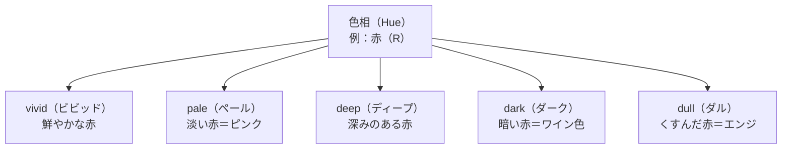

# lesson11: PCCS — 日本色研配色体系とトーン

## このレッスンで学ぶこと

- PCCS（日本色研配色体系）の目的と特徴を理解する
- PCCSの色相番号（1〜24）の体系を把握する
- 「トーン（色調）」の概念と主なトーンの特徴を覚える
- トーンを活用した配色の考え方（同一トーン配色など）を理解する
- マンセル表色系とPCCSの違いと使い分けを理解する

---

## PCCS とは

**PCCS（Practical Color Co-ordinate System）**は、**日本色彩研究所**が1964年に発表した色体系です。「実用的な色彩座標システム」という名の通り、**配色教育・デザイン実務での使いやすさ**を最優先に設計されています。

マンセル表色系が「色を正確に指定・伝達する」ことを目的としているのに対し、PCCSは「色の組み合わせ（配色）を考えやすくする」ことを目的としています。その最大の特徴が、**トーン（色調）**という独自の概念です。

### マンセル vs PCCS（まずは要点だけ）

両者の役割の違いを先につかんでおきましょう。

| 観点 | マンセル表色系 | PCCS |
|------|--------------|------|
| ねらい | 色の正確な指定・伝達 | 配色教育・デザイン実務 |
| 性格 | JIS採用の標準的な体系 | 直感的で配色を考えやすい |
| 得意なこと | 1色を厳密に表す | 色の組み合わせを整理する |

ざっくり言えば、**マンセル＝正確に指定する物差し**、**PCCS＝配色を考える道具**です。

::: info PCCSが開発された背景
従来の色体系は専門家向けで、初学者には使いにくいものでした。PCCSは美術・デザイン教育の現場での使いやすさを重視して開発され、日本の色彩教育に広く普及しています。
:::

---

## PCCSの色相体系

PCCSでは色相を**1〜24の番号**で表します。番号は色相環を一周するように並んでいます。

| 番号 | 記号 | 色名 |
|------|------|------|
| 1 | pR | 赤紫（ピンク寄り） |
| 2 | R | 赤 |
| 4 | rO | 赤橙 |
| 6 | O | 橙 |
| 8 | Y | 黄 |
| 10 | YG | 黄緑 |
| 12 | G | 緑 |
| 14 | BG | 青緑 |
| 16 | gB | 緑青（青緑寄りの青） |
| 18 | B | 青 |
| 20 | V | 青紫（バイオレット） |
| 22 | P | 紫 |
| 24 | RP | 赤紫 |

<!-- textlint-disable ja-technical-writing/ja-unnatural-alphabet -->

::: info 色相記号の大文字・小文字の意味
記号の大文字は基本の色みを表します（R＝赤、O＝橙、B＝青 など）。先頭の小文字は「どちら寄りか」を示す補助記号です。たとえば pR は p（purple＝紫）寄りの R（赤）、rO は r（red＝赤）寄りの O（橙）、gB は g（green＝緑）寄りの B（青）という意味です。試験では大まかな色みがつかめれば十分です。
:::

<!-- textlint-enable ja-technical-writing/ja-unnatural-alphabet -->

::: tip 補色の覚え方
PCCSでは、**番号が12（ちょうど半分）離れた色相が補色（補色関係）**になります。例えば、**2番の赤（R）と14番の青緑（BG）**が補色です。色相環の真向かいに位置する色が補色であるという関係はマンセルと共通ですが、PCCSは番号で確認しやすいのが特徴です。
:::

---

## トーン（Tone）= 色調という概念

PCCSの最大の特徴が**トーン（色調）**という考え方です。

トーンとは、**明度と彩度を合わせた「色の雰囲気・調子」**のことです。同じ赤でも「鮮やかな赤」「淡い赤（ピンク）」「くすんだ赤（エンジ）」「暗い赤（ワイン色）」では、印象がまったく異なります。これらの違いを「トーンが違う」と表現します。

---

## 主なトーンの特徴と印象

PCCSでは主に12のトーンが設定されています。

### 有彩色のトーン

<!-- textlint-disable ja-technical-writing/ja-unnatural-alphabet -->

| トーン名 | 読み方 | 明度 | 彩度 | 代表的な印象・イメージ |
|---------|--------|------|------|----------------------|
| vivid | ビビッド | 中〜高 | 最高 | 鮮やか・力強い・元気 |
| bright | ブライト | 高 | 高 | 明るく鮮やか・活発・爽やか |
| strong | ストロング | 中 | 高 | 強い・濃い・ダイナミック |
| deep | ディープ | 低〜中低 | 高〜中高 | 深み・充実感・重厚 |
| light | ライト | 高 | 中 | 明るく穏やか・優しい |
| soft | ソフト | 中高 | 中低 | 柔らかい・落ち着いた・上品 |
| dull | ダル | 中 | 中低 | くすんだ・渋い・地味 |
| dark | ダーク | 低 | 中低 | 暗い・重厚・格調 |
| pale | ペール | 最高 | 低 | 淡い・清楚・軽い・繊細 |
| light grayish | ライトグレイッシュ（ltg） | 高 | 最低 | 白みがかった・静かな |
| grayish | グレイッシュ（g） | 中 | 最低 | グレーがかった・無機質な |
| dark grayish | ダークグレイッシュ（dkg） | 低 | 最低 | 暗くくすんだ・渋い |

<!-- textlint-enable ja-technical-writing/ja-unnatural-alphabet -->

### 無彩色のトーン

白（W）・黒（Bk）・グレー（Gy）は有彩色のトーンには属しません。

::: tip トーンの位置関係を図でイメージする
PCCSのトーンマップでは、横軸が彩度（右ほど鮮やか）、縦軸が明度（上ほど明るい）に対応します。vivid は右中央、pale は左上、dark は左下に位置します。この位置関係を頭に入れると、トーン同士の関係が理解しやすくなります。
:::

---

## トーンを使った配色の考え方

### 同一トーン配色

**同じトーンの色を組み合わせる**配色です。色相が異なっていても、トーンが揃っているため統一感・まとまり感が生まれます。

例：pale（ペール）の赤・黄・青を組み合わせる → 全体がふんわりとした淡い印象になる

### トーンオントーン配色

**同じ色相で、明度差のある異なるトーンを組み合わせる**配色です。似た色みでもコントラストが生まれます。

例：同じ青系で bright（明るい）と dark（暗い）を組み合わせる → 青の濃淡によるグラデーション感

### トーンイントーン配色

**異なる色相を、同じトーンや近いトーンで組み合わせる**配色です。まとまりがありながら色相の変化で動きを出せます。

::: warning 「トーンオントーン」と「トーンイントーン」の違い
試験で混同しやすいポイントです。次のように整理しましょう。

- **トーンオントーン**＝同一色相・異なるトーン（明度差をつける）
- **トーンイントーン**＝異なる色相・同一（または近い）トーン

「オン＝同じ色相の上にトーンを重ねる」「イン＝同じトーンの中で色相を変える」とイメージすると覚えやすいです。
:::

---

## マンセル表色系との比較

| 比較点 | マンセル表色系 | PCCS |
|--------|--------------|------|
| 開発者・機関 | A・H・マンセル（米） | 日本色彩研究所（日） |
| 主な目的 | 色の正確な指定・伝達 | 配色教育・デザイン実務 |
| 色相の表し方 | 記号（R, YR など）+ 数字 | 1〜24の番号 |
| 明度の表し方 | V（0〜10） | 同様（0〜9.5程度） |
| 彩度の表し方 | C（0〜14以上） | s（0〜9） |
| 独自の概念 | なし（3属性のみ） | トーン（明度＋彩度の組み合わせ） |
| 標準規格 | JIS採用 | 配色教育で広く使用 |

::: info PCCSはマンセルと対応できる
PCCSの色相・明度・彩度は、マンセル値に変換できるように設計されています。両者は独立した体系ではなく、互いに参照できる関係にあります。
:::

---

## キーワード

| 用語 | 説明 |
|------|------|
| PCCS | Practical Color Co-ordinate System。日本色彩研究所が開発した配色教育向けの色体系 |
| トーン（Tone） | 明度と彩度を合わせた「色の調子・雰囲気」を表す概念。PCCSの最大の特徴 |
| vivid | 最高彩度のトーン。最も鮮やかで力強い印象 |
| pale | 高明度・低彩度のトーン。淡く清楚な印象 |
| deep | 低〜中低明度・高彩度のトーン。深みのある充実感のある印象 |
| dull | 中明度・低彩度のトーン。くすみのある落ち着いた印象 |
| dark | 低明度・低〜中彩度のトーン。重厚感・格調のある印象 |
| 同一トーン配色 | 同じトーンの異なる色相を組み合わせる配色。統一感が生まれる |
| トーンオントーン | 同じ色相で異なるトーン（明度差のある）を組み合わせる配色 |
| 補色 | PCCS色相環で番号が12離れた色相どうし。例：2（赤）と14（青緑） |

---

::: info 「補色」と「混同色（混同色線）」は別の概念です
補色は色相環で正反対の関係にある色どうしを指します。一方、色覚特性で見分けにくい色は混同色線という別の考え方で説明されます。赤と緑は色相環では離れた関係ですが、P型（1型）・D型（2型）に見分けにくいのは補色だからではありません。詳しくは [lesson15](/lessons/lesson15/) で学びます。
:::

---

## 試験のポイント

- **PCCSの目的**は「配色教育・デザイン実務のしやすさ」であり、正確な色指定を目的とするマンセルとは異なる
- **色相は1〜24番**で表す。補色は番号差が12（例：2赤と14青緑）
- **トーンの名称と特徴**を覚える：特に vivid・bright・pale・deep・dull・dark は頻出
- **同一トーン配色**：同じトーン＝統一感・まとまり感
- **トーンオントーン配色**：同じ色相・異なるトーン → コントラスト・グラデーション感
- トーンオントーン（同色相・異トーン）とトーンイントーン（異色相・同トーン）を**混同しない**
- PCCSとマンセルの違い（開発機関・目的・独自概念）を整理しておく
