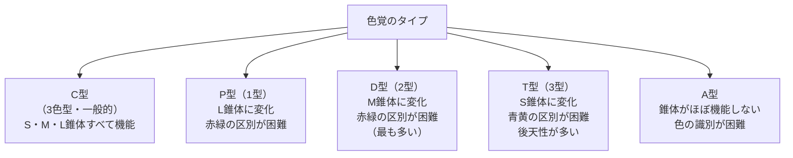

# lesson13: 色覚の分類 — 色の見え方のタイプを知る

## このレッスンで学ぶこと

- 「色覚の多様性」という考え方の意味を理解する
- 色覚のタイプ（C型・P型・D型・T型・A型）の分類と特徴を覚える
- 各タイプに対応する錐体（S・M・L）の関係を理解する
- 日本における色覚特性者の統計（頻度）を理解する
- 先天性・後天性の違いと、色のUDが必要な理由を理解する

## 色覚の多様性とは

「色の見え方は人によって異なる」ことを**色覚の多様性**といいます。

私たちは普段、自分の色の見え方が「標準」だと思いがちです。しかし実際には、生まれつき、または後天的な原因によって、色の見え方が異なる人が一定数います。これは「異常」や「欠陥」ではなく、人間の視覚の多様なあり方のひとつとして捉えることが大切です。

色彩検定UC級では、この色覚の多様性を理解した上で、**より多くの人に情報が届くデザイン（色のUD）**を実践できる能力が求められます。

::: info 用語について
色覚タイプを指す呼び方には、「**色覚異常**」「**色覚特性**」「**色覚の多様性**」などがあります。いずれも公式テキストに登場し、本サイトでも併用します。「**色盲**」「**色弱**」はかつて使われた呼称で、現在の公式テキストや日本眼科学会では使われていません。
:::

## 色覚タイプの分類

色覚は、網膜にある3種類の錐体（S錐体・M錐体・L錐体）のうち、どれが正常に機能しているかによって分類されます。

### C型（Common / 3色型色覚）

**S・M・L錐体がすべて正常に機能している**色覚タイプです。日本語では「3色型色覚」とも呼ばれます。日本人の大多数（男性の約95%、女性の約99.8%）がこのタイプです。UC級のデザインは、このC型ではない人も含めて情報が伝わるように設計します。

### P型（1型色覚 / Protanopia・Protanomaly）

**L錐体（長波長・赤系に感受する錐体）**の欠損または機能変化によって生じる色覚特性です。

- **強度P型（Protanopia）**: L錐体が完全に欠損しているタイプ
- **弱度P型（Protanomaly）**: L錐体の感度が変化しているタイプ

赤みが弱く感じられ、赤と緑・茶などが混同されやすいのが特徴です。

### D型（2型色覚 / Deuteranopia・Deuteranomaly）

**M錐体（中波長・緑系に感受する錐体）**の欠損または機能変化によって生じる色覚特性です。

- **強度D型（Deuteranopia）**: M錐体が完全に欠損しているタイプ
- **弱度D型（Deuteranomaly）**: M錐体の感度が変化しているタイプ

P型と似た混同パターンが見られますが、緑みが弱く知覚されます。**日本では色覚特性者の中で最も多いタイプ**です。

### T型（3型色覚 / Tritanopia）

**S錐体（短波長・青系に感受する錐体）**の欠損によって生じる色覚特性です。青と黄の区別が困難になります。P型・D型と異なり、**後天性（疾患や加齢）によって起こる場合が多い**のが特徴です。先天性のT型は非常にまれです。

### A型（Achromatopsia）

**錐体がほとんど機能しない**タイプです。色を識別できず、明暗の濃淡で世界を捉えます。光に対する過敏さ（**羞明**・しゅうめい）を伴うことも多いです。非常にまれな色覚特性です。

## 色覚タイプの分類図

## 日本における色覚特性者の統計

色覚特性は性別によって頻度が大きく異なります。これはP型・D型が**X染色体に連鎖した遺伝**によるためです。

| タイプ | 日本人男性 | 日本人女性 |
|--------|----------|----------|
| C型（一般的） | 約95% | 約99.8% |
| P型（1型） | 約1.5% | 約0.06% |
| D型（2型） | 約3.5% | 約0.12% |
| P型＋D型 合計 | **約5%（20人に1人）** | **約0.2%（500人に1人）** |
| T型（3型） | 非常にまれ | 非常にまれ |
| A型 | 非常にまれ | 非常にまれ |

::: warning 日本人男性の約5%が色覚特性者
これは決して少ない数字ではありません。クラスに30人いれば、そのうち男性が15人とすると、1〜2人は色覚特性を持つ可能性があります。公共の場所・ウェブサイト・印刷物など、多くの人が見るものでは必ず考慮が必要です。
:::

::: info なぜD型（約3.5%）はP型（約1.5%）より多いのか
D型に関わるM錐体の遺伝子は、P型に関わるL錐体の遺伝子と構造がよく似ており、X染色体上で隣り合っています。この類似から遺伝子の組み換えエラーが起きやすく、結果としてD型が多くなると考えられています。詳しくは [lesson15](/lessons/lesson15/) で解説します。
:::

## 先天性と後天性の違い

### 先天性（生まれつき）

P型・D型のほとんどは先天性であり、**X染色体に関連した遺伝**によって生じます。男性はX染色体を1本しか持たないため（XY）、遺伝的な影響を受けやすく、女性（XX）は2本のX染色体のうち1本が正常であれば発症しにくいです。このため、男女で頻度に大きな差があります。

先天性の色覚特性は、生まれてから変化しません。当事者は**自分の色覚特性に気づいていないことも多く**、学校での検査や眼科受診で初めて知る場合も少なくありません。

### 後天性（疾患・加齢など）

T型の多くは後天性です。また、P型・D型も後天的に変化することがあります。主な原因として以下が挙げられます。

- **緑内障・黄斑変性**: 視神経や黄斑部のダメージによって色覚が変化する
- **糖尿病網膜症**: 網膜への血行障害で色覚が影響を受ける
- **加齢**: 水晶体の黄変により青系の色が見えにくくなる
- **薬剤の副作用**: 一部の薬が色覚に影響することがある

::: info 加齢による色覚変化も色のUDに関係する
後天的な色覚変化は、高齢者への配慮とも重なります。特に「青みが見えにくくなる」という加齢変化はT型に似た変化であり、高齢者を対象としたデザインでも色の使い方に注意が必要です。
:::

## 色のUDが必要な理由

P型・D型を合わせると日本人男性の約5%にのぼります。これは非常に大きな割合であり、社会のあらゆる場面で影響が生じます。

- **公共の掲示・案内板**: 赤と緑の組み合わせを多用すると伝わらない
- **グラフ・図表**: 赤と緑の系列色は区別しにくい
- **地図・路線図**: 複数の色を使う場合、色覚特性者を考慮した色選びが必要
- **ウェブ・アプリ**: エラーを「赤だけ」で示すと見えない人がいる

こうした問題を防ぐために、色だけに依存しない情報伝達（形・記号・テキストとの併用）や、混同されにくい色の選択が求められます。

## キーワード

| 用語 | 説明 |
|------|------|
| 色覚の多様性 | 色の見え方が人によって異なること。多様性のひとつとして捉える考え方 |
| C型（3色型色覚） | S・M・L錐体がすべて機能する、最も頻度の高い色覚 |
| P型（1型色覚） | L錐体の欠損または変化。赤系が弱く見える。日本男性の約1.5% |
| D型（2型色覚） | M錐体の欠損または変化。緑系が弱く見える。日本男性の約3.5%。色覚特性者の中で最多 |
| T型（3型色覚） | S錐体の欠損。青黄の区別が困難。後天性が多い |
| A型 | 錐体がほぼ機能せず、色の識別が困難。非常にまれ |
| 先天性色覚特性 | 生まれつきの色覚の多様性。P型・D型のほとんどがこれにあたる |
| 後天性色覚変化 | 疾患・加齢・薬剤などによって生じる色覚の変化 |
| X染色体連鎖遺伝 | P型・D型の遺伝様式。男性に多く、女性に少ない理由 |

## 試験のポイント

- **5つのタイプ（C・P・D・T・A）の分類と対応する錐体**を覚える
  - P型 → L錐体、D型 → M錐体、T型 → S錐体
- **統計の数値**：日本人男性の約5%（P型1.5% + D型3.5%）が色覚特性者。女性は約0.2%
- **最も多いのはD型**（約3.5%）であることを押さえる
- **P型とD型はどちらも赤緑の区別が困難**（T型は青黄）
- **先天性と後天性の違い**：P型・D型のほとんどは先天性（X染色体連鎖）、T型は後天性が多い
- **「色覚異常」ではなく「色覚特性・色覚の多様性」**という表現が現在の考え方
- 当事者が自分の色覚特性を**知らないことがある**という点も重要
