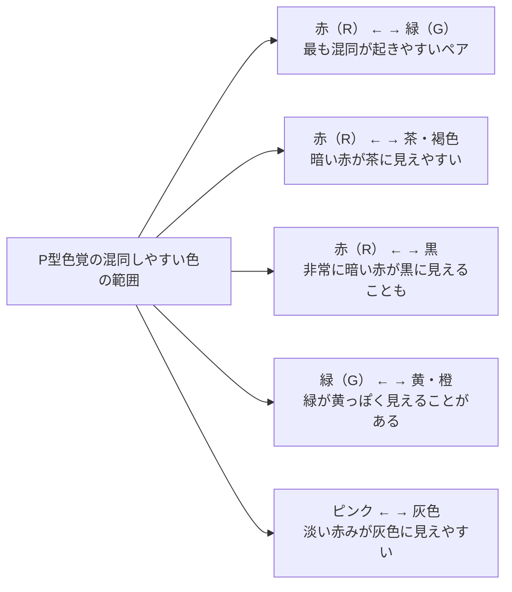

# lesson14: P型色覚（1型色覚）の見え方と混同しやすい色

## このレッスンで学ぶこと

- P型色覚（1型色覚）がどのような色の見え方をするかを理解する
- P型で混同しやすい色の組み合わせを具体的に覚える
- 日常生活でP型の人が困りやすい場面を知る
- L錐体の役割と、その欠損・変化が見え方に与える影響を理解する
- P型とD型の見え方の違いと共通点を整理する

## P型色覚（1型色覚）とは

P型色覚（1型色覚）は、**L錐体（長波長錐体）**の欠損または機能変化によって生じる色覚特性です。「P」は英語の **Protan（プロタン）**に由来します。Protan は「最初の（プロト＝first）」という意味で、歴史的に最初に詳しく研究された色覚特性であることからこの名前が付いています。

L錐体は**長波長の光（赤〜黄色系）**に感受します。L錐体が正常に機能しないと、長波長の光に対する感度が低下し、**赤みを感じにくくなります**。

::: info P型の強度と弱度
- **P型強度（Protanopia / 1色盲）**: L錐体が完全に欠損している状態。より強く色の混同が生じる
- **P型弱度（Protanomaly / 1色弱）**: L錐体の感度が変化しているが存在する状態。強度より影響は小さい

日本人男性の統計では、P型強度が約0.5%、P型弱度が約1.0%で、合計約1.5%です。
:::

## P型色覚の見え方の特徴

### 赤みが弱く知覚される

L錐体（赤系に感受）が正常に機能しないため、**赤みのある色が本来より暗く・弱く見えます**。同じ明るさの赤とC型の人が見た赤を比べると、P型の人には暗く沈んで見える傾向があります。

### 赤と緑・茶が混同されやすい

P型では、C型の人が「明らかに違う」と感じる赤と緑・茶が、似たような色に見えることがあります。これはL錐体の応答が変化しているため、赤・緑・茶の色の違いを識別するための信号が十分に得られないことによります。

### 色相環のどの範囲が混同されやすいか

P型で混同されやすいのは主に**色相環の赤橙〜緑の範囲**です。青・紫・青紫の区別は比較的できます。

## 混同しやすい色の組み合わせ一覧

| 組み合わせ | 説明 |
|-----------|------|
| 赤 ↔ 緑 | 最も代表的な混同。特に同程度の明るさの場合に顕著 |
| 赤 ↔ 茶・褐色 | 赤みのある茶と赤が似て見える |
| 赤 ↔ 黒 | 暗い赤（えんじ、ワイン色）が黒に近く見えることがある |
| 緑 ↔ 橙 | 緑が橙・茶色寄りに見えることがある |
| 緑 ↔ 黄 | 緑と黄の境界が曖昧になりやすい |
| ピンク ↔ 灰色 | 淡い赤みのピンクが無彩色の灰色と混同されやすい |
| 赤紫 ↔ 青 | 赤みが弱く見えるため、赤紫が青寄りに見えることがある |

::: warning デザインへの応用
「赤と緑を使えばわかりやすい」というのはC型視点です。P型・D型の人には赤と緑が似て見えることがあるため、**「赤＝OK・緑＝NG」のような配色は使わない**ことが重要です。
:::

## 日常生活でP型の人が困りやすい場面

### 交通・信号

**信号機の赤・青・黄**のうち、特に赤が暗く見える傾向があります。現在の信号機は**点灯位置（上が赤・下が青）**で判断できるよう設計されており、これはUDの考え方が反映された例です。

また、工事現場の誘導灯（赤と緑の棒）や、電車のホームドアのランプなどでも困ることがあります。

### 地図・図表

- **地下鉄の路線図**：赤と緑の路線が同時に使われていると区別しにくい
- **棒グラフ・折れ線グラフ**：赤の系列と緑の系列を同時に使うと区別できない
- **地図の色分け**：赤と緑で区域分けされた地図が判別しにくい

### 自然・食品

- **トマト**：葉（緑）と実（赤）の色の違いが分かりにくく、熟れ具合の判断が困難
- **紅葉**：赤く色づいた葉と緑の葉の区別が難しい場合がある
- **フルーツの熟れ具合**：色だけで熟度を判断するりんご・いちごなど

### 医療・安全

- **非常口のサイン**：緑地に白の人型（現在は問題が少ない）や赤いランプ
- **薬の色分け**：赤と緑で区別された薬の仕分けが困難
- **ケーブル・配線の色識別**：電気工事や電子機器の赤と緑のケーブル

::: tip P型の人の戦略
P型の人は色だけでなく、**位置・形・明暗・テキスト**などの情報を組み合わせて判断しています。信号の「上が赤」「下が青」、野菜の「硬さ・つや・形」で熟れ具合を判断するなど、日常的に色以外の手がかりを活用しています。
:::

## P型とD型の比較

P型とD型はどちらも「赤緑の区別が困難」という点で似ていますが、**機能変化している錐体が異なります**。

| 比較点 | P型（1型） | D型（2型） |
|--------|----------|----------|
| 異常な錐体 | L錐体（長波長・赤系） | M錐体（中波長・緑系） |
| 主な知覚変化 | 赤みが弱く感じられる | 緑みが弱く感じられる |
| 混同しやすい色 | 赤・緑・茶・ピンク・灰 | 赤・緑・茶・黄・橙（P型と類似） |
| 日本男性の頻度 | 約1.5% | 約3.5%（より多い） |
| 色相の「寄り方」 | 赤が暗く・緑寄りに見えやすい | 赤が黄寄りに見えやすい |

実用的なUDデザインでは、P型とD型を個別に区別するよりも、**「赤緑の混同が生じる可能性がある」**と考えて両方に対応した配色を心がけることが重要です。

なお、P型・D型が先天性（X染色体連鎖の遺伝）であるのに対し、T型（3型）は後天性・加齢によるものが多く、高齢者の見え方（[lesson21](/lessons/lesson21/)）とも関連します。P型・D型・T型の位置づけをあわせて押さえておきましょう。

## キーワード

| 用語 | 説明 |
|------|------|
| P型色覚（1型色覚） | L錐体の欠損または変化による色覚特性。日本男性の約1.5%。赤みが弱く感じられる |
| L錐体 | 長波長（赤〜黄系の光）に感受する錐体。P型ではこれが正常に機能しない |
| Protan（プロタン） | P型の英語由来。「最初の」という意味で、最初に研究された色覚特性 |
| P型強度（Protanopia） | L錐体が完全に欠損したタイプ。日本男性の約0.5% |
| P型弱度（Protanomaly） | L錐体の感度が変化したタイプ。日本男性の約1.0% |
| 赤緑混同 | P型・D型で赤と緑が似て見える現象。UCデザインで最も重要な課題のひとつ |
| 色覚補償戦略 | 色覚特性者が色以外の手がかり（位置・形・明暗・テキスト）を活用する行動 |

## 試験のポイント

- **P型の原因**：L錐体（長波長・赤系）の欠損または変化
- **混同しやすい色の代表例**：赤↔緑、赤↔茶、ピンク↔灰色
- **日本人男性の約1.5%**がP型（強度0.5%＋弱度1.0%）
- **信号機の赤が暗く見える**という具体例を覚える
- P型の「赤みが弱く知覚される」という特徴（D型は緑みが弱く知覚）
- **P型はD型より頻度が低い**（D型のほうが多い：3.5%）
- グラフ・地図などで赤と緑を同時に使うことの問題点を説明できるようにする
