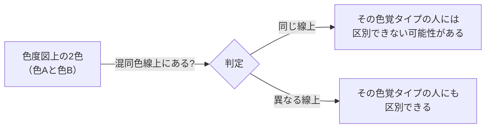
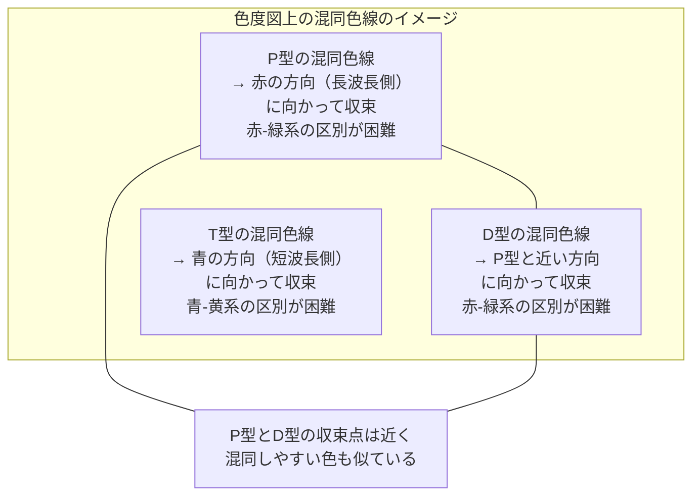

# lesson15: 混同色線 — 色度図で見分けにくい色を知る

## このレッスンで学ぶこと

- CIE xy色度図の読み方と構造を理解する
- 混同色線（Dichromatic Confusion Line）の概念を説明できる
- P型・D型・T型それぞれの混同色線の方向と特徴を把握する
- 混同色線の知識をデザインの実務に活かす考え方を身につける
- 「なぜ赤と緑がNGなのか」を科学的に説明できるようになる

---

## CIE xy色度図とは

色覚の話をするとき、「どの色とどの色が区別しにくいか」を視覚的に表すためによく使われるのが**CIE xy色度図（シーアイイー エックスワイ色度図）**です。CIEとは国際照明委員会（Commission Internationale de l'Éclairage）の略称で、1931年に国際標準として定められました。

### 色度図の構造

色度図は次のような構造をしています。

| 要素 | 説明 |
|------|------|
| 横軸（x 値） | 赤みの強さを表す。右に行くほど赤みが強い |
| 縦軸（y 値） | 緑みの強さを表す。上に行くほど緑みが強い |
| 馬蹄形の曲線（スペクトル軌跡） | 単波長の光（可視光）の色が並ぶ外縁部の曲線 |
| 直線部分（紫線） | 可視光スペクトルの両端（赤と紫）をつないだ直線 |
| 白色点 | 図の内側にある「等エネルギー白色」の位置（x≈0.33, y≈0.33付近） |

馬蹄形の**外側の曲線上**には単純な波長の光が並んでいます。曲線の左端が短波長側（紫・青）、右端が長波長側（赤）です。馬蹄形の**内側**には、単純な波長の光を混ぜた色（白や複合色）が位置します。

::: info 色度図は「彩度・色相」を表す地図
色度図は色相と彩度の情報を表す「地図」のようなものです。白色点に近いほど彩度が低く（くすんだ色）、馬蹄形の外縁部に近いほど彩度が高い（鮮やかな色）です。
:::

---

## 混同色線とは

**混同色線（Confusion Line / Dichromatic Confusion Line）**とは、色度図上で「ある色覚タイプの人が同じ色に見えてしまう色の集合」を結んだ直線のことです。

これを「線」として描けるのは、色度図の性質によるものです。2色型色覚（P型・D型・T型など、有効に機能する錐体が2種類の状態）の人が「区別できない色」は、色度図上でひとつの直線上に集まります。その直線が混同色線です。

::: warning 重要な意味
**混同色線上にある2つの色は、その色覚タイプの人には「色相の面で」区別しにくくなります。** どんなに明確に異なる色名であっても、混同色線上にあれば色相だけでは見分けにくい場合があります。ただし、2色の間に十分な明度差があれば、「明るい色・暗い色」として識別できる場合もあります。
:::

---

## P型・D型・T型の混同色線

P型・D型・T型の混同色線はそれぞれ異なる方向を向いており、色度図上で「収束する点（収束点）」を持っています。

### P型（1型：L錐体の機能不全）の混同色線

- **収束する方向**: 色度図の右端（長波長・赤の方向）
- **結ぶ色の組み合わせ**: 赤みがかった色と緑みがかった色が同一線上に来ることが多い
- **代表的な混同ペア**: 赤（2R系）と緑（10GY系）、赤とオリーブ色、ピンクと薄い灰色

### D型（2型：M錐体の機能不全）の混同色線

- **収束する方向**: P型と非常に近い方向。収束点が少しずれる
- **傾向**: P型と同様に赤と緑の区別が困難
- **特徴**: P型より緑側の感受性に変化がある分、混同する色の範囲も少し異なる

### T型（3型：S錐体の機能不全）の混同色線

- **収束する方向**: 色度図の上端（短波長・青の方向）
- **結ぶ色の組み合わせ**: 青みがかった色と黄みがかった色が同一線上に来ることが多い
- **代表的な混同ペア**: 青と黄、紫と薄い黄緑

::: info P型とD型の混同色線の方向は似ている
P型とD型の混同色線は収束点が近いため、区別しにくい色の傾向がよく似ています。これが「P型・D型どちらも赤と緑が見分けにくい」と言われる理由です。
:::

---

## 混同しやすい代表的な色の組み合わせ

P型・D型の人が混同しやすい代表的な色の組み合わせは以下の通りです。これらの組み合わせは混同色線上（またはその近傍）に位置しています。

| 組み合わせ | 混同しやすいタイプ |
|-----------|--------------|
| 赤（2R付近）と緑（10GY付近） | P型・D型 |
| 赤とオリーブ色 | P型・D型 |
| ピンクと薄い灰色 | P型・D型 |
| ピンクと薄い緑 | P型・D型 |
| 青と黄 | T型 |
| 紫と薄い黄緑 | T型 |

::: tip 「明度差があれば区別できる」は正確ではない
色覚特性のある人が区別できないのは「色相」であることが多く、明度差があっても色相の違いだけでは区別できない場合があります。ただし、明度差が大きければ「明るい色」「暗い色」という形で区別が付きやすくなります。
:::

---

## 混同色線の実務への活用

混同色線の概念を知ると、「なぜ赤と緑が避けるべき組み合わせなのか」が腑に落ちます。単に「NG色の組み合わせを暗記する」のではなく、**原理から理解**することで、試験問題にも柔軟に対応できます。

実務でのポイントは以下の通りです。

1. **シミュレーターで確認する**: 色度図を手計算で解析するのは現実的ではありません。Adobe IllustratorのUDプラグインや、専用のカラーシミュレーターを使って確認します
2. **色の組み合わせを事前にチェックする**: 特に情報の区別に色を使うグラフ・地図・標識では混同色線の概念を活かして確認します
3. **色以外の情報も補足する**: 混同される可能性がある場合は、形・文字・パターンなど色以外の情報も一緒に使うことで誰にでも伝わるデザインになります

::: info 色度図を読める必要はない
試験では「色度図を計算で解く」問題は出ません。混同色線の概念・方向・混同しやすい色の組み合わせが説明できることが求められます。
:::

---

## キーワード

| 用語 | 説明 |
|------|------|
| CIE xy色度図 | 国際照明委員会が定めた色の地図。X軸が赤み、Y軸が緑みを表す |
| スペクトル軌跡 | 色度図上の馬蹄形の曲線。単波長の可視光が並ぶ外縁部 |
| 白色点 | 色度図内側の等エネルギー白色の位置（x≈0.33, y≈0.33付近） |
| 混同色線（Dichromatic Confusion Line） | 特定の色覚タイプが「同じ色に見えてしまう色」を結んだ色度図上の直線 |
| P型の混同色線 | 長波長（赤）方向に収束。赤と緑系の色を結ぶ |
| D型の混同色線 | P型と近い方向に収束。赤と緑系の色を結ぶ |
| T型の混同色線 | 短波長（青）方向に収束。青と黄系の色を結ぶ |
| 収束点 | 混同色線が集まっていく色度図上の点 |

---

## 試験のポイント

- **混同色線の定義**：色度図上で「その色覚タイプが同じ色に見えてしまう色」を結んだ直線
- **P型・D型の混同色線**は長波長（赤）方向に収束し、赤と緑系の区別が困難
- **T型の混同色線**は短波長（青）方向に収束し、青と黄系の区別が困難
- P型とD型の混同色線は**収束点が近く、混同する色の傾向も似ている**
- 混同色線上の2色は「その色覚タイプには色相の面で区別しにくい」という意味を押さえる（明度差があれば見分けられる場合もある）
- CIE xy色度図はX軸＝赤み、Y軸＝緑み、外縁部ほど彩度が高い
- 実務では「シミュレーターで確認する」ことが現実的な対応策
