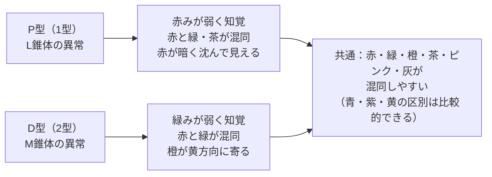

# lesson15: D型色覚（2型色覚）の見え方と混同しやすい色

## このレッスンで学ぶこと

- D型色覚（2型色覚）がどのような色の見え方をするかを理解する
- D型で混同しやすい色の組み合わせを具体的に覚える
- D型がP型と比べてどのように多いか（統計）を把握する
- M錐体の役割と、その欠損・変化が見え方に与える影響を理解する
- P型・D型合わせた実務への影響と色のUDの対策を理解する

## D型色覚（2型色覚）とは

D型色覚（2型色覚）は、**M錐体（中波長錐体）**の欠損または機能変化によって生じる色覚特性です。「D」は英語の **Deutan（ドゥータン）**に由来します。Deutanは「2番目の（デュート＝second）」という意味で、P型（1型）に続いて体系的に研究されたことからこの名前が付いています。

M錐体は**中波長の光（緑系）**に感受します。M錐体が正常に機能しないと、中波長の光に対する感度が低下し、**緑みを感じにくくなります**。

**D型は色覚特性者の中で最も多いタイプ**であり、日本人男性全体の約3.5%を占めます。これはP型（約1.5%）と合わせると約5%（20人に1人）になります。

::: info D型の強度と弱度
- **D型強度（Deuteranopia）**: M錐体が完全に欠損している状態。より強く色の混同が生じる。日本男性の約1%
- **D型弱度（Deuteranomaly）**: M錐体の感度が変化しているが存在する状態。日本男性の約2.5%

弱度（Deuteranomaly）は全色覚特性の中で最も頻度が高いタイプです。
:::

## D型色覚の見え方の特徴

### 緑みが弱く知覚される

M錐体（緑系に感受）が正常に機能しないため、**緑みのある色が本来と異なって知覚されます**。赤と緑の区別が困難になりますが、P型とは色の「寄り方」がやや異なります。

### 赤みのあるオレンジが黄色方向に寄って見える

D型では、赤みのあるオレンジや橙色が黄色・黄緑系に寄って見えやすい傾向があります。P型が赤を「暗く・緑方向に」感じやすいのとは少し異なるパターンです。

### P型との比較

P型は「赤みが弱く（赤が暗くなる）」という特徴があるのに対し、D型は「緑みが弱く（緑が黄寄りに見える）」という特徴があります。どちらも最終的に赤と緑の混同が起きますが、その「色の見え方の歪み方」は厳密には異なります。

## 混同しやすい色の組み合わせ一覧

| 組み合わせ | 説明 |
|-----------|------|
| 赤 ↔ 緑 | P型と同様に最も代表的な混同。特に同程度の明るさの場合に顕著 |
| 赤 ↔ 茶・褐色 | 赤みのある茶と赤の区別が困難 |
| 緑 ↔ 黄 | 緑が黄みがかって見えるため、黄と区別しにくい |
| 緑 ↔ 橙 | 緑と橙が似て見える（D型は黄方向に寄るため） |
| ピンク ↔ 薄い緑 | 淡い赤みのピンクが薄緑と混同されやすい |
| 茶 ↔ 緑・オリーブ | 茶色とオリーブ色（暗い黄緑）が似て見える |
| 赤紫 ↔ 青紫 | 赤みの成分が弱くなるため、赤紫が青寄りに見えることがある |

::: tip P型とD型で混同パターンが似ている理由
P型（L錐体）もD型（M錐体）も、どちらも「赤と緑を区別するために必要な錐体」が影響を受けています。人間の色覚では、赤と緑の区別は主にL錐体とM錐体の応答の差から生まれます。どちらかが欠損・変化すると、この「差」が小さくなるため、結果として似たような混同パターンになります。
:::

## D型が最も多い色覚特性者である理由

[lesson13](/lessons/lesson13/) で見たとおり、D型は色覚特性者の中で最も多いタイプです。

::: info発展：なぜD型が多いのか（試験には出にくい内容）
理由は遺伝子の構造にあります。M錐体の遺伝子（OPN1MW遺伝子）はL錐体の遺伝子（OPN1LW遺伝子）と非常に似ており、X染色体上で隣接して存在します。この類似性から**遺伝子の組み換えエラーが起きやすく**、M錐体に影響する変異が生じやすいと考えられています。仕組みよりも「D型は約3.5%で最も多い」という事実を覚えれば十分です。
:::

::: info D型はP型の約2倍以上
D型（約3.5%）はP型（約1.5%）の2倍以上の頻度です。タイプ別頻度の一覧は [lesson13](/lessons/lesson13/) を参照してください。
:::

## D型に特有の困りごと

D型の混同パターンはP型と非常に似ているため、困りやすい場面もほぼ共通します（信号・路線図・グラフなど）。日常事例の網羅は [lesson20](/lessons/lesson20/) に集約しています。

D型で特に目立つのが **グラフ・ダッシュボードの配色** です。「目標達成＝緑、未達成＝赤」のような、ビジネス文書で多用される赤緑の対比はD型が最も影響を受ける構造です。

::: warningビジネス文書・プレゼンでの注意
会社の会議資料・プレゼン・ダッシュボードでは、赤と緑を同時に使った配色が頻繁に見られます。日本人男性の20人に1人が見分けにくいと考えれば、この配色の問題は実務に直結します。
:::

## P型・D型共通の特徴と対策

### 共通の特徴

- どちらも「赤緑の区別が困難」
- 青・紫・黄の区別は比較的できる
- 明暗（明度差）は識別できる → **明度差を大きくすると見分けやすくなる**
- 色相が同じでも彩度・明度が大きく異なれば識別できることがある

### 色のUDの対策

| 問題のある使い方 | 改善策 |
|----------------|--------|
| 赤と緑だけで情報を区別する | 明度差をつける・形や記号を追加する・テキストを添える |
| グラフの系列を赤と緑で区別する | 青とオレンジなど混同されにくい組み合わせに変更する |
| エラーを「赤だけ」で示す | アイコン（×マーク）や文言（「エラー」）を併記する |
| 色のみで状態を示す | 模様・ハッチング・形・位置など色以外の属性を加える |

::: tip赤緑以外で使いやすい組み合わせ
P型・D型に混同されにくい色の組み合わせとしては、**青とオレンジ**、**青と黄**、**紫と黄緑**などがあります。ただし、「この組み合わせは絶対に安全」という万能な答えはなく、コントラストや明度差の確保が重要です。
:::

## キーワード

| 用語 | 説明 |
|------|------|
| D型色覚（2型色覚） | M錐体の欠損または変化による色覚特性。日本男性の約3.5%。色覚特性者の中で最多 |
| M錐体 | 中波長（緑系の光）に感受する錐体。D型ではこれが正常に機能しない |
| Deutan（ドゥータン） | D型の英語由来。「2番目の」という意味 |
| D型強度（Deuteranopia） | M錐体が完全に欠損したタイプ。日本男性の約1% |
| D型弱度（Deuteranomaly） | M錐体の感度が変化したタイプ。日本男性の約2.5%。全色覚特性で最も頻度が高い |
| 赤緑混同 | P型・D型で赤と緑が似て見える現象。色のUDで最も重要な課題のひとつ |
| 明度差による対策 | 色覚特性者でも明暗の区別はできるため、明度差を大きくすることで識別しやすくなる |

## 試験のポイント

- **D型の原因**：M錐体（中波長・緑系）の欠損または変化
- **D型は色覚特性者の中で最も多い**：日本男性の約3.5%（P型の約1.5%より多い）
- **P型＋D型合計で日本男性の約5%**（20人に1人）
- **D型の特徴**：緑みが弱く知覚される。赤みのあるオレンジが黄方向に寄って見える
- **混同しやすい色**：赤↔緑、緑↔黄、緑↔橙、茶↔オリーブ
- **P型とD型の共通点**：どちらも赤緑の区別が困難。青・紫・黄は比較的区別できる
- **実務対策**：赤と緑だけで情報を区別しない。形・記号・テキストを色に加える。明度差を確保する
- **D型弱度（Deuteranomaly）が全色覚特性タイプの中で最も頻度が高い**ことを覚える
