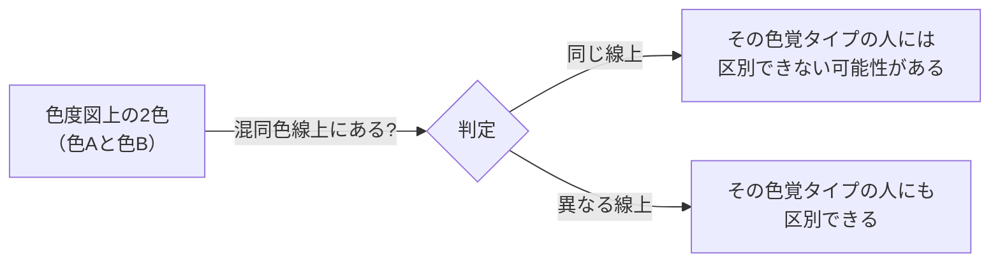

# lesson16: 混同色線 — 同じ色に見える色を結ぶ線

## このレッスンで学ぶこと

- 混同色線（Dichromatic Confusion Line）の概念を理解する
- P型・D型・T型それぞれが混同しやすい色の方向を把握する
- 「なぜ赤と緑がNGなのか」を原理から説明できるようになる
- 混同色線の知識をデザインの実務に活かす考え方を身につける

[lesson14](/lessons/lesson14/)・[lesson15](/lessons/lesson15/) では、P型・D型の人が赤と緑を混同しやすいことを具体例で学びました。本レッスンでは、その「なぜ起きるのか」を **混同色線** という考え方で押さえます。

## 混同色線とは

**混同色線（Confusion Line / Dichromatic Confusion Line）** とは、ある色覚タイプの人にとって**同じ色に見えてしまう色を結んだ直線**のことです。

2色型色覚（P型・D型・T型のように有効に機能する錐体が2種類の状態）の人が「区別できない色」は、色を平面に並べた地図（色度図）の上で1本の直線上に集まります。その直線を混同色線と呼びます。

::: warning 重要な意味
**混同色線上にある2つの色は、その色覚タイプの人には「色相の面で」区別しにくくなります。** どんなに名前の違う色でも、混同色線上にあれば色相だけでは見分けにくくなります。明度差（明るさの違い）があれば「明るい色・暗い色」として識別の手がかりにできますが、これは色相に頼らずに済む補助的な手がかりであって、色相の混同そのものは解消しません。
:::

## P型・D型・T型の混同しやすい方向

P型・D型・T型では、混同色線が向かう「方向」が違います。これが「どの色とどの色が見分けにくいか」の違いになります。

| タイプ | 混同色線の方向 | 主に区別しにくい色相 |
|--------|--------------|--------------------|
| P型（1型） | 長波長（赤）方向 | 赤と緑 |
| D型（2型） | 長波長（赤）方向（P型と近い） | 赤と緑 |
| T型（3型） | 短波長（青）方向 | 青と黄 |

::: info P型とD型の混同色線の方向は似ている
P型とD型の混同色線の向きは近いため、区別しにくい色の傾向もよく似ています。これが「P型・D型どちらも赤と緑が見分けにくい」と言われる理由です。
:::

## 混同しやすい代表的な色の組み合わせ

混同色線上（またはその近傍）にある代表的な色の組み合わせを覚えておきましょう。

| 組み合わせ | 混同しやすいタイプ |
|-----------|--------------|
| 赤と緑 | P型・D型 |
| 赤とオリーブ色 | P型・D型 |
| ピンクと薄い灰色 | P型・D型 |
| ピンクと薄い緑 | P型・D型 |
| 青と黄 | T型 |
| 紫と薄い黄緑 | T型 |

::: tip 混同色線上の色は明度差で補う
これらは色相としては区別困難ですが、十分な明度差があれば「明るい色／暗い色」として手がかりにできます。色相だけに頼らないことが、UD配色の基本です。
:::

## 混同色線の実務への活用

混同色線の概念を知ると、「なぜ赤と緑が避けるべき組み合わせなのか」が腑に落ちます。「NG色の組み合わせを暗記する」のではなく、**原理から理解**することが大切です。

実務では次のように活かします。

1. **シミュレーターで確認する**：手計算ではなく、シミュレーターで色覚タイプ別の見え方を確認します（[lesson27](/lessons/lesson27/)）
2. **色の組み合わせを事前にチェック**：グラフ・地図・標識など情報を色で区別する場面では特に重要
3. **色以外の情報も補足**：混同される可能性がある場合は、形・文字・パターンを併用する

::: info 試験では計算問題は出ない
試験では「色度図を計算で解く」問題は出ません。混同色線の **概念・方向・混同しやすい色の組み合わせ** が説明できれば十分です。
:::

## キーワード

| 用語 | 説明 |
|------|------|
| 混同色線（Dichromatic Confusion Line） | 特定の色覚タイプが同じ色に見えてしまう色を結んだ直線 |
| P型の混同色線 | 長波長（赤）方向。赤と緑系の色を結ぶ |
| D型の混同色線 | P型と近い方向。赤と緑系の色を結ぶ |
| T型の混同色線 | 短波長（青）方向。青と黄系の色を結ぶ |

## 試験のポイント

- **混同色線の定義**：その色覚タイプが同じ色に見えてしまう色を結んだ直線
- **P型・D型の混同色線**は長波長（赤）方向に向かい、赤と緑系の区別が困難
- **T型の混同色線**は短波長（青）方向に向かい、青と黄系の区別が困難
- P型とD型は **混同しやすい色の傾向が似ている**
- 混同色線上の2色は「色相の面で区別しにくい」という意味。明度差があれば見分けられる場合もある
- 実務での対応は **シミュレーターで確認 + 色以外の手がかりを併用**
