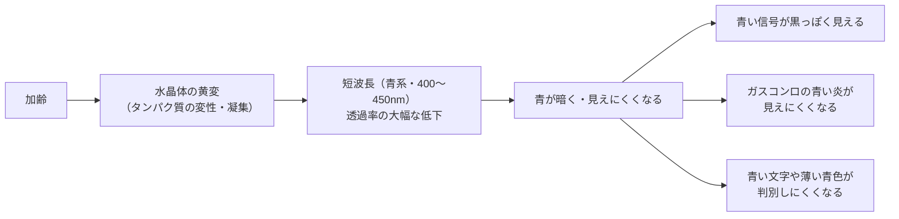
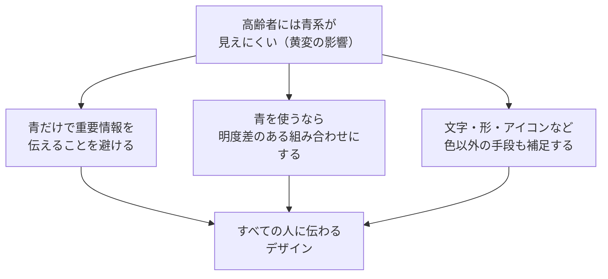

# lesson18: 水晶体の黄変 — 青が見えにくくなる理由

## このレッスンで学ぶこと

- 水晶体の黄変（おうへん）のメカニズムを理解する
- 黄変によって青系の色の透過率が下がる理由を説明できる
- 黄変と白内障の違いを区別する
- 日常生活への影響（青い信号・炎・テキスト）を把握する
- 高齢者向けデザインで青系を扱うときの注意点を身につける

---

[lesson17](/lessons/lesson17/)で触れた水晶体の黄変を、ここで詳しく見ていきます。

---

## まず「なぜ重要か」を知る

水晶体の黄変は、高齢者の日常で次のような困りごとを生みます。配色や安全に直結する身近な例です。

- **青信号が黒っぽく見える**: 青と緑の区別が難しくなります
- **ガスコンロの青い炎が見えにくい**: 火が消えているかの判断が難しくなります
- **青い文字やランプが判別しにくい**: 点灯しているか分かりにくくなります

これらが起きる理由を、次のメカニズムから理解していきましょう。

---

## 水晶体とは

目の中で光を屈折させてピントを合わせる役割を担うのが**水晶体**です。直径約9mm・厚さ約4mmのレンズ状の透明な組織で、カメラでいえばレンズにあたります。

水晶体は外側の「水晶体嚢（のう）」と呼ばれる袋と、その中の「水晶体線維（クリスタリンというタンパク質）」でできています。若いうちは水晶体は**ほぼ無色透明**で、可視光のすべての波長を均等に透過させます。

---

## 黄変のメカニズム

加齢とともに水晶体は**黄変（おうへん）**します。黄変とは、文字通り水晶体が黄みがかった色に変わっていく現象です。

### なぜ黄変するのか

水晶体の主成分であるタンパク質（クリスタリン）は、加齢とともに次のように変化します。

1. タンパク質が酸化・変性する
2. 変性したタンパク質同士が凝集（くっついて固まる）する
3. 凝集したタンパク質が**黄色〜褐色に着色**する
4. 水晶体全体が黄みを帯びていく

この変化は20代後半から少しずつ始まり、60〜70代以降に顕著になります。

::: info 紫外線の影響
紫外線は水晶体のタンパク質変性を促進させます。日差しが強い地域に住む人や屋外労働が多い人では黄変が早まる傾向があると言われています。サングラスや帽子による紫外線対策は水晶体の黄変進行を遅らせる効果があるとされます。
:::

---

## 黄変が色覚に与える影響

### 短波長の光が吸収される

水晶体が黄みがかると、**短波長（400〜450nm付近）の青系の光が黄変した水晶体に吸収されやすくなります**。黄色と青は補色の関係にあるため、黄色くなった水晶体は青の光を選択的に吸収します。

結果として、短波長の光が網膜まで届く量が大きく減少します。

### 若い人と高齢者の透過率の違い

20代の水晶体は短波長（400〜450nm）の光をよく通しますが、80代の水晶体では同じ波長の光の透過率が大幅に低下します。この差は可視光の中でも**短波長側（青・紫系）で特に顕著**で、長波長側（赤・橙系）ではそれほど差がありません。

### 具体的な影響

| 場面 | 影響 |
|------|------|
| 青い信号（青信号） | 青みが消えて黒っぽく見え、青・緑の区別が難しくなる |
| ガスコンロの炎 | 青い炎が認識しにくくなる（消えているか判断できないリスク） |
| 青い文字・UI | 「青い文字」が黒に近く見えてしまう |
| 薄い青の背景 | 白と混同しやすくなる |
| 青いランプ・LED | 点灯しているかどうか判断が難しくなる |

::: warning ガスコンロの安全リスク
ガスコンロの炎は通常青い炎（正常燃焼）ですが、高齢者には見えにくくなることがあります。「炎が消えているのか、青い炎が出ているのか」の判断が困難になり、事故のリスクにつながるため、音や光（赤いランプ）での補足が重要です。
:::

---

## 黄変と白内障の違い

黄変と白内障はどちらも水晶体の変化ですが、別の概念です。

| 比較 | 黄変 | 白内障 |
|------|------|--------|
| 変化の内容 | タンパク質の着色（黄〜褐色） | タンパク質の凝集による白濁（混濁） |
| 主な症状 | 青系の色の識別困難 | 視力低下・かすみ・グレア増加 |
| 進行 | 緩やかなグラデーション | 混濁が進むと著しく視力が低下 |
| 治療 | 治療なし（進行を遅らせることはできる） | 手術で人工レンズに置き換えることができる |
| 関係 | 黄変が進むと白内障に移行することがある | 白内障は黄変の「進んだ状態」とも言える |

::: tip 黄変と白内障はつながっている
黄変（着色）と白内障（混濁）は同じタンパク質変性が引き起こす変化です。黄変が進行すると白内障になることもあります。試験では「黄変＝青系の識別困難」「白内障＝視力低下・グレア」という対応で覚えましょう。
:::

---

## UD（ユニバーサルデザイン）への対応

水晶体の黄変を理解したうえで、高齢者向けデザインに活かせるポイントを整理します。

### 青系の情報色の使用に注意

**青だけで重要情報を伝えることは避けるべき**です。高齢者には青が暗く見えてしまうため、「青い部分＝重要」というデザインは機能しない可能性があります。

### 青と組み合わせるなら明度差を確保

青系の色を使う場合は、**明度差のある組み合わせ**にすることで比較的識別しやすくなります。

- 青（暗め）× 白（明るい背景）→ 比較的見えやすい
- 青（暗め）× 黄（明るい） → 明度差があり見えやすい
- 青（暗め）× 黒（暗い背景）→ 区別しにくい

### 色以外の手段を補う

青系の情報には、色だけでなく**文字・形・アイコン**も組み合わせて情報を伝えるようにします。

---

## キーワード

| 用語 | 説明 |
|------|------|
| 水晶体 | 目の中でピント調節を担うレンズ状の透明組織。主成分はクリスタリン（タンパク質） |
| クリスタリン | 水晶体を構成するタンパク質。加齢で変性・凝集し黄変・白濁の原因となる |
| 黄変（おうへん） | 加齢によりクリスタリンが変性・着色し、水晶体が黄みを帯びる現象 |
| 短波長の光 | 波長400〜450nm付近の青・紫系の光。黄変により透過率が大きく低下する |
| 白内障（Cataract） | 水晶体が混濁する眼疾患。視力低下・グレア増加・色覚変化が起きる |
| 補色関係 | 黄と青は補色。黄みがかった水晶体が青の光を吸収しやすくなる |
| 透過率の低下 | 高齢者の水晶体は若者と比べ短波長の透過率が大幅に低い |

---

## 試験のポイント

- **黄変のメカニズム**：クリスタリン（タンパク質）が変性・凝集して黄〜褐色になる
- 黄変により**短波長（青系）の透過率が大幅低下** → 青が暗く・見えにくくなる
- **黄変 ≠ 白内障**：黄変は着色、白内障は混濁。症状も異なる
- 黄変の具体的影響：**青い信号・ガスコンロの炎・青い文字**が見えにくくなる
- UDへの対応：**青だけで重要情報を伝えない**、明度差のある組み合わせを使う
- 黄変は**補色の関係**（黄と青）で青系の光が吸収されることを理解する
- 白内障は手術で人工レンズへの置き換えが可能、黄変単体には根本的な治療なし
