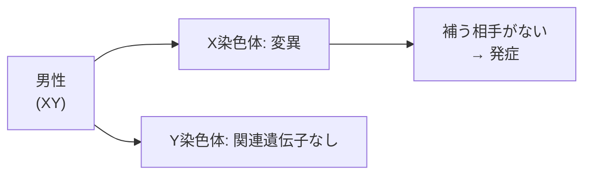

# lesson18: 色覚の遺伝 — なぜ男性に多いのか

## このレッスンで学ぶこと

- P型・D型が**X染色体劣性遺伝**であることを理解する
- 男性（XY）と女性（XX）で発症率が大きく異なる理由を知る
- 女性が**保因者（キャリア）**になるしくみを理解する
- T型・A型は遺伝形式が異なる（常染色体遺伝）ことに触れる

::: infoこのレッスンの位置づけ
試験で頻出のテーマではありませんが、なぜ男女差があるのかという根拠を理解することで、配慮の意義がより深まります。遺伝の用語が出てきますが、本レッスン冒頭の「遺伝の基礎」で最小限のことだけ押さえれば読み進められます。
:::

## なぜ「男性に多い」のか

色覚特性の頻度は、日本人男性で約 **5%（20人に1人）**、女性で約 **0.2%（500人に1人）**です（[lesson13](/lessons/lesson13/) 参照）。男女でこれほど大きな差があるのは、P型・D型が**X染色体**に乗った**劣性遺伝**だからです。

### 染色体の基本

人の細胞には23対46本の染色体があります。そのうち **1対（2本）が性染色体**で、性別を決めます。

- 男性: **XY**（X染色体1本＋ Y染色体1本）
- 女性: **XX**（X染色体2本）

P型・D型の原因となる遺伝子は**X染色体上**にあります。Y染色体には対応する遺伝子がありません。

### 遺伝の基礎

「劣性遺伝」の話に入る前に、ごく簡単な遺伝のしくみを確認しておきます。

- 人の遺伝情報は、**染色体**上の**遺伝子**に書かれています
- 多くの遺伝子は**対（2つで1組）**になっており、一方は父から、もう一方は母から受け継ぎます
- 対になった遺伝子は、必ずしも同じ働きをするとは限りません。働き方が異なる場合、どちらが「表に出る」かのルールがあります

そのルールのうち、「対の一方が正常であれば、その正常な方の働きが優先される」性質を**劣性遺伝（潜性遺伝）**と呼びます。色覚特性のうちP型・D型は、この劣性遺伝のパターンに従います。

## 劣性遺伝のしくみ

「**劣性**」とは、対になる遺伝子のうち一方が正常であれば、その正常な働きが優先される性質です。色覚に関しては次のようになります。

- X染色体に**正常な遺伝子**があれば、正常な錐体が作られる
- X染色体に**変異した遺伝子**しかなければ、その錐体が正常に働かない

X染色体を**1本だけ**持つ男性と、**2本**持つ女性では、発症のしやすさが変わります。

### 男性（XY）の場合

男性のX染色体は1本だけです。**この1本に変異があれば、補う相手がいないため必ず発症します**。

これが、男性に色覚特性者が多い直接の理由です。

### 女性（XX）の場合

女性はX染色体を2本持ちます。両方のXが変異していなければ発症しません。

- **XX（両方正常）**: 発症しない（通常）
- **XX'（片方変異）**: 発症しない（**保因者・キャリア**）
- **X'X'（両方変異）**: 発症する

両方のXに変異がそろう確率は低いため、女性の発症率は男性よりはるかに低くなります。

::: info 「劣性」の言い方
近年は「劣っている」という誤解を避けるため、医学・遺伝学では「**潜性（せんせい）**」という言い方も使われます。意味は同じで、対になる遺伝子のうち働きが現れにくい方を指します。
:::

## 保因者（キャリア）

**保因者**とは、変異遺伝子を持っているが本人は発症していない人を指します。色覚に関しては、**X'X（片方変異）**の女性が保因者にあたります。

- 本人は通常通り色を見分けられる
- ただし、子どもに変異X染色体を受け継ぐ可能性がある

保因者は本人の生活に影響はありませんが、**遺伝の伝達経路としては重要**です。

## T型・A型の遺伝

P型・D型はX染色体連鎖（伴性遺伝）ですが、**T型・A型**は遺伝のしかたが異なります。

| タイプ | 原因遺伝子の位置 | 男女差 |
|--------|----------------|-------|
| P型（1型） | X染色体 | 男性に多い |
| D型（2型） | X染色体 | 男性に多い |
| T型（3型） | 常染色体 | **男女ほぼ同じ** |
| A型 | 常染色体 | **男女ほぼ同じ** |

T型・A型は性染色体ではなく**常染色体**上の遺伝子に関わるため、男女で発症率に差はほとんどありません。先天性T型は非常にまれで、加齢や眼疾患による後天性の変化として現れる方が多いです（[lesson21](/lessons/lesson21/)・[lesson23](/lessons/lesson23/) 参照）。

::: warning遺伝はあくまで「確率」
遺伝のパターンは確率の話です。「親が色覚特性者だから子も必ずそうなる」とは言えませんし、逆も同じです。気になる場合は専門医・遺伝カウンセラーに相談するのが安全です。
:::

## キーワード

| 用語 | 説明 |
|------|------|
| X染色体連鎖遺伝 | 原因遺伝子がX染色体上にある遺伝。**伴性遺伝**ともいう |
| 劣性（潜性）遺伝 | 対になる遺伝子の一方が正常であれば、形質が現れにくい遺伝形式 |
| 保因者（キャリア） | 変異遺伝子を持つが発症していない人。多くは女性のX'X |
| 性染色体 | 性別を決める染色体。男性はXY、女性はXX |
| 常染色体 | 性染色体以外の染色体。T型・A型はここに関わる |

## 試験のポイント

- P型・D型は**X染色体に乗った劣性（潜性）遺伝**
- 男性はXが **1本だけ**なので、変異があれば**必ず発症**する
- 女性はXが **2本**あり、両方に変異がそろわないと発症しない
- 女性の発症率が低い代わりに、**保因者（キャリア）**になりうる
- **T型・A型は常染色体遺伝**で、男女差がほとんどない
