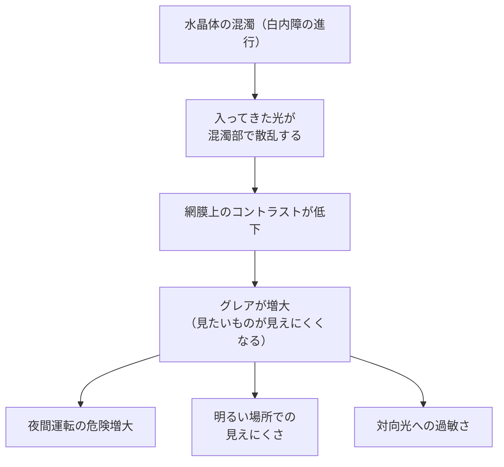
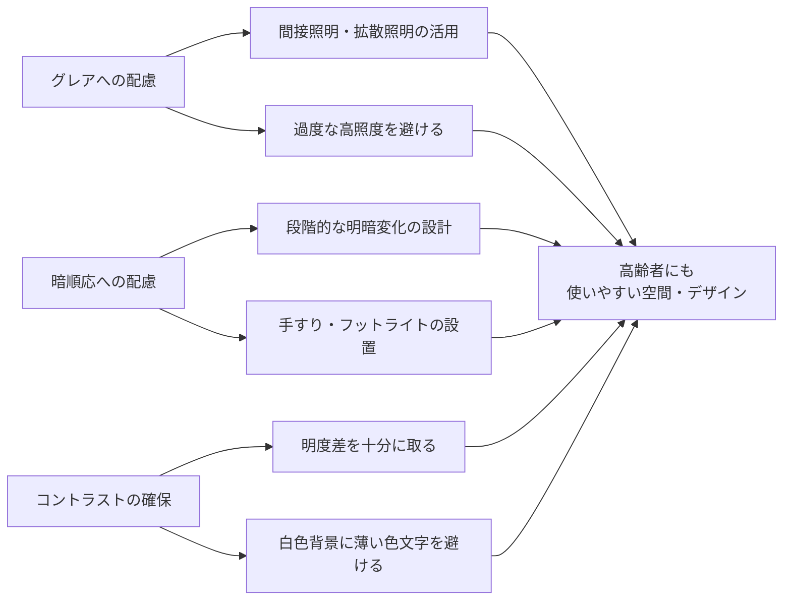

# lesson19: グレアと白内障 — 光への過敏さと混濁

## このレッスンで学ぶこと

- グレア（Glare）の定義と種類（不能グレア・不快グレア）を説明できる
- 加齢とグレアの関係（水晶体の混濁と光散乱）を理解する
- 暗順応の仕組みと高齢者における遅れのメカニズムを把握する
- 白内障（Cataract）の特徴・症状・治療の概要を説明できる
- グレア対策・暗順応配慮のUDデザインの考え方を身につける

---

## グレア（Glare）とは

**グレア（Glare）**とは、過度に強い光や不快な光が視覚に悪影響を与える現象のことです。日本語では「眩しさによる見えにくさ」と言い換えることもできます。

単に「眩しい」というだけでなく、グレアがあると「見たいものが見えなくなる」「目が痛い・疲れる」という影響が生じます。

---

## グレアの種類

グレアには大きく2種類があります。

### 不能グレア（Disability Glare）

視覚対象が**見えなくなるほど強いグレア**です。強烈な光が目に入り、コントラストが失われて対象が見えなくなります。

代表的な例：夜間の対向車のヘッドライト、正面からの直射日光

::: warning 不能グレアは安全問題
対向車のヘッドライトで前方が一瞬見えなくなる経験は、交通事故に直結します。高齢者では水晶体の混濁によりグレアが増大するため、夜間運転が特に危険になります。
:::

### 不快グレア（Discomfort Glare）

見えてはいるが**不快に感じるグレア**です。視力の低下は起きないが、目の疲労や不快感が生じます。

代表的な例：白いオフィスの天井の蛍光灯、光沢のある紙の反射

| 比較 | 不能グレア | 不快グレア |
|------|-----------|-----------|
| 影響 | 視覚対象が見えなくなる | 見えるが不快・疲れる |
| 程度 | 強い | 中程度 |
| 例 | 対向車ライト・直射日光 | 蛍光灯・光沢紙の反射 |

---

## 加齢とグレアの関係

なぜ高齢になるとグレアへの感受性が増すのでしょうか。主な原因は**水晶体の混濁**です。

### 水晶体の混濁と光散乱

水晶体が透明であれば、入ってきた光は一点（網膜上）に収束されます。ところが水晶体が混濁（白内障）してくると、光が混濁部分で四方八方に**散乱**します。

散乱した光は、本来見たい対象の像を形成せずに網膜全体を照らすことになり、コントラストが下がって「何かが眩しくてよく見えない」状態になります。これが加齢によるグレア増大のメカニズムです。

### 瞳孔縮小はグレア対策にならない

明るい光に対しては瞳孔が縮小します。しかし水晶体内の散乱は瞳孔サイズに関係なく起きるため、**瞳孔が縮小してもグレアは軽減されません**。根本的な解決は水晶体の手術（白内障手術）によるものです。

### グレア・暗順応・白内障の関係を整理する

本レッスンの3つの要素は、次のようにつながっています。

- **白内障が進むとグレアが増える**: 水晶体の混濁が進むほど光散乱が強まり、グレアが増大します
- **白内障や瞳孔縮小は暗順応の遅れにも関わる**: 取り込む光が減り、暗所で見えるまでに時間がかかります
- **グレアと暗順応の遅れは同時に起きやすい**: 明るい場所で眩しく、暗い場所では見えにくいという困りごとが重なります

つまり、加齢による水晶体の変化が、グレアの増大と暗順応の遅れの共通の原因になっています。

::: info グレアが特に問題になる場面
夜間運転のほか、手術室・検査室・映画館など「外から明るい光が差し込む暗室環境」でもグレアが問題になります。
:::

---

## 暗順応の遅れ

### 暗順応とは

**暗順応**とは、明るい場所から暗い場所に入ったとき、目が徐々に慣れて見えるようになるプロセスのことです。

このプロセスは主に**桿体（かんたい）**という光受容細胞が担っています。桿体は明るい光では飽和して機能せず、暗い場所で徐々に感度を上げていきます。ロドプシンという光感受性タンパク質の再合成がこのプロセスの鍵です。

### 高齢者で暗順応が遅れる理由

加齢により以下の変化が起きるため、暗順応に時間がかかるようになります。

| 原因 | 内容 |
|------|------|
| 桿体の感度低下 | 網膜の桿体細胞の機能が低下し、暗所での光感受性が下がる |
| 瞳孔の縮小 | 加齢で瞳孔が開きにくくなり、暗所に入ったときに取り込める光量が減る |
| ロドプシン再合成の遅延 | 光感受性タンパク質の再合成速度が遅くなる |

若い人では暗順応に20〜30分程度かかりますが、高齢者ではさらに時間がかかり、暗い場所での「見えなさ」が長く続きます。

### 日常での影響

- **映画館に入った直後**: 席が見えずつまずく危険
- **夜間の外出**: 車や段差が見えにくい
- **明るい部屋から廊下に出たとき**: 一瞬何も見えない時間が延びる
- **トンネルへの突入**: 運転中に急に暗くなる場面で危険

::: tip 対策：環境設計での配慮
暗順応の遅れへの対応は、**「急な明暗変化を避ける設計」**が有効です。病院・ホテル・商業施設の廊下では、段階的に照度を下げる設計、手すりや夜間照明（フットライト）の設置が効果的です。
:::

---

## 白内障（Cataract）

### 白内障とは

**白内障（Cataract）**は、水晶体が混濁（白く濁る）する眼疾患です。加齢が主な原因で起きる「加齢性白内障」が最も多く、日本では70代の8割以上が何らかの白内障の症状を持つといわれています。

::: info 白内障は世界共通の問題
白内障による視力低下は世界の失明原因の第1位です（WHO）。特に発展途上国では手術が受けられず視力を失う人が多くいます。
:::

### 白内障の主な症状

| 症状 | 内容 |
|------|------|
| 視力低下 | かすんで見える、細かい文字が読みにくくなる |
| グレアの増大 | 光が散乱し対向光が極端に眩しくなる |
| 色覚の変化 | 混濁・黄変により青系の識別困難、全体的に黄みがかって見える |
| 近視の変化 | 水晶体が膨化（膨らむ）して一時的に近視が進む場合がある |

### 白内障の治療

白内障は手術によって**混濁した水晶体を取り除き、人工レンズ（眼内レンズ）に置き換える**ことができます。手術は安全性が高く、日本でも年間100万件以上行われています。

::: tip 手術後の色覚変化
白内障手術で人工レンズを入れると、青系の光の遮断がなくなるため「青が鮮やかに見えるようになった」と感じる人も多くいます。手術前と後で色の見え方が変化します。
:::

---

## グレア・暗順応へのUDデザイン対応

グレアと暗順応の遅れへの対応として、UDデザインでは以下の点が重要です。

### 照明設計の原則

1. **光源が直接目に入らないようにする**: 直接照明ではなく間接照明・拡散照明を活用する
2. **必要以上に明るくしない**: 高照度はグレアを増大させる。適切な照度を選ぶ
3. **均一な照度分布にする**: 明暗の差が大きすぎると暗順応の問題が起きる
4. **段階的な明暗変化を設ける**: 明るい場所と暗い場所の間に中間照度の空間を作る

### グレア対策の実務例

実際の現場では、次のような工夫がグレア対策として有効です。

- **照明が直接目に入らない配置**: 光源を視線の高さから外し、間接照明や拡散照明にします
- **ディスプレイの輝度調整**: 周囲の明るさに合わせ、画面を明るくしすぎないようにします
- **非光沢素材の使用**: 反射を抑えるマット仕上げの紙・パネル・床材を選びます
- **必要以上に明るくしない**: 高照度はグレアを増やすため、適切な照度に抑えます

### コントラストの確保

グレアで困っている高齢者には、「明るさ」よりも**適切なコントラスト**の方が重要です。眩しくない適度な明るさの中で、文字・図形・背景の明度差を十分に確保することが有効です。

---

## キーワード

| 用語 | 説明 |
|------|------|
| グレア（Glare） | 過度に強い光・散乱光によって視覚が妨げられる現象 |
| 不能グレア（Disability Glare） | 見たいものが見えなくなるほど強いグレア |
| 不快グレア（Discomfort Glare） | 見えるが不快・疲れを感じるグレア |
| 光散乱 | 水晶体の混濁により光が四方八方に広がる現象。グレア増大の原因 |
| 暗順応 | 明るい場所から暗い場所に入ったとき、目が徐々に慣れるプロセス |
| 桿体（かんたい） | 網膜の暗所視担当の光受容細胞。加齢で感度低下し暗順応が遅れる |
| ロドプシン | 桿体に含まれる光感受性タンパク質。暗順応に必要な物質 |
| 白内障（Cataract） | 水晶体が混濁する眼疾患。視力低下・グレア・色覚変化が起きる |
| 眼内レンズ | 白内障手術で混濁した水晶体の代わりに挿入する人工レンズ |

---

## 試験のポイント

- **グレアの2種類**：不能グレア（見えなくなる）と不快グレア（不快・疲れる）の違いを覚える
- グレアが加齢で増大する理由：**水晶体の混濁による光散乱**
- **瞳孔縮小はグレア対策にならない**：散乱は水晶体内で起きるため
- **暗順応のメカニズム**：桿体とロドプシンが担う。加齢で桿体感度低下→遅れる
- 暗順応の遅れへの対応：**段階的な明暗変化の設計・フットライト・手すり**
- 白内障の症状：**視力低下・グレア増大・色覚変化（青系の識別困難）**
- 日本では**70代の8割以上**が白内障の症状を持つ
- 白内障の治療：**混濁した水晶体を除去し人工レンズ（眼内レンズ）に置き換える手術**
- UDの照明原則：「明るくすればよい」ではなく**適切なコントラストと拡散照明**が重要

---

## 第5章のまとめ：高齢者に配慮した色・照明のチェックリスト

高齢者の視機能変化（[lesson17](/lessons/lesson17/)〜lesson19）をふまえ、配色と照明の設計で確認したい点をまとめます。

::: tip 高齢者配慮チェックリスト
- □ 青系は明度差を確保する（黄変で青が暗く見えるため）
- □ コントラストを十分に取る（コントラスト感度の低下に配慮）
- □ グレアを起こさない照明にする（直接光を避け拡散照明を使う）
- □ 必要以上に明るくしない（高照度はグレアを増やす）
- □ 急な明暗差を避ける（暗順応の遅れに配慮し段階的な照度変化に）
- □ 色だけに頼らず文字・形・アイコンも併用する
:::
