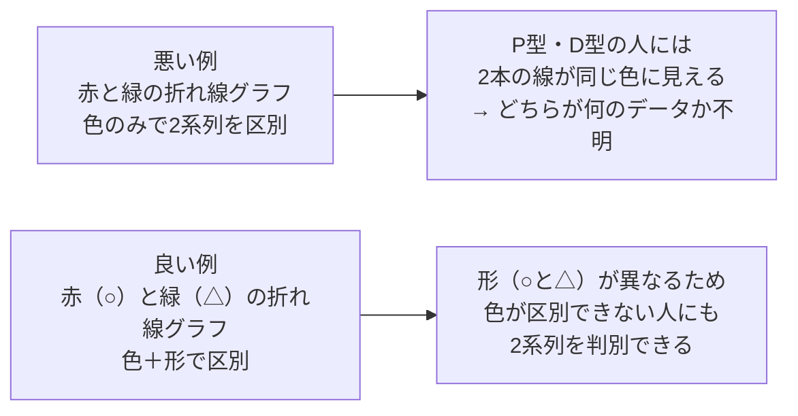
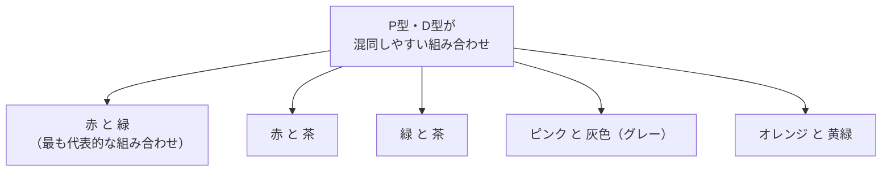
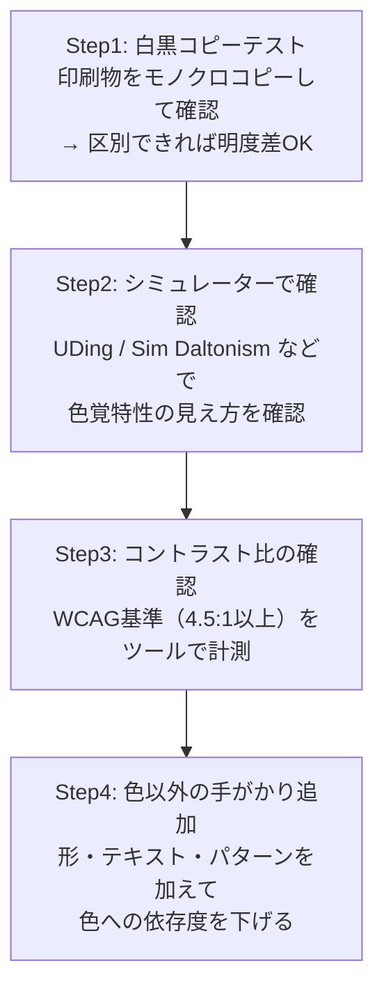

# lesson20: 色のUD配色の基本方針 — 色だけに頼らない

## このレッスンで学ぶこと

- 「色だけで情報を区別しない」という最も重要なUD配色の原則を理解する
- 明度差（コントラスト）を確保することの意味と具体的な目安を覚える
- 色覚特性の種類ごとに混同しやすい色の組み合わせを把握する
- 色の意味・機能を色以外の手段（形・テキスト・パターン）でも伝える方法を学ぶ
- 実務でUD配色を実践するための優先順位とチェック手順を理解する

---

## UD配色とは何か

**UD配色（ユニバーサルデザイン配色）** とは、色の見え方の違いに関わらず、できるだけ多くの人が情報を正確に受け取れるよう配慮した配色のことです。

色の見え方は個人によって異なります。P型（1型）・D型（2型）などの色覚特性を持つ人（日本人男性の約5%、20人に1人）、加齢によって色覚が変化した高齢者、白内障などの眼疾患のある人など、私たちの周囲にはさまざまな色の見え方をしている人がいます。

UD配色は「特定の人のための特別な配慮」ではなく、**すべての人にとって使いやすいデザインを目指す** という考え方です。結果として、白黒印刷・薄暗い環境・小さいサイズでの表示など、あらゆる状況でも伝わる強靭なデザインになります。

::: info UC級試験における位置づけ
UC（色覚の多様性）級の試験では、UD配色の理論と実践の両方が問われます。「なぜ見えにくいのか」という理由を理解した上で、「どうすれば見えやすくなるか」という解決策まで答えられるようにしましょう。
:::

---

## 基本原則1: 色だけで情報を区別しない

UD配色の中で最も重要な原則が「**色だけで情報を区別しない**」です。

### なぜ問題なのか

グラフの複数の系列を「赤と緑」だけで区別していた場合、P型・D型の色覚特性を持つ人にはほぼ同じ色に見えてしまい、どちらがどの系列か判断できません。これは情報の欠落を意味します。

### 悪い例と良い例

| 場面 | 悪い例 | 良い例 |
|------|--------|--------|
| 折れ線グラフの系列 | 赤線と緑線だけで区別 | 色 ＋ 形（○・△）で区別 |
| 棒グラフの系列 | 赤棒と緑棒で区別 | 色 ＋ ハッチング（縞・ドット）で区別 |
| 地図の地域区分 | 近い色相で塗り分け | 明度差のある色 ＋ 地域名ラベル |
| エラー表示 | 赤文字だけで示す | 赤文字 ＋ 「エラー」のテキスト |

::: warning 「色を使ってはいけない」ではない
UD配色とは「色を使ってはいけない」というルールではありません。「色だけに頼る」ことを避け、色以外の手がかりも同時に用意するという考え方です。色を加えることで視認性・可読性が向上することは多く、色の活用は積極的に行ってかまいません。
:::

---

## 基本原則2: 明度差（コントラスト）を確保する

色の見え方がどれだけ違っても、**明度差（明暗の差）は比較的多くの人が認識しやすい** という特性があります。P型・D型の色覚特性者も、高齢者も、明暗の差は感じ取れます。

### 明度差の重要性

**白黒（グレースケール）に変換したときに区別できる配色** を目指すのが明度差確保の基本的な考え方です。モノクロプリントや薄暗い照明下でも情報が失われない配色は、色覚特性の有無を問わず誰にでも読みやすいデザインです。

### コントラスト比の目安

Webアクセシビリティ標準である **WCAG（Web Content Accessibility Guidelines）** では、文字と背景のコントラスト比に以下の基準が設けられています。

| 基準 | コントラスト比 | 内容 |
|------|-------------|------|
| 最低限（読みやすさの目安） | 3:1 以上 | 大きな文字・装飾的要素の最低基準 |
| WCAG AA（推奨） | 4.5:1 以上 | 通常の文字サイズでの推奨基準 |
| WCAG AAA（高水準） | 7:1 以上 | より高いアクセシビリティを求める場合 |

::: tip コントラスト比の計算方法
コントラスト比は「明るい側の相対輝度 ÷ 暗い側の相対輝度」で求めます。白（輝度1.0）と黒（輝度0.0）の組み合わせが最大の21:1です。計算には「Colour Contrast Analyser」などの無料ツールが便利です。
:::

---

## 基本原則3: 見えにくい色の組み合わせを避ける

色覚特性の種類ごとに、混同しやすい（区別が難しい）色の組み合わせがあります。これらを知っておくことで、問題のある配色を事前に回避できます。

### P型・D型が混同しやすい色の組み合わせ

P型（1型2色覚）とD型（2型2色覚）は赤〜緑の色相範囲で特に区別が難しくなります。

### T型が混同しやすい色の組み合わせ

T型（3型2色覚）は青〜黄の色相範囲で区別が難しくなります。T型は比較的少数ですが、配慮が必要です。

| 混同しやすい組み合わせ | 備考 |
|-------------------|------|
| 青 と 黄 | T型には同じように見えることがある |
| 青 と 緑（やや） | 境界付近で混同が起こりやすい |

### 高齢者が見えにくい色・組み合わせ

加齢により水晶体が黄変し、青系の短波長の光が届きにくくなります。また、コントラスト感度が低下するため、明度差の小さい組み合わせが見えにくくなります。

| 見えにくいケース | 理由 |
|---------------|------|
| 低明度の青・青紫 | 水晶体の黄変で青の光が吸収される |
| コントラストの低い組み合わせ全般 | 加齢によるコントラスト感度の低下 |
| 小さい文字のグレー | 明度差不足 ＋ 視力低下の複合 |

::: warning 赤と緑の組み合わせは最も問題が多い
日本人男性の約5%（20人に1人）が P型（1型）・D型（2型）の色覚特性を持ちます。赤と緑の組み合わせはその代表的な混同色です。「グラフを赤と緑で区別する」「赤文字と緑背景を使う」といったデザインは、UD配色の観点から優先的に改善すべき対象です。
:::

::: tip ここで挙げたのは代表例です
上の組み合わせは代表的な例にすぎません。混同色線（[lesson15](/lessons/lesson15/)）を参考にすると、他にも注意すべき組み合わせが見つかります。実際の配色では、シミュレーターでの確認も合わせて行いましょう。
:::

---

## 基本原則4: 色の意味・機能を他の手段でも伝える

色には「意味を持たせる」という重要な役割があります。赤は「危険・警告」、緑は「安全・OK」、黄は「注意」といった約束事は広く使われています。しかしこれらの意味も、色だけに依存させると色覚特性者には伝わりません。

色以外の手がかりには、主に次の手段があります。

- **形（シェイプ）**: マーカーの○△□、アイコン、交通標識の三角・丸・四角など
- **テキスト・ラベル**: 「エラー」「完了」などの文字、グラフの系列名や数値
- **パターン（ハッチング）**: 縞・ドット・格子など、白黒印刷でも区別できる塗り分け
- **位置・順序**: 信号機の上中下のように、並び順で意味を示す方法

これらの具体的な使い分けは[lesson22](/lessons/lesson22/)で詳しく学びます。ここでは代表的な3つを紹介します。

### 色＋テキスト（最も確実な方法）

- 赤色の警告ランプ ＋ 「エラー」「警告」のテキスト
- 緑色のOKアイコン ＋ 「完了」「正常」のテキスト
- 赤字の強調 ＋ 太字や下線も組み合わせる

### 色＋形（直感的な識別）

- 交通標識: 赤三角（警告）、青丸（規制）、青四角（案内）
- グラフ: ○（赤系）、△（青系）、□（緑系）などの形の違い
- フォームの入力エラー: 赤枠 ＋ ✗アイコン（正常は ✓アイコン）

### 色＋パターン（印刷・グラフで有効）

- グラフの棒: 赤塗り（横縞ハッチ）・青塗り（縦縞ハッチ）
- 地図: 斜線ハッチ・ドット・クロスハッチによる地域区分
- 白黒印刷でも区別できる

---

## 実務での優先順位とチェック手順

実際の制作現場では、以下の順序でチェックすると効率的です。

| チェック | 方法 | 難易度 |
|---------|------|--------|
| 白黒変換テスト | モノクロコピー・スクリーンショット変換 | 低（すぐできる） |
| 色覚シミュレーター | 無料ツール（UDing等）でスクリーンショットを確認 | 低〜中 |
| コントラスト比計測 | Colour Contrast Analyserなどのツール | 中 |
| 色以外の手がかり確認 | 形・テキスト・パターンが十分か目視確認 | 低 |

::: tip 最も手軽なチェック方法
制作物をスマートフォンのカメラで撮影し、写真編集アプリで「モノクロ（グレースケール）」フィルターをかけると、白黒変換テストが手軽にできます。色だけで区別していた要素が同じグレーに見えてしまう場合は、形やテキストなどの手がかりを追加しましょう。
:::

---

## キーワード

| 用語 | 説明 |
|------|------|
| UD配色 | ユニバーサルデザイン配色。色の見え方の違いに関わらず多くの人が情報を受け取れる配色 |
| 明度差（コントラスト） | 明るい色と暗い色の差。色覚特性の有無を問わず認識しやすい手がかり |
| コントラスト比 | 明るい側の輝度と暗い側の輝度の比率。WCAG AAでは4.5:1以上が推奨 |
| WCAG | Web Content Accessibility Guidelines。Webアクセシビリティの国際標準規格 |
| P型・D型 | 赤〜緑の範囲で色の区別が難しい色覚特性の種類 |
| T型 | 青〜黄の範囲で色の区別が難しい色覚特性の種類 |
| 白黒変換テスト | デザインをグレースケールに変換して明度差を確認するUD配色の基本チェック法 |
| ハッチング | 線や点などのパターンによる塗り分け。色の代替手段として有効 |
| 色以外の手がかり | 形・テキスト・パターン・位置など、色に頼らない情報識別の手段 |

---

## 試験のポイント

- **「色だけで区別しない」** が UD配色の最重要原則。色に加えて形・テキスト・パターンを活用する
- **明度差（コントラスト）** は色覚特性者・高齢者ともに認識しやすい。最優先で確保する
- **WCAG AAのコントラスト比 4.5:1以上** は頻出の数値として覚えておく
- **P型・D型が混同しやすい色**: 赤と緑、赤と茶、緑と茶、ピンクと灰は代表例として押さえる
- **T型が混同しやすい色**: 青と黄が代表的な組み合わせ
- **高齢者の色覚特性**: 青系が見えにくくなる（水晶体の黄変）、コントラスト感度の低下
- **白黒変換テスト** が最も手軽なUD配色チェック方法
- 「色を使ってはいけない」ではなく「色だけに頼ってはいけない」が正しい理解
