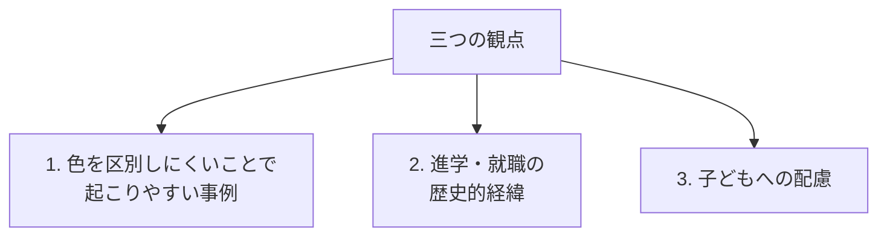
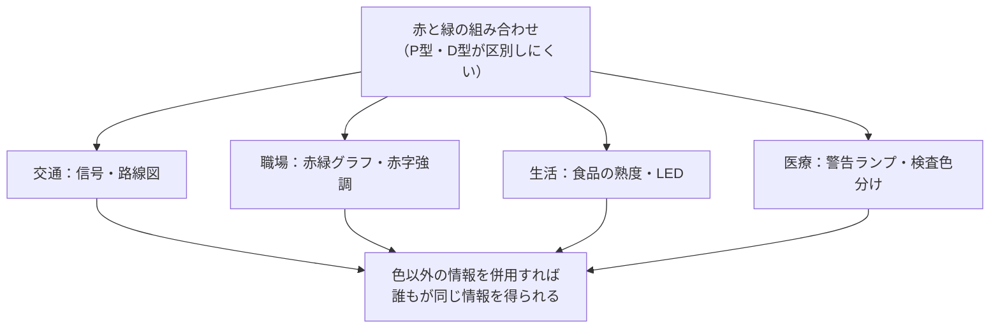
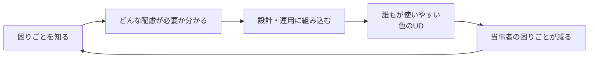

# lesson20: 不都合を感じる日常事例 — 困りごと・進学就職の経緯・子どもへの配慮

## このレッスンで学ぶこと

- 色覚特性のある人の日常の困りごとの具体例を知る
- 進学・就職での扱いの歴史的経緯を整理する
- 学校健診での色覚検査の廃止と再開の流れを把握する
- 子どもへの学校での配慮事項（チョーク・赤字・図工美術）を理解する
- 「困りごとを知る」ことが色のUDの出発点であると理解する

## 困りごとを知ることが色のUDの出発点

色のUD（カラーユニバーサルデザイン、CUD）を実践するためには、まず「誰が、どんな場面で、どう困っているのか」を知ることが不可欠です。困りごとを知らなければ、どんな配慮をすればよいかも見えてきません。

色覚特性（P型・D型・T型など）のある人は、日本人男性の**約5%（20人に1人）**、女性の**約0.2%（500人に1人）**です。学校のクラスや会社の部署にほぼ確実にいる計算で、社会の中で常に一定の比率を占めています。本人が口に出さないことも多いため、「困っている人がいる」事実が見えにくくなっています。

::: info 「困っていない」ではなく「工夫している」
多くの当事者は日常で工夫を重ねて対処しています。「特に困っていない」という言葉の裏には、形・位置・文字などで色を補う努力があることが多く、デザインを変えればその工夫が不要になります。
:::

## 色を区別しにくいことで起こりやすい事例

P型・D型は赤と緑を中心に、T型は青と黄を中心に区別が難しくなります。日常で起こりやすい事例を場面別に整理します。

### 交通・移動

- **信号機**：赤と緑（青信号）が暗く似て見えることがあり、点灯位置（縦型なら上＝赤・下＝青）で判断する人が多い
- **電車の路線図**：色だけで路線を分けると、近い色相どうしが同じに見える
- **カラーコーン・誘導棒**：赤いコーンと黄色い誘導棒、夜間の赤い保安灯と黄色い保安灯が区別しにくい

::: tip縦型信号機の意義
日本の信号機が縦型に統一されているのは、雪国での視認性に加えて、**位置情報で判断できる**ように配慮された設計でもあります。
:::

### 職場

- **グラフ・表**：赤と緑の2系統で表した売上比較などは、見分けがつかないことがある
- **プレゼン資料の赤字**：黒い本文の中に赤字で強調すると、強調されていることに気づかないことがある
- **回路図・配線**：赤と黒のケーブル、緑と茶のケーブルの判別ミスが起きうる
- **書類の校正・採点**：黒の文字に赤で書き込んだ修正・正解が区別しにくい

::: warningよくある失敗例
社内資料で「今月（赤）と先月（緑）の比較」のような赤緑グラフは典型的な失敗例です。線種・マーカー形状・直接ラベルを併用すれば、誰もが同じ情報を読み取れます。
:::

### 日常生活

- **食品の熟度・焼き加減**：トマトが緑から赤に熟す変化、肉が生（赤）から焼け色（茶）に変わる変化が分かりにくい
- **薬の識別**：錠剤やカプセルを色だけで区別すると服薬ミスにつながる
- **衣類の色合わせ**：ベージュとライトグリーン、茶系と暗赤系などが混同しやすい
- **電子機器のLED**：充電中の赤と完了の緑、待機中の橙と動作中の緑などが似て見える

### 医療・安全

| 場面 | 起こりうる困りごと |
|------|----------|
| 非常口・誘導灯 | 緑のサインが背景に溶けて見える |
| 警告ランプ | 赤い警告と黒い背景のコントラストが低い場合に気づきにくい |
| 検査結果の色分け | 「正常＝緑、要注意＝黄、異常＝赤」の判別ができない |
| カラーコード化された配線 | 誤接続が事故につながりかねない |

::: warning安全に関わる場面こそ色だけに頼らない
警告・非常口・危険表示は、色に加えて**形・記号・文字・点滅**を組み合わせることが必須です。
:::

## 進学・就職に関わる歴史的経緯

色覚は、過去には進学先や職業選択を左右する要素として扱われてきました。現在は多くの制限が見直されていますが、経緯を知ることは色のUDを社会的に位置づけるうえで重要です。当事者を「制限される側」として描くのではなく、**社会がこの問題にどう向き合ってきたか**として整理します。

### 学校健診における色覚検査の流れ

| 時期 | 取り扱い |
|------|---------|
| 戦後〜2002年度 | 小学校4年生で**全員に色覚検査**を実施 |
| 2001年 | 厚労省の規則改正で**雇入時健診からの色覚検査が廃止**、就職時の色覚制限が大幅に緩和 |
| 2003年度 | 2002年の学校保健法の施行規則改正を受け、**学校健診の必須項目から削除**（事実上の廃止） |
| 2014年〜 | 「進学・就職で初めて気づき不利益を被る」事例の指摘を受け、**希望者を対象に検査を再開**する動きが広がる |

廃止の背景には、「色覚特性があっても日常生活に大きな支障はない」という理解の広がりと、検査が当事者に強い心理的負担を与えてきた経緯がありました。一方で再開の動きは、「**自分の色覚特性を知らないまま進路を決め、後で困る**」事例を防ぐためのものです。現在の検査は**任意・希望者対象**が基本で、結果も本人と保護者に丁寧に伝えるよう配慮されています。

::: info検査の目的の変化
かつての検査は「異常者をふるい分ける」目的が強くありました。現在は「**自分の色覚特性を知り、進路や生活に活かす**」ためのものへと位置づけが変わっています。詳しくは [lesson19](/lessons/lesson19/) を参照してください。
:::

### 就職時の色覚検査と職種制限の経緯

かつては鉄道・警察・消防・自衛隊・船舶・航空など、安全に関わる多くの職業で**色覚を理由とした採用制限**がありました。電気工事・印刷・染色・医療検査など、色を扱う技能職でも入職や資格取得に制限がかかる場合がありました。

その後、色覚特性があっても実務に支障がない事例が多数積み重なり、また人権・職業選択の自由の観点からの議論を経て、**多くの職種で制限が緩和・撤廃**されてきました。現在は「色覚特性を理由に一律に排除する」のではなく、「**実際の業務に必要な色の判別ができるか**」を個別に判断する流れが主流です。

### 現代でも色判別への配慮が必要な職場

制限が緩和された一方で、**現場で色判別が安全に直結する職種**は今も存在します。これらは「採用を制限する」のではなく、「**色に頼らない作業手順・表示**を設計でカバーする」べき領域です。

| 領域 | 色判別が関わる場面 | 望ましい配慮 |
|------|------------------|------------|
| 電気工事 | 配線の色分け（赤・黒・緑・白など） | 番号タグ・文字表示の併用 |
| 医療検査 | 検体・試薬・試験紙の発色 | デジタル測定機器・数値表示の併用 |
| 印刷・染色 | 色合わせ・色校正 | 計測器（測色計）の使用 |
| 食品 | 鮮度・焼き加減の判別 | 温度計・時間管理の併用 |

::: tip 「制限」から「配慮設計」へ
歴史的には「特性のある人を業務から外す」方向で対応されてきた領域も、近年は「**作業環境を色に頼らない設計に変える**」方向に進んでいます。これは色のUDの考え方そのものです。
:::

### 進学・就職におけるUD的な視点

- 当事者は「**自分の色覚特性を早めに知る**」ことで、進路選択や仕事での工夫を計画できる
- 社会・職場は「**色を扱う業務を色だけに頼らない設計に変える**」ことで、誰でも安全に働ける環境を作れる
- 学校や進路指導は「色覚特性があるから諦める」ではなく「**特性を踏まえて適切に支援する**」立場をとる

## 子どもへの学校での配慮

子どもは、自分の色覚特性を認識していないことがほとんどです。本人は「みんな同じように見ている」と思っているため、困りごとを言葉にできません。学校では大人の側から先回りした配慮が必要になります。

### 教室の黒板・チョーク

- **赤や緑のチョーク**は、黒板の上ではP型・D型の子どもに非常に見えにくい
- **白と黄色のチョーク**を基本に、強調は**枠で囲む・下線を引く**などの形で行う
- 重要事項は色だけでなく**「ここ重要」と書く**ことで補強する

### プリント・教科書

- 重要語句を**赤色で印刷**したプリントは、黒い本文と区別しにくいことがある
- 太字・下線・囲み・記号など、**色以外の強調**を併用する
- 教科書のグラフが赤緑で色分けされている場合、ハッチング（網かけ）・線種・直接ラベルが補助になる

### テスト・採点

- 黒鉛筆で書かれた解答に**赤ペンで丸つけ**をすると、本人には正誤が見分けにくいことがある
- 模範解答を**赤字で印刷**する形式も、問題文と答えが混ざって見えやすい
- 「正解には◯、誤りには／」など**形で示す**配慮、または**コントラストの強い色**（濃い青など）の使用が望ましい

### 図工・美術

- 「赤いリンゴを描こう」「赤と緑を混ぜて茶色を作ろう」などの課題で、本人の見え方と先生の期待がずれることがある
- 先生から「なぜその色で塗ったの？」と問われても、本人には**そう見えていた**ため理由を答えにくい
- 絵の具のチューブやパレットに**色名のラベル**をつける、色名を声に出して確認するといった配慮が役立つ
- 作品を「色の正しさ」で評価するのではなく、構図・観察・表現意図など複数の観点で評価する

### 体育・実技

- 紅白帽の見分け、ビブスの色分け、ライン引きの色などで混同が起こりうる
- **形（帽子の表裏）・位置・番号**を併用すると分かりやすい

### 教師・保護者の心構え

| 心がけ | 内容 |
|-------|------|
| 早めに気づく | 「色をよく間違える」「赤や緑が苦手そう」などの様子に注意を払う |
| 本人を責めない | 「ふざけている」「集中していない」と決めつけない |
| 配慮は静かに | 全員に対する自然な工夫として行い、当事者だけを目立たせない |
| 進路につなぐ | 中学・高校での進路指導に色覚特性の情報を引き継ぎ、本人の選択を支える |

::: info当事者を「設計の出発点」に
子どもへの配慮は「特別な対応」ではなく、教材・教室・授業設計の最初から組み込むのが理想です。これは色のUDの基本姿勢でもあります。
:::

## キーワード

| 用語 | 説明 |
|------|------|
| 色のUD（CUD） | カラーユニバーサルデザイン。色覚の多様性を前提とした設計 |
| P型・D型の困りごと | 主に赤と緑、およびそれに近い色相どうしの区別が難しい |
| T型の困りごと | 主に青と黄の区別が難しい。日常での頻度はP型・D型より低い |
| 縦型信号機 | 色だけでなく位置（上＝赤、下＝青）で判断できる設計 |
| 学校健診の色覚検査 | 2003年度に必須項目から削除。2014年頃から希望者対象で再開する動き |
| 職業の色覚制限 | かつて鉄道・警察・自衛隊などで広く行われていたが、現在は多くが緩和・撤廃 |
| 色判別が必要な職種 | 電気工事・医療検査・印刷・食品など。色以外の手段で補う設計が望ましい |
| 学校での配慮 | チョーク色・赤字強調・図工美術・採点など、色以外の手段を併用する |

## 試験のポイント

- 困りごとは **「色を区別しにくい事例」「進学・就職の経緯」「子どもへの配慮」** の3つに整理される
- 学校健診の色覚検査は **2003年度に必須項目から削除**、その後**希望者対象で再開**
- かつての職業制限(鉄道・警察・自衛隊など)は現代は多くが緩和・撤廃
- 現代の課題は「制限する」ではなく「**色に頼らない作業手順・表示**で配慮する」こと
- 子どもは自分の色覚特性を**認識していないことが多い**ため、大人からの先回り配慮が必要
- 「見えていない」ではなく「**区別しにくい**」が正確な表現
