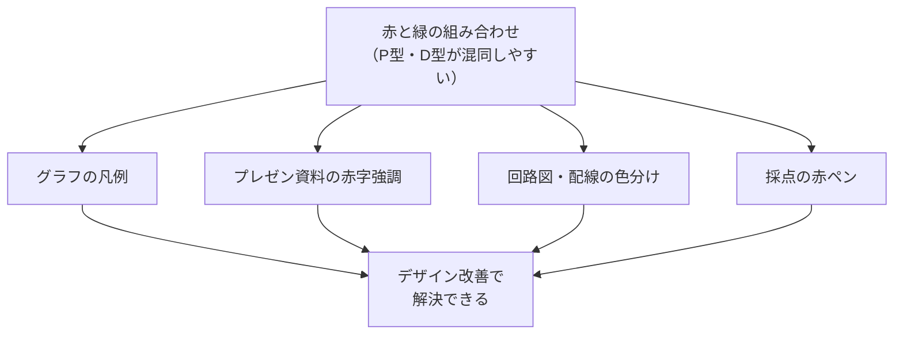
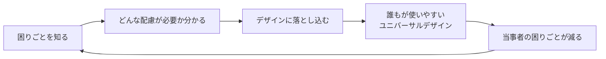

# lesson20: 色覚特性と日常 — 当事者の困りごとを知る

## このレッスンで学ぶこと

- 色覚特性のある人が日常生活で感じる具体的な困りごとを知る
- 交通・職場・学校・日常生活・医療の各場面での課題を理解する
- 「見えていない」ではなく「区別しにくい」という認識を持つ
- 困りごとを知ることがユニバーサルデザインの出発点であることを理解する
- 子どもへの学校での配慮事項を把握する

## 困りごとを知ることがUDの出発点

ユニバーサルデザイン（UD）を実践するためには、まず「誰がどんな困りごとを抱えているか」を知ることが不可欠です。困りごとを知らなければ、どんな配慮をすべきかも分かりません。

色覚特性（P型・D型・T型など）のある人は、日本人男性の約5%、つまり20人に1人います。これはクラスに1〜2人、会社の部署に必ず数人いる計算です。普段の生活で困りごとを表に出さないことも多いため、「困っている人がいる」という事実が見えにくくなっています。

::: info 「困っていない」ではなく「工夫している」
多くの場合、色覚特性のある人は生活の中でさまざまな工夫をして対処しています。「特に困っていない」と言う人でも、社会のデザインを変えることでその工夫が不要になることがあります。
:::

## 1. 交通・移動での困りごと

### 信号機

信号機の色（赤・黄・青）はP型・D型の人にとって識別しにくい場合があります。特に**赤が暗く見えたり、青と白っぽく見えたりする**ことがあります。多くの人は「上の灯が点いたら止まる」という**位置情報**で判断しています。

::: tip 縦型信号機の標準化
日本の信号機が縦型に統一されているのは、このような背景もあります。横型では雪が積もって灯が見えなくなるという理由も含め、縦型の位置（上・中・下）で判断できるよう設計されています。
:::

### 電車の路線図

複数の路線を色で区別している路線図は、色覚特性のある人にとって非常に読みにくい場合があります。特定の会社の路線と別の会社の路線が同じ色に見えてしまうことがあります。

### 工事現場のカラーコーン・誘導棒

赤いカラーコーンと黄色い誘導棒の区別が困難なことがあります。夜間の工事現場など視認性が低い状況では、特に見分けがつきにくくなります。

## 2. 職場での困りごと

### グラフ・表

**赤と緑を使った棒グラフや折れ線グラフ**は、P型・D型の人には両者が同じ色に見え、データの区別ができないことがあります。「今月（赤）と先月（緑）の売上比較」などが最もよくある例です。

::: warning よくある失敗例
会議でプレゼンした資料のグラフが「赤と緑だけで2系統を区別していた」という状況は非常によく起きます。作成者は気づかず、参加者も指摘しにくいことが多いです。
:::

### プレゼン資料の赤字

**重要な箇所を「赤字」で表す**習慣は職場に広く浸透していますが、P型・D型の色覚特性がある人には、赤字が周囲の黒い文字と区別しにくい場合があります。「重要な部分が分からなかった」という体験につながります。

### 回路図・配線

電気工事や電子機器の配線では、赤いケーブルと黒いケーブルの識別が求められる場面があります。P型・D型の人には赤が暗く見えることがあり、誤接続のリスクが生じることがあります。

### 採点の赤ペン

**黒で書いた問題の解答に赤で正解を書く**採点方式は、学校でも職場でも使われます。黒と赤の組み合わせは、P型・D型の人には混同しやすい色の組み合わせです。

## 3. 日常生活での困りごと

### 食品の新鮮さの判断

**トマトの熟れ具合**は、色（緑→赤への変化）で判断することが多いですが、P型・D型の人には赤と緑が区別しにくいため、「まだ緑か、もう赤くなったか」が分かりにくい場合があります。

**肉の焼き加減**（生の赤から焼けた茶色への変化）も同様に判断が難しいことがあります。加熱不足の可能性があるため、食中毒などのリスクにもつながりかねません。

### 薬の識別

複数の薬を色だけで区別している場合（「赤い錠剤は○○」など）、P型・D型の人には同じ色に見えてしまうことがあります。服薬ミスのリスクを考えると、薬の包装には色以外の識別手段（形・文字・記号）も組み合わせることが重要です。

## 4. 医療・安全に関わる困りごと

色覚特性による困りごとが、安全に直結する場面もあります。

| 場面 | 困りごと |
|------|----------|
| 非常口サイン | 赤や緑のサインが識別しにくいことがある |
| 警告ランプ | 危険を示す赤い警告ランプが判別しにくい |
| 検査結果の色分け | カラー印刷の検査結果（正常・要注意・異常の色分け） |
| 薬の管理 | 色のみで区別されている薬（錠剤の色など） |

::: warning 安全に関わる場面こそUDが重要
警告・非常口・危険の表示は、「色に頼らない情報伝達」が特に重要です。色のみで危険を示すデザインは、UC級で学ぶべき最重要の改善点の1つです。
:::

## 5. 子どもへの学校での配慮

子どもは、自分の色覚特性を認識していないことがほとんどです。そのため、学校での色を使った指示や課題で困りごとが生じやすくなります。

### 図工・美術での困りごと

「赤と緑を混ぜて茶色を作る」「赤いリンゴを描く」などの課題で、混同が起きることがあります。先生から「なぜ緑で塗ったの？」と言われても、本人には赤として見えているため、なぜ指摘されているか分かりません。

### 教科書・プリントの色分け

重要語句を**赤でマーク**するプリントや教科書は、P型・D型の子どもには黒い文字と区別しにくい場合があります。「どこが重要なのか分からなかった」という体験を繰り返すことで、学習意欲に影響が出ることもあります。

### カラーテストの模範解答

テストの模範解答が赤字で印刷されている場合、P型・D型の子どもには問題文と答えが混在して見えてしまうことがあります。

::: info 正しい認識を持つことが大切
「見えていない」ではなく「区別しにくい」というのが正確な理解です。社会の仕組みやデザインを変えることで、多くの困りごとは解消できます。色覚特性のある人を「支援される側」ではなく、「設計の出発点から考慮される対象」として扱うことがUDの本質です。
:::

## キーワード

| 用語 | 説明 |
|------|------|
| 色覚特性 | 色の識別に関する特性の違い。「色覚異常」に代わる呼称としても使われる |
| P型・D型の困りごと | 主に赤と緑の区別が難しい。信号・グラフ・配線・食品の色変化など |
| T型の困りごと | 主に青と黄の区別が難しい。日常では比較的少ない |
| 縦型信号機 | 色だけでなく「位置（上・中・下）」で判断できるよう配慮された信号機 |
| 赤字強調の問題 | P型・D型の人には黒字と赤字が区別しにくい場合がある職場でよくある問題 |
| 色覚補償の工夫 | 多くの色覚特性者が、色以外の情報（形・位置・文字）で補って判断している |

## 試験のポイント

- 「困りごとを知ることがUDの出発点」という考え方を理解する
- P型・D型の人が混同しやすいのは**赤と緑（および類似色）**、T型は**青と黄**
- 日本人男性の約**5%（20人に1人）**に色覚特性があることを覚える
- **信号機が縦型**なのは位置情報で判断できるよう配慮されているため
- 職場でよくある問題：**赤緑グラフ・赤字強調・採点赤ペン**
- 「見えていない」ではなく「**区別しにくい**」が正確な表現
- 安全に関わる警告・非常口は特に色以外の情報との併用が重要
- 子どもは自分の色覚特性を認識していないことが多く、学校での配慮が必要
