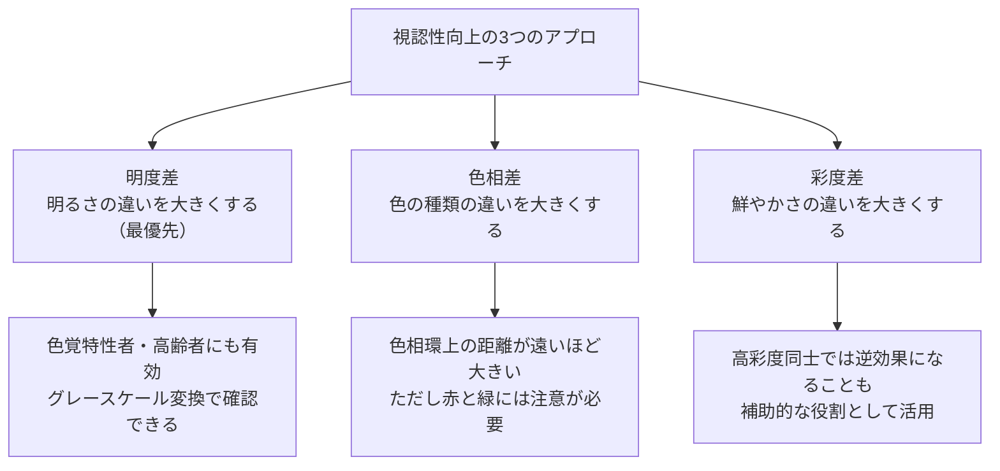
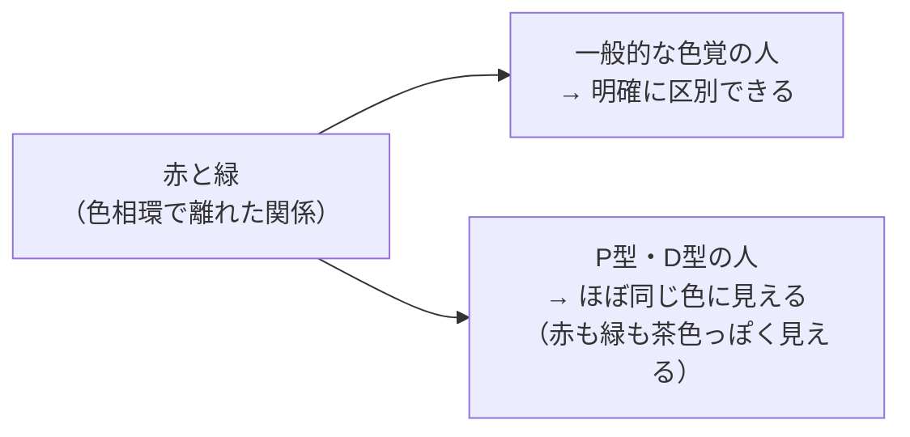
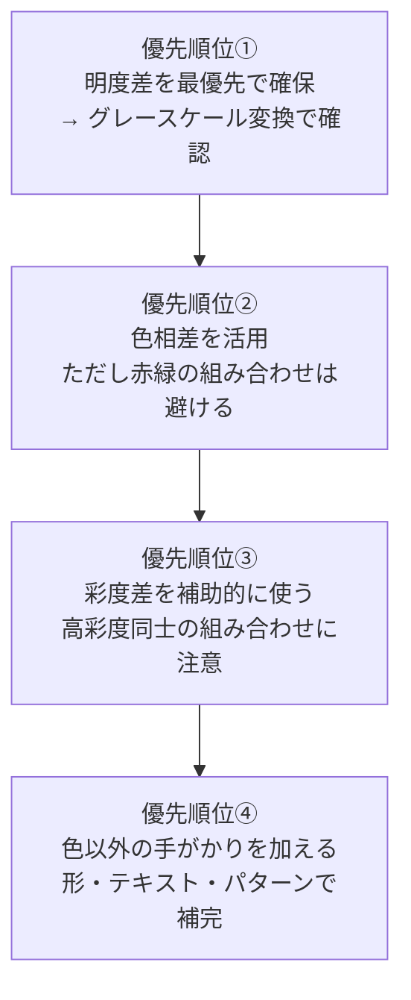
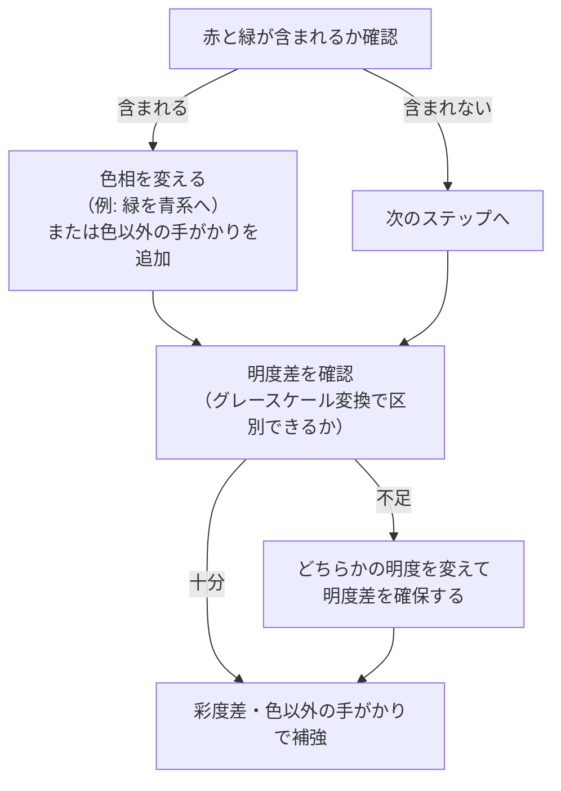

# lesson21: 明度差・色相差・彩度差 — 見やすい配色の作り方

## このレッスンで学ぶこと

- 視認性を高める3つのアプローチ（明度差・色相差・彩度差）の違いと役割を理解する
- 明度差が最優先である理由と、グレースケール変換による確認方法を覚える
- 色相差が大きくても視認性に問題が生じる場合（赤と緑）を理解する
- 避けるべき色の組み合わせの具体例を把握する
- UD配色における3つのアプローチの正しい優先順位を身につける

---

## 視認性を高める3つのアプローチ

配色の「見やすさ（視認性）」を高めるには、主に3つのアプローチがあります。

---

## 明度差（最重要アプローチ）

### 明度差とは

**明度差** とは、組み合わせた色の「明るさ（明度）」の差のことです。明度差が大きいほど、色の組み合わせはコントラストが高く、見やすくなります。

白（最も明るい）と黒（最も暗い）の組み合わせが最大の明度差を持ち、視認性は最高です。このときコントラスト比は最大値の21:1になります。一方、明度が近い同士の組み合わせ（例: 薄いグレーと白）はコントラストが低く、見えにくくなります。

### なぜ明度差が最重要なのか

色覚特性（P型・D型・T型）を持つ人や高齢者でも、**明度（明暗）の違いは比較的認識しやすい** という特性があります。色相の区別が難しくても、明暗の差は感じ取れます。このため、明度差の確保はUD配色において最も優先度が高いアプローチです。

::: tip グレースケール変換テスト
デザインをグレースケール（白黒）に変換したとき、色の区別がつく = 明度差がある、ということです。色覚特性者に近い状態での見え方確認として、最も手軽で効果的な方法です。モノクロコピーや写真アプリのモノクロフィルターで手軽に確認できます。
:::

### 代表的な明度差の例

| 組み合わせ | 明度差 | 視認性の評価 |
|-----------|--------|------------|
| 白地 ＋ 黒文字 | 最大 | ◎ 最高（コントラスト比 21:1） |
| 黄色地 ＋ 黒文字 | 高 | ○ 良好（黄は明度が高く、黒との差が大きい） |
| 白地 ＋ 黄文字 | 低 | △ 要注意（黄は明度が高く白との差が小さい） |
| 赤地 ＋ 緑文字 | 低〜中 | × P/D型NG（明度が近く、かつ色相も混同される） |
| 水色地 ＋ 白文字 | 低 | × 高齢者NG（明度差が不足） |
| 黒地 ＋ 濃紺文字 | 極小 | × 誰にも見えにくい |

---

## 色相差

### 色相差とは

**色相差** とは、色相環上での2色の距離（角度の差）のことです。色相環上で離れた位置にある色ほど色相差が大きく、近い位置にある色は色相差が小さい（類似色相）です。

| 色相の関係 | 色相差 | 例 |
|-----------|--------|-----|
| 補色（正反対） | 最大（色相差12） | 赤（PCCS 2番）と青緑（14番） |
| 対照色相 | 大 | 赤と青、黄と紫 |
| 中差色相 | 中 | 赤と黄、青と緑 |
| 類似色相 | 小 | 赤と赤橙、青と青紫 |
| 同一色相 | なし | 同じ色相内での明暗の変化 |

### 色相差の落とし穴: 赤と緑の問題

「色相環で離れた色どうしは、最も見やすい組み合わせのはず」と思いがちです。しかし、**赤と緑は色相環で離れた関係（色相差が大きい）にありますが、P型（1型）・D型（2型）にはこの色相差が認識されにくく、区別が困難** です。

なお、PCCSで赤（2番）の補色は青緑（14番）であり、赤と緑は厳密には補色ではありません（[lesson11](/lessons/lesson11/)参照）。色相差が大きくても、その色相差の「種類」によっては色覚特性者に伝わらない場合があります。

::: warning 色相差だけを頼りにしない
色相差を大きくすると見やすくなるのは基本ですが、赤と緑の組み合わせは例外です。色相差の活用と合わせて、明度差の確保や色以外の手がかりの追加が必須です。
:::

---

## 彩度差

### 彩度差とは

**彩度差** とは、組み合わせた色の「鮮やかさ（彩度）」の差のことです。高彩度の色と低彩度（くすんだ・グレーっぽい）色を組み合わせると、彩度差によって識別しやすくなることがあります。

### 彩度差の注意点

ただし彩度差は、明度差・色相差に比べて補助的な役割として位置づけるのが適切です。

| 状況 | 評価 | 理由 |
|------|------|------|
| 高彩度の赤 ＋ 低彩度のベージュ | 〇 識別しやすい | 彩度差に加えて明度差も生じることが多い |
| 高彩度の赤 ＋ 高彩度の緑 | × 問題あり | 彩度は近く、P/D型には色相差も伝わらない |
| 高彩度の青 ＋ 高彩度の紫 | △ 要確認 | 高彩度同士で明度差が小さい場合は見えにくい |

---

## 実際の配色での優先順位

3つのアプローチを組み合わせる際の考え方を整理します。

### 場面別の判断フロー

実際の配色を決めるときは、次の順で判断すると迷いません。

---

## 避けるべき組み合わせの具体例

以下は「避けるべき色の組み合わせ」の代表例です。理由とセットで覚えることが重要です。

| 組み合わせ | 問題点 | 対処法 |
|-----------|--------|--------|
| 赤（#FF0000）と緑（#00FF00） | P/D型には同じ色に見える。明度も近い | 色に加えてハッチングや形を追加する |
| 薄いグレーと白 | 明度差不足。高齢者・弱視者に判別困難 | どちらかの明度を変える（暗いグレーに） |
| 低明度の青紫と低明度の赤紫 | 明度差なし。色相差も小さい | 明度差をつける。一方を大幅に明るくする |
| オレンジと黄色（明るい背景上） | 明度が近く、P/D型は色相差を認識しにくい | 明度を変えるか、形やテキストを追加 |
| 青と紫（暗い背景上） | 暗い背景では色相差が見えにくい | 明るい背景に変えるか、明度差を確保する |

::: info 実際の色コードで考える練習
RGB値やHSL値から明度を比較する練習をしてみましょう。たとえば白（#FFFFFF）と薄いグレー（#E0E0E0）では、明度はほとんど変わらず視認性が低いと判断できます。一方、白（#FFFFFF）と中程度のグレー（#767676）はコントラスト比4.5:1を達成できます。
:::

---

## まとめ: 3つのアプローチの特性比較

| アプローチ | 色覚特性者への効果 | 高齢者への効果 | 優先度 |
|-----------|----------------|-------------|--------|
| 明度差 | 高（明暗は認識しやすい） | 高（明暗は認識しやすい） | 最高 |
| 色相差 | 中（組み合わせによる） | 中（コントラスト低下に注意） | 高 |
| 彩度差 | 低〜中（補助的） | 中（高彩度が見えにくい場合もある） | 補助 |

---

## キーワード

| 用語 | 説明 |
|------|------|
| 視認性 | 色・形・文字などが見えやすい度合い。背景との差が大きいほど視認性が高い |
| 明度差 | 2色の明度（明るさ）の差。UD配色で最優先に確保すべき要素 |
| 色相差 | 色相環上での2色の距離。補色が最大の色相差を持つ |
| 彩度差 | 2色の彩度（鮮やかさ）の差。補助的な視認性向上手段 |
| グレースケール変換 | デザインを白黒に変換して明度差を確認するテスト手法 |
| コントラスト比 | 明るい側の輝度と暗い側の輝度の比率。WCAG AAは4.5:1以上を推奨 |
| 補色 | 色相環で正反対の位置にある色。PCCSでは色相番号が12離れた色（赤2番の補色は青緑14番） |
| P型（1型）・D型（2型） | 赤〜緑の範囲で色の識別が難しい色覚特性。日本人男性の約5%（20人に1人） |

---

## 試験のポイント

- **明度差が最優先** であることを覚える。色覚特性者・高齢者ともに明暗の差は認識しやすい
- **グレースケール変換で区別できる = 明度差がある** と理解する
- **赤と緑は色相環で離れた関係だが、P型（1型）・D型（2型）には区別が難しい** という例外を押さえる
- **WCAG AAのコントラスト比 4.5:1** は重要な数値として記憶する
- 彩度差は「補助的」なアプローチであり、高彩度同士の組み合わせは逆効果になることがある
- 「避けるべき組み合わせ」の代表例（赤と緑、薄いグレーと白）と理由をセットで覚える
- 優先順位: 明度差 > 色相差 > 彩度差 の順序を理解する
