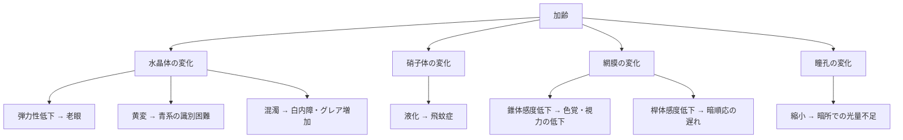
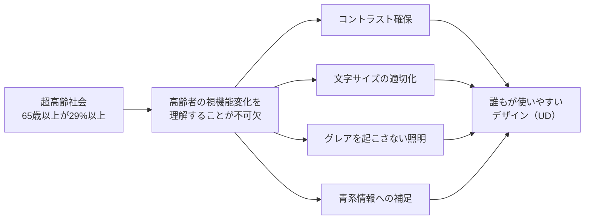

# lesson21: 加齢による視機能の変化 — 高齢者の見え方を知る

## このレッスンで学ぶこと

- 加齢によって起きる視機能の変化の種類と内容を説明できる
- 目の構造（水晶体・硝子体・網膜・瞳孔）の加齢変化のメカニズムを理解する
- グレア・暗順応・コントラスト感度など各変化がもたらす日常の困りごとを把握する
- 日本の高齢社会の現状とUDにおける高齢者配慮の重要性を理解する

## 加齢による視機能の変化は避けられない

目は生まれてから少しずつ変化し続けます。加齢に伴う視機能の変化は、特定の疾患がなくても誰にでも起きます。色覚特性と並んで、**高齢者の視機能変化への理解はUC級の重要テーマ**のひとつです。

変化の内容を知ることで、「高齢者はなぜそのように見えるのか」「どんなデザインが助けになるのか」を理由から理解できるようになります。

## 主な視機能の変化

### 1. 視力の低下（老眼）

加齢とともに**水晶体の弾力性が低下**します。水晶体は毛様体という筋肉によって厚みを変えることでピントを調節していますが、弾力性が失われると近くを見るときに厚くなれなくなります。これが**老眼（老視）**です。

一般的に40代後半から自覚が始まり、60代以降にはほぼすべての人に影響が出ます。

::: info 老眼は「病気」ではなく「加齢変化」
老眼は疾患ではなく、加齢に伴う生理的な変化です。眼鏡やコンタクトレンズで矯正できます。
:::

### 2. コントラスト感度の低下

コントラスト感度とは、**微妙な明暗差を感じ取る能力**のことです。加齢によってこの能力が低下すると、「薄い色の文字が白い背景に書かれていると読めない」「段差が見えにくい」という状況が生まれます。

デザインでいえば、**十分な明度差（コントラスト）の確保**が特に重要になります。

### 3. 色覚の変化（青系の識別困難）

水晶体が加齢とともに**黄変（おうへん）**することで、短波長の光（青系）が吸収されやすくなります。詳細は [lesson22](/lessons/lesson22/) で扱いますが、「青が暗く見える」「青と黒の区別がつきにくくなる」という変化が起きます。

### 4. 明順応・暗順応の遅れ

私たちの目は、明るさが大きく変わったときに少しずつ慣れていきます。慣れる方向によって名前が異なります。

| 名称 | 方向 | 担う細胞 | 例 |
|------|------|---------|------|
| **明順応** | 暗 → 明 | 主に**錐体**（明所視を担う） | 暗いトンネルから明るい屋外に出たときに目がくらむ感覚 |
| **暗順応** | 明 → 暗 | 主に**桿体**（暗所視を担う） | 明るい場所から暗い映画館に入ったとき、しばらく見えにくい |

加齢ではこの**順応にかかる時間が長くなります**。とくに桿体の感度低下によって**暗順応の遅れ**が顕著になり、映画館に入った直後・夜間の外出・トンネル進入時など「明→暗」の場面で見えにくくなります。明順応も若年者より時間がかかるようになります。

### 5. グレア（眩しさ）への感受性増大

**グレア**とは、過度に強い光や散乱した光によって視覚が妨げられる現象です。加齢によって水晶体が混濁してくると、光が散乱しやすくなりグレアが増加します。

対向車のヘッドライトが非常に眩しく感じたり、白い紙が眩しすぎて読みにくかったりします。

::: warning 「明るければよい」は間違い
高齢者への配慮として「照明を明るくすればよい」と思いがちですが、強すぎる光はグレアを増大させます。適切な明るさと光の方向・拡散が重要です。
:::

### 6. 視野の狭まり

**周辺視野（中心以外の視野）**が加齢とともに狭くなります。特に注意が必要なのは、左右から近づいてくる障害物や人物が見えにくくなる点です。交差点での事故リスクとも関連します。

## 色のUDの観点で特に重要な3つ

ここまで挙げた6つの変化はどれも大切ですが、**色のUD**の観点では次の3つを優先して押さえましょう。

1. **水晶体の黄変による色覚変化**: 青系が見えにくくなり、配色の判断に直接影響します
2. **コントラスト感度の低下**: 明度差が不足すると文字や図が読めなくなります
3. **グレアの増加**: 過度な照明や反射が、かえって見えにくさを生みます

この3つは、配色・照明・素材の設計判断に直結するため、デザイナーがまず理解すべきポイントです。

::: tip 各論への導線
水晶体の黄変とグレアの詳細は [lesson22](/lessons/lesson22/) で学びます。本レッスンが加齢変化の総論、[lesson22](/lessons/lesson22/) が各論という位置づけです。
:::

## 加齢が目に与えるメカニズム

加齢変化は目のどの部位で起きているのでしょうか。それぞれの部位と変化を整理します。

| 部位 | 加齢変化 | 引き起こす症状 |
|------|----------|----------------|
| 水晶体 | 弾力性の低下 | 老眼（近くが見えにくい） |
| 水晶体 | 黄変 | 青系の色が暗く・見えにくくなる |
| 水晶体 | 混濁（白内障） | 視力低下・グレア増加 |
| 硝子体 | 液化・線維化 | 飛蚊症（黒い点が浮かんで見える） |
| 網膜（錐体） | 感度低下 | 色覚の低下・視力の低下 |
| 網膜（桿体） | 感度低下 | 暗順応の遅れ・夜間視力の低下 |
| 瞳孔 | 縮小 | 暗所での光量不足 |

### 瞳孔の縮小

瞳孔は光の量を調節するカメラの絞りのような役割を持っています。加齢により瞳孔の最大開口径が小さくなり、暗い場所で取り込める光の量が減ります。これも夜間視力の低下に影響します。

## 高齢社会とUDにおける意義

日本は世界でも有数の超高齢社会です。**65歳以上の人口が総人口の29%以上**を占め、今後もさらに高齢化が進む見込みです。

つまり、日本社会で情報を発信したり、製品・サービスを提供したりするとき、**対象の約3人に1人が高齢者**という計算になります。高齢者の視機能変化を無視したデザインは、非常に多くの人を排除していることになります。

::: tip 高齢者に優しいデザインは全員に優しい
段差をなくしたスロープが車いすユーザーだけでなく台車を引く人やベビーカーを押す人にも便利なように、高齢者の視機能を考慮したデザインは若い人にとっても見やすいことがほとんどです。
:::

### 特に課題が大きい場面

- **公共サイン**: 駅・空港・病院などの案内表示
- **薬のラベル**: 小さな文字・低コントラストの印刷
- **食品パッケージ**: 賞味期限・注意書きの見えにくさ
- **デジタル機器**: スマートフォン・ATM・券売機の画面

## キーワード

| 用語 | 説明 |
|------|------|
| 老眼（老視） | 水晶体の弾力性低下によりピント調節ができなくなる加齢変化 |
| コントラスト感度 | 微妙な明暗差を感じ取る能力。加齢により低下する |
| 水晶体の黄変 | 加齢により水晶体タンパク質が変性し黄みがかる現象。青系の光の透過率が下がる |
| 明順応 | 暗い場所から明るい場所に入ったときに目が慣れるプロセス。主に錐体が担う |
| 暗順応 | 明るい場所から暗い場所に入ったときに目が慣れるプロセス。主に桿体が担う |
| グレア | 過度に強い光や散乱光によって視覚が妨げられる現象。加齢で感受性が増す |
| 桿体（かんたい） | 網膜の光受容細胞。主に暗所視・暗順応を担う。加齢で感度が低下 |
| 錐体（すいたい） | 網膜の光受容細胞。色覚・明所視を担う。加齢で感度が低下 |
| 視野の狭まり | 加齢により周辺視野が狭くなる変化 |
| 飛蚊症 | 硝子体の変化により黒い点や糸くずのようなものが見える現象 |

## 試験のポイント

- 加齢による視機能の変化は**6種類**をまとめて押さえる：視力低下・コントラスト感度低下・色覚変化（青系）・明順応/暗順応の遅れ・グレア感受性増大・視野の狭まり
- 各変化の**原因部位**を対応させて覚える（老眼＝水晶体の弾力低下、色覚変化＝水晶体の黄変、暗順応遅れ＝桿体の感度低下）
- **明順応＝暗→明（主に錐体）**、**暗順応＝明→暗（主に桿体）**。方向と担う細胞をセットで覚える
- **「明るくすればよい」は間違い**：グレア感受性も上がるため過度な照明はNG
- 日本は65歳以上が**人口の29%以上**を占める超高齢社会
- 高齢者に配慮したデザインは**全員に使いやすい**設計であることが多い
- 水晶体の変化は**老眼・黄変・白内障（混濁）**の3つを区別して覚える
