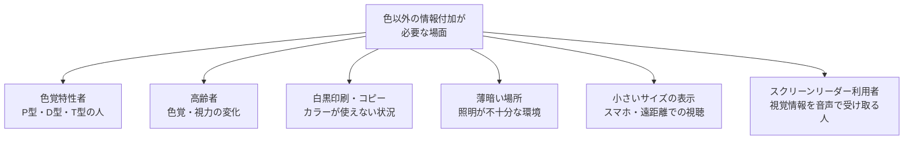
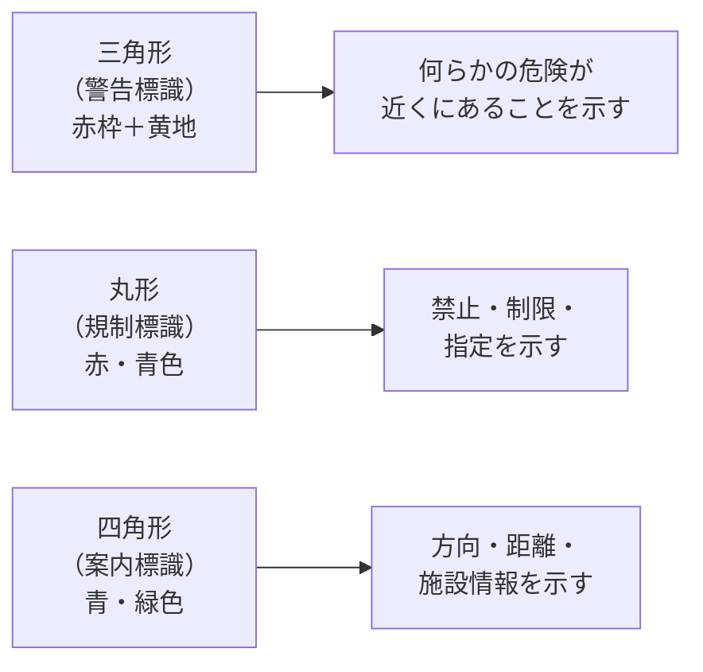
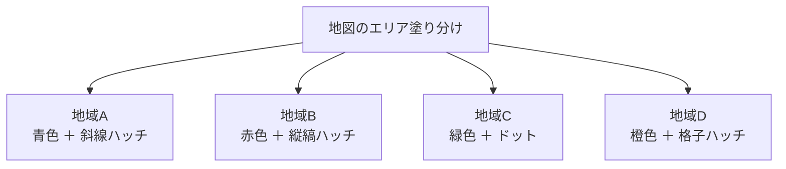
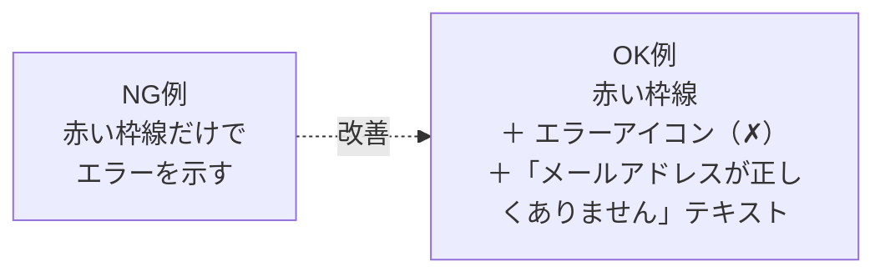
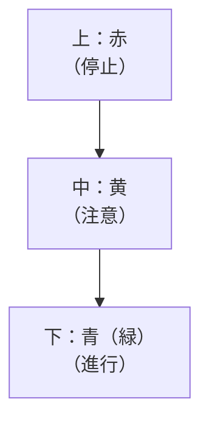

# lesson22: 色以外の情報付加 — 形・パターン・テキストを活用する

## このレッスンで学ぶこと

- 「色だけに頼らない」を実現する4つの具体的な手法（形・パターン・テキスト・位置）を理解する
- 各手法がどのような場面で有効か、具体的な事例とともに覚える
- 白黒印刷・薄暗い環境・照明変化など、色以外の制約がある状況でも情報が伝わる理由を理解する
- 実際のデザイン事例（グラフ・地図・フォーム・薬の管理）への応用方法を把握する

## なぜ色以外の情報付加が必要なのか

色に加えて別の手がかりも用意するというUD配色の原則を実践するには、具体的に「何を加えればよいか」を知る必要があります。

色以外の情報付加が必要な理由は、色覚特性への対応だけではありません。

つまり、色以外の手がかりを加えることは、多様な状況・多様な人々に対応する「強いデザイン」を作ることに直結します。

::: info 「アクセシビリティ向上」は全体の使いやすさ向上につながる
色以外の手がかりを加えると、色覚特性のない人にとっても情報が伝わりやすくなります。たとえばグラフに形（○△□）を加えると、白黒印刷時や遠くから見るときにも区別できて便利です。アクセシビリティの改善は、特定の人のためだけでなく全員の利便性を高めます。
:::

::: tip 4手法は同じ重みではない（信頼性の優先順位）
形・パターン・テキスト・位置の4手法は、確実さが同じではありません。迷ったときは「テキスト（文字）」が最も確実です。

| 優先 | 手法 | 特徴 |
|------|------|------|
| 高 | テキスト（文字） | 読めれば誰にでも確実に伝わる |
| ↓ | 形（シェイプ） | 白黒でも区別しやすい |
| ↓ | パターン（ハッチング） | 小サイズだと潰れやすい |
| 低 | 位置・順序 | 文脈や並びの理解が前提になる |

テキスト＞形＞パターン＞位置 の順で、情報の伝わりやすさ・確実さが高い傾向があります。
:::

## 場面別の使い分け

形・パターン・テキスト・位置の4手法は、場面によって有効なものが異なります。代表的な組み合わせを押さえておきましょう。

| 場面 | 有効な手法 | 理由 |
|------|----------|------|
| 折れ線・散布図グラフ | 形 ＋ テキスト | マーカーの形で系列を分け、ラベルで補う |
| 棒グラフ・地図 | パターン ＋ テキスト | ハッチングで塗り分け、ラベルで地域名を示す |
| 医療・薬の管理 | 必ずテキスト | 取り違えが生命に関わるため文字が不可欠 |
| 地図の区分 | パターン ＋ ラベル | 白黒印刷でも区別でき、名称で特定できる |
| 信号機・並んだUI | 位置・順序 | 並び順そのものが意味を伝える |
| フォームのエラー | 形 ＋ テキスト | アイコンと文章で原因まで伝える |

迷ったときは、最も確実なテキストを基本に据え、形やパターンを補助として重ねると安定します。

## 手法1: 形（シェイプ）の活用

形は、色が使えない・見えにくい状況でも確実に情報を伝えられる強力な手がかりです。

### グラフでの活用

折れ線グラフや散布図では、各系列に異なる形のマーカーを使うことで、色が区別できなくても系列を判別できます。

| 系列 | 色のみの場合 | 色＋形の場合 |
|------|------------|------------|
| 系列A | 赤線 | 赤線 ＋ ○マーカー |
| 系列B | 緑線 | 緑線 ＋ △マーカー |
| 系列C | 青線 | 青線 ＋ □マーカー |
| 系列D | 橙線 | 橙線 ＋ ◆マーカー |

グレースケールに変換しても、○△□◆の違いで系列を識別できます。

### アイコン・記号での活用

アイコンや記号は、形そのものに意味が込められているため、色が見えなくても情報が伝わります。

| 状況 | 形の例 | 意味 |
|------|--------|------|
| 完了・正常 | ✓（チェックマーク） | OK・正常 |
| 未完了・エラー | ✗（バツマーク） | NG・エラー |
| 注意・警告 | ！（感嘆符）△（三角） | 注意が必要 |
| 情報 | ℹ（インフォマーク） | 追加情報あり |

### 交通標識での活用（UD設計の優れた実例）

道路標識は「形＋色＋テキスト（または記号）」の組み合わせで設計されており、UD設計の優れた実例です。

形が違うだけで「警告・規制・案内」の種類が判断できます。色が見えなくても形で大まかな意味がわかります。

::: tip 形の組み合わせを考える
形を追加する際は「区別しやすい形の組み合わせ」を選ぶことが重要です。○と◎は似ているため区別しにくいですが、○と△と□の組み合わせは形の違いが明確で識別しやすいです。
:::

## 手法2: パターン（テクスチャ・ハッチング）の活用

パターン（テクスチャ・ハッチング）は、特に印刷物やグラフで威力を発揮します。白黒コピーされた場合でも、塗りのパターンの違いで区別できます。

### 棒グラフでの活用

棒グラフの各棒に、色と合わせてハッチングパターンを加えます。

| 系列 | 色 | ハッチングパターン |
|------|----|--------------------|
| 系列A | 青 | 斜線（右上がり斜め） |
| 系列B | 赤 | 縦縞 |
| 系列C | 緑 | ドット（点） |
| 系列D | 橙 | クロスハッチ（格子） |
| 系列E | 紫 | 横縞 |

### 地図での活用

エリアの塗り分けには、色に加えてパターンを使うと色覚特性者・白黒印刷の両方に対応できます。

### パターン活用の注意点

パターンを密すぎる・細かすぎると見えにくくなります。特に小サイズの印刷では、パターンが潰れて識別できなくなる場合があります。使用する最小サイズを想定してパターンの細かさを調整しましょう。

::: warning デジタルでのパターン表示
Webやデジタルでパターンを使う場合、低解像度モニターや小さい表示サイズではパターンが見えにくくなることがあります。パターンを使う際はサイズに余裕を持たせるか、テキストも合わせて使いましょう。
:::

## 手法3: テキスト・ラベルの活用

テキスト（文字）は、最もシンプルかつ確実に情報を伝える方法です。色が見えなくても、文字が読める限り情報は伝わります。

### グラフへのラベル付与

グラフの凡例を「色の四角形＋系列名」で示すだけでなく、データポイントや棒グラフに直接ラベルを付与すると、より確実に情報が伝わります。

| 方法 | 説明 | 効果 |
|------|------|------|
| 凡例に系列名を記載 | 「●東京」「△大阪」のように形＋名前 | 凡例を見れば系列がわかる |
| データポイントに数値ラベル | グラフの点や棒の上に数値を表示 | 値を読まなくても情報が伝わる |
| 最終データポイントに系列名 | 折れ線の端に直接「東京」「大阪」と記載 | 凡例と線を対応させる手間が省ける |

### 警告・状態表示への適用

フォームのエラーや警告表示では、色だけでなく必ずテキストも添えることが重要です。

### 「赤字文化」の問題と対策

日本のビジネス文書では「重要なことは赤字で書く」という慣習があります。しかしこれは色だけで重要性を示す方法であり、色覚特性者には伝わりにくい場合があります。

| 状況 | 問題のある方法 | 改善した方法 |
|------|-------------|------------|
| 重要事項の強調 | 赤文字のみ | 赤文字 ＋ **太字** |
| 訂正箇所の指示 | 赤文字のみ | 赤文字 ＋ 下線または取り消し線 |
| 締め切り日の強調 | 赤文字のみ | 赤文字 ＋ ★や「重要」ラベル |

::: tip 太字は最も手軽な補助手段
テキストを太字（ボールド）にすることは、色に依存せずに「強調」を伝える最も手軽な方法のひとつです。赤文字と太字を組み合わせることで、色覚特性に関わらず重要性が伝わります。
:::

## 手法4: 位置・順序の活用

位置や順序を利用することで、色に頼らずに情報を伝えられる場合があります。

### 信号機の事例

縦型信号機は「赤が上、黄が中、青（緑）が下」という位置で判断できます。これは色覚特性者が色の違いで信号を区別できない場合でも、位置で判断できる優れたUD設計です。

### テーブルのゼブラストライプ

表の行を交互に薄い色で塗り分ける「ゼブラストライプ」は、視線の行き違いを防ぐ効果的な手法です。ただし、色のみの区別に頼るのではなく、行番号や罫線とあわせて使うとより確実です。

| 工夫 | 内容 |
|------|------|
| ゼブラストライプ | 奇数行・偶数行を交互に薄い色で塗り分け |
| ゼブラ＋行番号 | 色が見えなくても行番号で位置を特定できる |
| ゼブラ＋罫線強化 | 色が見えにくくても罫線で行の区切りが分かる |

## 実際のデザイン事例

学んだ手法を実際のデザインでどう組み合わせるか、事例で確認しましょう。

### 地下鉄路線図

問題のある設計：各路線を色のみで区別（赤・緑・青など）

改善された設計：色＋路線番号（E線、T線など）＋路線名のテキスト表示

### 薬の管理

問題のある設計：錠剤の色やラベルの色だけで薬を管理

改善された設計：色＋薬の名前・用量の文字表記＋飲む時間のテキスト

::: info 薬の管理は特に重要
薬の取り違いは生命に関わる問題です。色だけで管理せず、薬の名前・量・服用時間を必ずテキストで記載することは、医療安全の観点からも不可欠です。
:::

### Webのフォームバリデーション

問題のある設計：エラー状態を赤い枠線だけで示す

改善された設計：赤い枠線＋✗アイコン＋「エラー：〇〇を入力してください」のテキストメッセージ

## キーワード

| 用語 | 説明 |
|------|------|
| ハッチング | 線や点などのパターン（縞・格子・ドット）による塗り分け手法。白黒印刷でも識別可能 |
| ゼブラストライプ | テーブルの行を交互に色で塗り分ける手法。視線の行き違いを防ぐ |
| アイコン | 形（✓✗⚠ℹ）で意味を伝える記号。色がなくても情報を伝達できる |
| マーカー形状 | 折れ線・散布図グラフの各系列に付ける形（○△□◆など）。色の代替として機能する |
| バリデーションエラー | フォームの入力内容が不正な場合に表示する警告。色＋アイコン＋テキストで伝える |
| テキストラベル | グラフや図に直接文字で説明を付ける手法。最も確実な情報伝達手段 |
| 位置・順序による識別 | 信号機の上中下など、位置（場所）によって情報を伝える手法 |

## 試験のポイント

- 色以外の情報付加の4つの手法（形・パターン・テキスト・位置）を列挙できるようにする
- **ハッチング（縞・ドット・格子）** は白黒印刷でも区別できる代表的なパターン手法
- **交通標識** は形（三角・丸・四角）＋色の組み合わせというUD設計の優れた実例
- **グラフのマーカー形状（○△□◆）** は折れ線グラフの系列識別に有効
- 「赤字文化」の問題点：赤文字のみでは色覚特性者に重要性が伝わらない → 太字や下線を併用
- **縦型信号機** は位置（上・中・下）での識別ができるUD設計の例
- テキストラベルは「最もシンプルかつ確実な」情報伝達手段
- 薬の管理では色だけでなくテキスト（薬名・用量・服用時間）が不可欠
