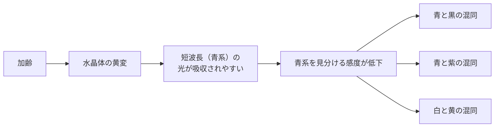
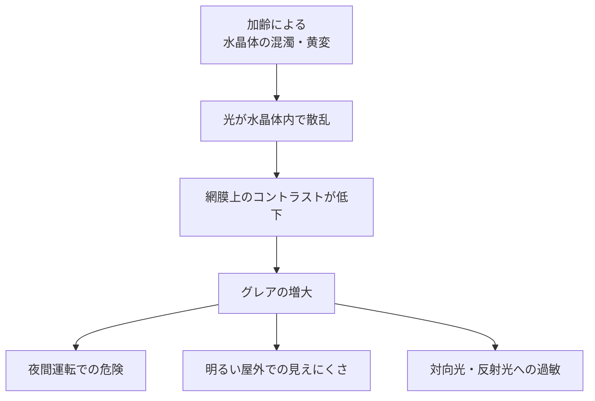
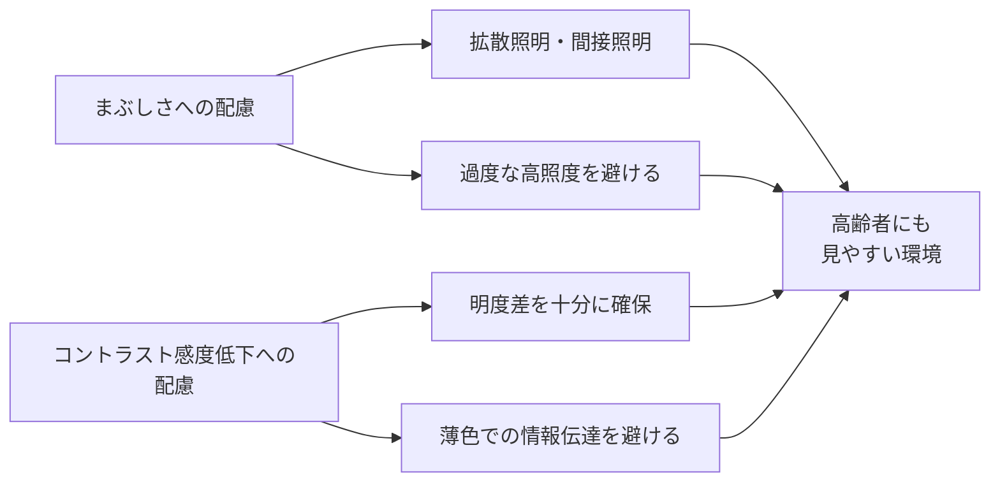

# lesson22: 高齢者の見え方の特徴 — 色の弁別機能とまぶしさへの感受性

## このレッスンで学ぶこと

- 水晶体の黄変で短波長（青系）が見えにくくなる仕組みを理解する
- 加齢で見分けにくくなる色（青と黒・青と紫・白と黄など）を理解する
- グレアの2種類（不能グレア・不快グレア）と加齢で増す理由を知る
- コントラスト感度の低下が日常に与える影響を理解する
- 高齢者に配慮した照明・配色の基本方針を身につける

[lesson21](/lessons/lesson21/)で扱った加齢による視機能の変化のうち、本レッスンでは **色の弁別機能** と **まぶしさ・コントラスト感** の2つに焦点を当てます。

## 色の弁別機能

加齢にともない、色を見分ける力（弁別機能）は少しずつ低下します。とくに **青系の色相** で影響が大きく、原因は水晶体の黄変です。

### 水晶体の黄変

**水晶体（すいしょうたい）** は目の中でピント調節を担うレンズ状の透明組織です。加齢にともない、水晶体が少しずつ **黄みがかってくる** 現象を黄変と呼びます。20代後半から始まり、60〜70代以降に顕著になります。紫外線は黄変を促進するため、屋外活動が多い人ほど進みやすい傾向があります。

### 短波長の透過率低下

黄変した水晶体は、**短波長側（青系）の光を吸収しやすくなります**。結果として、網膜に届く青系の光が減り、青を見分ける感度が低下します。長波長側（赤・橙系）への影響は小さいため、**青系だけが暗くくすんで見える** という偏りが生じます。

### 見分けにくくなる色の組み合わせ

加齢により混同しやすくなる代表的な組み合わせを整理します。

| 組み合わせ | 混同の理由 |
|------|------|
| 青と黒 | 青が暗く見え、黒に近づく |
| 青と紫 | 紫から青みの成分が抜け、両者の差が小さくなる |
| 白と黄 | 黄変した水晶体を通すと、白が淡い黄色に見えて黄と近づく |
| 水色と灰色 | 青みが抜けて、無彩色との区別が難しくなる |
| 緑と青緑 | 青みの差が読み取りにくくなる |

::: warning 安全に直結する具体例
- **青信号**: 青みが減って黒っぽく見え、青と緑の区別が難しくなります
- **ガスコンロの青い炎**: 炎が出ているか消えているかの判断が難しくなります
- **青色LEDの点灯表示**: 点いているかどうか判別しにくくなります
:::

### 黄変と白内障の関係

黄変と **白内障（はくないしょう）** はどちらも水晶体の変化ですが、症状の出方が異なります。詳しくは[lesson23](/lessons/lesson23/)で扱いますが、ここで対比だけ整理します。

| 比較 | 黄変 | 白内障 |
|------|------|--------|
| 変化の内容 | 水晶体が黄〜褐色に着色 | 水晶体が白く濁る |
| 主な症状 | 青系の色の識別困難 | 視力低下・かすみ・グレア増大 |
| 関係 | 加齢で進む生理的な変化 | 治療が必要な病気。加齢以外の原因（外傷・薬剤・他疾患）でも起こる |

水晶体の中心部が黄色く硬化するタイプ（核白内障）は黄変の延長と見なせる面もありますが、白内障には水晶体の外側が濁る皮質白内障や、後部が濁る後嚢下白内障など別の仕組みで起こるタイプもあるため、「黄変＝白内障の前段階」と単純化はできません。

## まぶしさとコントラスト感

加齢では「暗くて見えにくい」だけでなく「明るすぎて見えにくい」という問題も増えます。**グレア（Glare）** への感受性が高まり、**コントラスト感度** が低下するためです。

### グレアとは

**グレア** とは、過度に強い光や散乱光によって視覚が妨げられる現象のことです。単に「眩しい」だけでなく、「見たいものが見えなくなる」「目が痛い・疲れる」という影響が生じます。

グレアには大きく2種類あります。

| 種類 | 内容 | 例 |
|------|------|------|
| **不能グレア**（Disability Glare） | 視覚対象が見えなくなるほど強いグレア | 夜間の対向車のヘッドライト、正面からの直射日光 |
| **不快グレア**（Discomfort Glare） | 見えてはいるが不快に感じるグレア | 白い天井の蛍光灯、光沢のある紙の反射 |

### 加齢でグレアが増す理由

加齢で水晶体が混濁したり黄変が進むと、入ってきた光が水晶体内部で **散乱** します。散乱した光は網膜全体を照らしてしまい、本来見たい対象のコントラストを下げます。これが「眩しくてよく見えない」状態の正体です。

さらに高齢者では **瞳孔の縮小** や **瞳孔反応の鈍化** も起きます。明るい場所で瞳孔が小さくなっても、水晶体内で起きる散乱は瞳孔サイズと無関係に発生するため、グレアは軽減されません。

::: info 「明るくすればよい」ではない
高齢者には「とにかく明るく」が良いと思われがちですが、明るすぎる照明はグレアを増やし、かえって見えにくくします。適切な照度と拡散照明の組み合わせが重要です。
:::

### コントラスト感度の低下

**コントラスト感度** とは、明るさのわずかな差を見分ける力のことです。加齢にともない、薄い濃淡や淡い色の差を見分けるのが難しくなります。

低下の主な要因は次のとおりです。

- 水晶体の混濁・黄変による網膜像のコントラスト低下
- 網膜・視神経の感度低下
- 散乱光による「かぶり」

日常では次のような困りごとが起きます。

- 薄いグレーで印刷された文字が読みにくい
- 段差や階段の境目が見えにくく、つまずきやすい
- 白い皿に乗せた白いご飯が見分けにくい
- 淡い色のボタンが背景に溶け込んで気づかない

::: tip 高齢者にはコントラスト比をより高く
WCAG AAの基準は標準テキストで4.5:1以上ですが、高齢者向けの掲示や案内では **より高いコントラスト比（7:1以上）** を確保すると安心です。詳しくは[lesson27](/lessons/lesson27/)・[lesson28](/lessons/lesson28/)で扱います。
:::

### 適切な照明設計

グレアとコントラスト感度低下の両方に配慮した照明設計には、次の原則があります。

1. **光源を直接視野に入れない**: 直接照明より、間接照明や拡散照明を選ぶ
2. **必要以上に明るくしない**: 高照度はグレアを増大させる
3. **均一な照度分布にする**: 場所による明るさのムラを減らす
4. **段階的な明暗変化を設ける**: 急な明るさの変化を避ける
5. **反射を抑える**: 光沢のある床材・紙面・パネルを避ける

## キーワード

| 用語 | 説明 |
|------|------|
| 水晶体（すいしょうたい） | 目の中でピント調節を担うレンズ状の透明組織 |
| 黄変（おうへん） | 加齢により水晶体が黄みを帯びる現象 |
| 短波長の光 | 青・紫系の光。黄変により透過率が大きく低下する |
| 色の弁別機能 | 色相や明度の差を見分ける力。加齢で青系を中心に低下する |
| グレア（Glare） | 過度に強い光・散乱光によって視覚が妨げられる現象 |
| 不能グレア | 視覚対象が見えなくなるほど強いグレア。対向車のヘッドライトなど |
| 不快グレア | 見えるが不快・疲れを感じるグレア。蛍光灯・光沢紙の反射など |
| 光散乱 | 水晶体の混濁・黄変により光が四方八方に広がる現象。グレア増大の原因 |
| コントラスト感度 | 明るさのわずかな差を見分ける力。加齢で低下する |
| 拡散照明 | 光を散らして均一に行きわたらせる照明。グレア対策に有効 |

## 試験のポイント

- 水晶体の黄変により **短波長（青系）の透過率が低下** し、青系の弁別が困難になる
- 加齢で見分けにくくなる代表例：**青と黒・青と紫・白と黄**
- 黄変した水晶体は **短波長（青系）の光を吸収しやすくなり**、青系が暗くくすんで見える
- グレアには **不能グレア**（見えなくなる）と **不快グレア**（不快・疲れる）の2種類がある
- 加齢でグレアが増す理由は **水晶体の混濁・黄変による光散乱**
- **瞳孔の縮小はグレアを軽減しない**（散乱は水晶体内で起きるため）
- 加齢では **コントラスト感度** が低下し、薄い文字・段差・淡い色の差が見えにくくなる
- 高齢者配慮の照明原則：**拡散照明・適切な照度・段階的な明暗変化・反射の抑制**
- 「明るくすればよい」ではなく、**適切なコントラストと拡散照明** が重要
