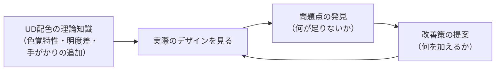
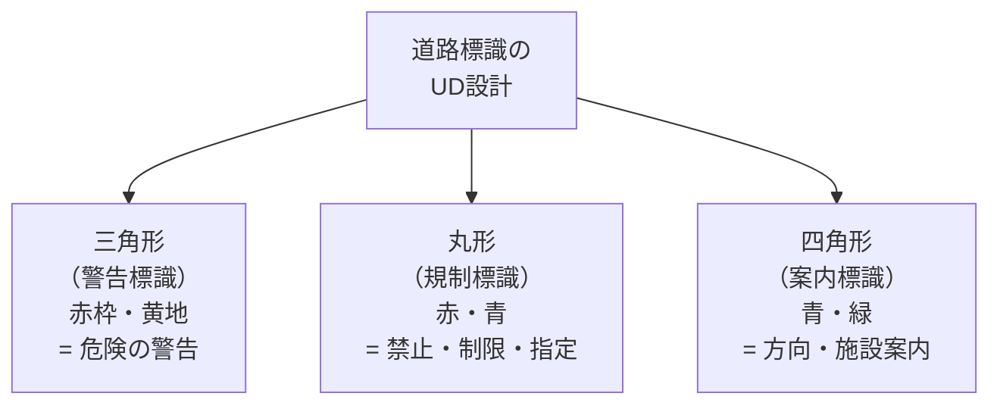
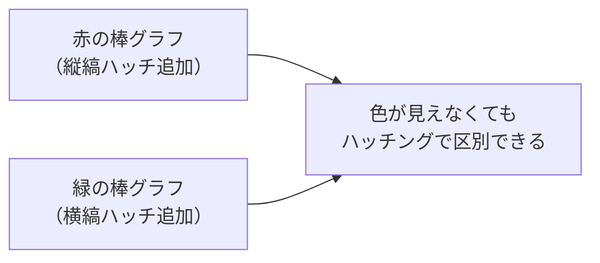
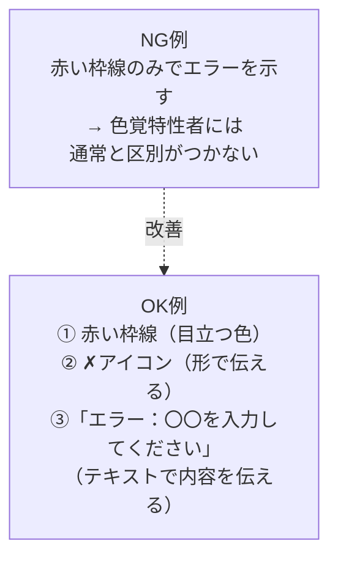
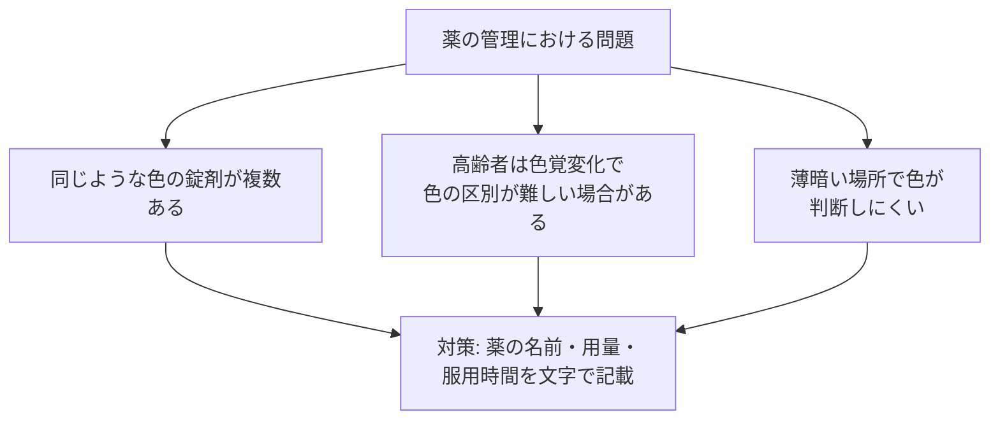
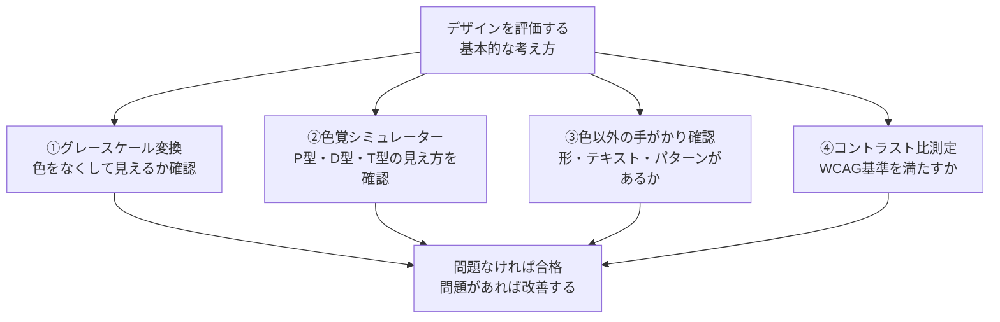

# lesson23: 事例で学ぶ色のUD — サイン・グラフ・Web

## このレッスンで学ぶこと

- 学んだUD配色の知識を「身の回りのデザインを評価する目」として活かす方法を理解する
- 交通・公共サインにおけるUD設計の実例（良い例・問題のある例）を把握する
- 資料・プレゼンにおけるグラフや表の配色問題と解決策を理解する
- WebやデジタルUIでのUD配色の実践（フォームエラー・グラフ・リンク）を学ぶ
- 医療・薬の場面での色管理の問題点と対策を把握する

---

## 「見る目」を養う — 事例学習の目的

これまでのレッスンで、UD配色の理論（色覚特性・明度差・色以外の手がかり）を学んできました。このレッスンでは「理論を実際の事例に当てはめる力」を養います。

試験では「この配色の問題点は何か」「どうすれば改善できるか」という実践的な設問が出されます。身の回りのデザインをUD配色の観点で評価・改善する思考プロセスを身につけましょう。

---

## 事例1: 交通・公共サイン

### 電車の路線図

日常的に目にする電車の路線図は、多くの色を使った複雑な情報を伝えるデザインです。

**問題のある配色の例**

| 問題 | 内容 |
|------|------|
| 近い色相の隣接 | 近い色相・近い明度の路線が隣り合っている |
| 色のみの区別 | 路線番号や路線名の記載がなく、色だけで識別させている |
| 薄い色の使用 | 背景に対して明度差が不足した薄い色の路線 |

**良い配色・デザインの例**

| 工夫 | 内容 |
|------|------|
| 路線番号の付与 | 各路線に「E線」「T線」「H線」のような番号・記号を付ける |
| 路線名の文字表記 | 駅や路線名をテキストでも表示する |
| 明度差のある色の選択 | 路線同士が隣接する部分で、明度差が十分な色を選ぶ |
| 太さ・線種の変化 | 幹線は太く、支線は細くするなど、色以外の情報も活用 |

::: info 実際の路線図の取り組み
東京の地下鉄路線図は、色に加えて各路線のアルファベット記号（G線、M線など）と路線カラーのブランド管理がされています。これにより、色が区別できない場合でもアルファベットで路線を特定できます。
:::

### 道路標識

道路標識は「形＋色＋記号・文字」の組み合わせで設計された、UD設計の優れた実例です。

色覚特性者でも形（三角・丸・四角）で「警告・規制・案内」の種類がわかります。色と形を両方使うUD設計の代表例として覚えましょう。

### 非常口サイン

緑の非常口ピクトグラムは国際規格（ISO 7010）に基づいています。

| 要素 | 内容 |
|------|------|
| 色 | 緑（安全・進む方向を示す） |
| 形 | 走る人の形＋矢印のシルエット |
| 色なしでも | 白地に黒のシルエットでも意味が伝わる形 |

::: tip ピクトグラムはUD設計の完成形
ピクトグラム（絵文字・象形記号）は、言語・色覚・視力に関わらず意味を伝えられるよう設計されています。非常口の走る人のシルエットは、色がなくても「出口・避難方向」を示しています。
:::

---

## 事例2: 資料・プレゼン

### 棒グラフの配色

オフィスで最も頻繁に作られる資料のひとつである棒グラフでは、UD配色の問題が起きやすいです。

**NG例: 赤と緑の2系列を色だけで区別**

P型（1型）・D型（2型）の人には赤も緑も同じような茶色っぽい色に見えます。凡例を見ても、どちらがどちらの系列か区別できません。

**OK例1: 色＋ハッチングを追加**

**OK例2: 色＋値ラベルを付与**

各棒の上に数値を直接表示することで、視覚的な区別よりも数値で情報を読み取れるようになります。

**OK例3: 明度差のある2色に変更**

赤と緑の組み合わせを、濃紺と黄色（または白）に変更すると、明度差が確保され P型（1型）・D型（2型）にも見やすくなります。

### 表の配色

| 問題のある配色 | 改善した配色 |
|-------------|------------|
| ヘッダーを赤、行を緑で塗り分け | ヘッダーを濃いグレー（白文字）、行を白 |
| 交互行の色差が小さすぎる | 白と中程度のグレー（#E0E0E0程度）の交互 |
| 注目行を赤背景のみで示す | 赤背景＋「★注目」のテキスト＋太字 |

### 「赤字文化」の問題点と対策

日本の職場で広く行われている「重要事項を赤文字で示す」慣習には、UD配色の観点から問題があります。

::: warning 赤文字だけでは伝わらない場合がある
P型・D型の色覚特性を持つ人の中には、黒文字と赤文字の区別が難しい場合があります。「赤字でマークしておいた重要な部分」が見落とされるリスクがあります。
:::

| 状況 | 問題のある方法 | 改善した方法 |
|------|-------------|------------|
| 重要事項 | 赤文字のみ | 赤文字 ＋ **太字** |
| 修正・変更箇所 | 赤文字のみ | 赤文字 ＋ 下線・取り消し線 |
| 数値の強調 | 赤文字のみ | 赤文字 ＋ 大きいフォントサイズ |
| 注意事項 | 赤文字のみ | 赤文字 ＋「※注意」のラベル |

---

## 事例3: Web・デジタル

### フォームのバリデーションエラー

Webフォームでの入力エラー表示は、UD配色が最も重要な場面のひとつです。

WCAGでは「エラーを色のみで示してはいけない」という規定があります（WCAG 1.4.1: 色の使用）。エラーには必ずテキストによる説明を付けることが求められます。

### グラフ・ダッシュボード

ビジネスで使われるダッシュボードやレポートグラフでは、数値の正負や比較を色で示すことがよくあります。

| 問題のある設計 | 改善した設計 |
|-------------|------------|
| 前年比プラスを青、マイナスを赤で示す（色のみ） | 色＋「+10%」「-5%」のテキスト表示 |
| 目標達成を緑、未達成を赤で示す（色のみ） | 色＋「達成」「未達成」のラベル＋進捗バー |
| 株価上昇を青、下落を赤で示す（色のみ） | 色＋↑↓の矢印記号＋数値テキスト |

### リンクの表示（WCAG基準）

Webページのリンクテキストを「テキストの色だけ」で本文と区別するのは、WCAGでは問題があるとされています。

| 問題のある設計 | 改善した設計 |
|-------------|------------|
| 本文と同じサイズ・書体でリンクのみ青色で示す | 青色＋下線（アンダーライン） |
| 下線なしでリンクを示す | 下線付き＋ホバー時に背景色変化など |
| コントラストの低いリンク色 | WCAG AAのコントラスト比4.5:1以上を確保 |

::: info WCAGのリンク基準（1.4.1）
WCAGでは、リンクを本文テキストと区別するために色以外の視覚的手がかり（下線など）が必要と規定しています。ただし、リンクが3:1以上の色コントラストを持ちかつホバー時に下線が現れる場合は例外として認められます。
:::

---

## 事例4: 医療・薬

### 薬の色別管理の問題点

薬の見た目（色・形・サイズ）は似ているものが多く、色だけで管理すると取り違えの危険があります。

| 良い薬の管理方法 | 内容 |
|---------------|------|
| 薬名をテキストで表記 | 色だけでなく薬品名を文字で明記する |
| 用量の明記 | 「1錠」「2錠」「半錠」を文字で表示 |
| 服用時間の明記 | 「朝食後」「就寝前」などをテキストで明記 |
| 一包化調剤 | 1回分をまとめて包装し、袋に情報を印刷する |

### 点滴・注射薬の管理

医療現場での薬剤管理では、色だけでなくテキストが必須です。

| 手段 | 内容 |
|------|------|
| カラーコードラベル | 薬剤の種類を色で区別するラベル |
| テキスト表記の必須化 | ラベルには薬剤名・濃度・調合時刻を文字で記載 |
| バーコード管理 | 色に依存しない機械的な識別手段 |

::: warning 医療安全とUD配色
医療現場では「色の見間違い」や「ラベルの見落とし」が重大な医療事故につながる可能性があります。色だけに依存した管理を避け、テキスト・バーコードなど複数の識別手段を組み合わせることが医療安全の基本です。
:::

---

## UD配色の「評価の目」をまとめる

学んだ事例をもとに、デザインを評価する際のチェックポイントをまとめます。

| チェック項目 | 確認方法 |
|------------|---------|
| 色だけで区別していないか | グレースケールに変換して確認する |
| 明度差は十分か | コントラスト比ツールで計測（4.5:1以上が目安） |
| 色覚特性者の見え方は | 色覚シミュレーターで確認 |
| 形やパターンが使われているか | 目視でグラフ・図版を確認 |
| テキストで情報が補完されているか | エラー・警告・強調に文字情報があるか確認 |
| 赤と緑の組み合わせが避けられているか | 特にグラフの系列色に注意 |

---

## キーワード

| 用語 | 説明 |
|------|------|
| UD設計 | ユニバーサルデザインの考え方を取り入れた設計。多様な人・状況に対応できる |
| 道路標識の三種類 | 三角（警告）・丸（規制）・四角（案内）。色＋形によるUD設計の優れた実例 |
| WCAG 1.4.1 | 「色の使用」規定。色だけで情報を伝えてはいけないというWebアクセシビリティの基準 |
| バリデーションエラー | Webフォームの入力エラー表示。赤枠＋アイコン＋テキストで伝えることが必要 |
| ピクトグラム | 形（シルエット・絵文字）で意味を伝える記号。言語・色覚に関わらず情報を伝えられる |
| 一包化調剤 | 1回分の薬をまとめて包装し、袋に薬情報を印刷する薬の管理方法 |
| 色覚シミュレーター | P型・D型・T型の色の見え方をシミュレートするツール（UDing等） |
| 赤字文化 | 重要事項を赤文字で示す日本のビジネス慣習。色だけへの依存で色覚特性者に伝わらない場合がある |

---

## 試験のポイント

- **道路標識** は形（三角・丸・四角）＋色の組み合わせというUD設計の優れた実例として頻出
- **電車の路線図** では色＋路線番号（文字）の組み合わせが改善例
- **グラフのNG例**: 赤と緑の2系列を色のみで区別 → 改善: ハッチング追加または値ラベル追加
- **フォームエラー** は WCAG 1.4.1 により「色のみで示してはいけない」
- **リンクの表示** には下線などの色以外の手がかりが必要（WCAG基準）
- **「赤字文化」の問題**: 赤文字のみでは色覚特性者に重要性が伝わらない → 太字・下線を併用
- **医療・薬の管理**: 色だけでなくテキスト（薬名・用量・服用時間）の記載が安全に不可欠
- **縦型信号機** は「位置（上・中・下）」による識別ができるUD設計の代表例
- UD配色の評価手順: グレースケール変換 → シミュレーター確認 → コントラスト比測定 → 色以外の手がかり確認
