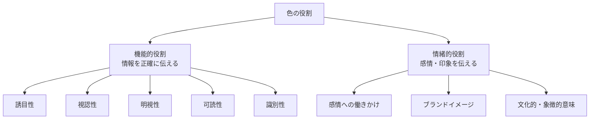
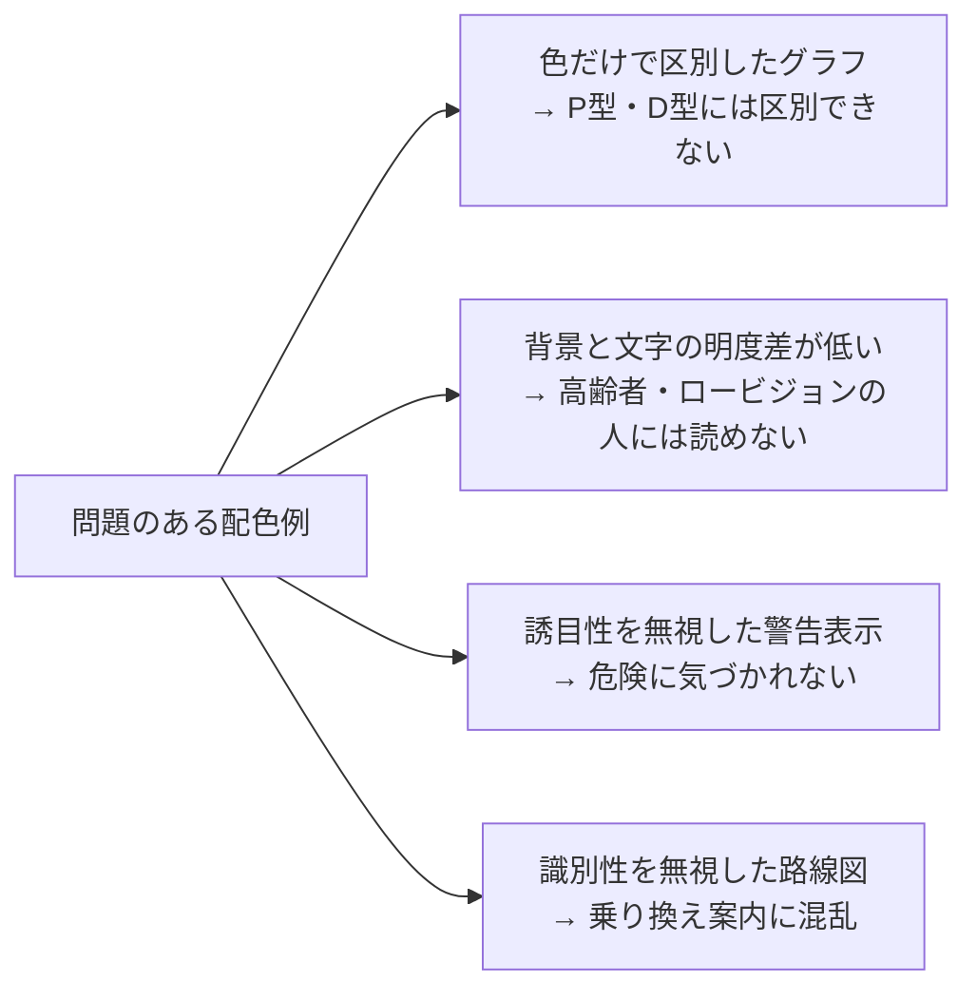

# lesson25: 色の機能的役割と情緒的役割

## このレッスンで学ぶこと

- 色の役割が「機能的役割」と「情緒的役割」の2種類に分かれることを理解する
- 誘目性・視認性・明視性・可読性・識別性の定義と違いを説明できるようになる
- UC級の試験において機能的役割が中心となる理由を理解する
- 機能的役割を果たさない配色の具体的な問題点を把握する
- 情緒的役割との両立という観点でデザインを考えられるようになる

## 色の2つの役割

私たちの日常にある色は、大きく2つの役割を担っています。

1. **機能的役割**：情報を正確に・わかりやすく伝える役割
2. **情緒的役割**：感情・印象・イメージを伝える役割

UC級では特に「機能的役割」が重要なテーマです。色のUDは「色が情報として正確に伝わるか」に焦点を当てた取り組みだからです。

## 機能的役割

機能的役割とは、色が情報を正確・効率的に伝えるために果たす役割です。代表的な5つの機能をしっかり覚えましょう。誘目性→視認性→明視性は「対象を見つけ、内容を理解する」までの段階に対応しています。

### 誘目性（ゆうもくせい）

**注意を引きつける力**のことです。見ようと意識していなくても自然と目が向く性質を指します。

- 彩度が高い（鮮やかな）色は誘目性が高い
- 赤・オレンジ・黄色などの暖色系が特に注意を引きやすい
- 周囲の色と大きく異なる色（異質な色）は目立ちやすい

**例**: 赤い非常口表示、黄色い踏切の遮断機、工事現場のオレンジ色の安全コーン

::: tip 誘目性のポイント
誘目性は「見ようとしていなくても目に入る」性質です。危険を知らせる・注意を促す場面で積極的に使われます。
:::

### 視認性（しにんせい）

**注意を向けたときに、対象を見つけやすい力**のことです。誘目性が「無意識でも目に入る」のに対し、視認性は「探したときに見つかるか」を指します。背景と対象の明度差が大きいほど高くなります。

- 背景と対象物の明度差が大きいほど見つけやすくなる
- 白地に黒文字は最も視認性が高い組み合わせのひとつ
- 夜間の標識（黒地に黄文字）も明度差を活かしている

**例**: 遠くからでも見つかる非常口サイン、黒地に白抜き文字の案内表示

::: warning 視認性と色覚特性
視認性を高めるには**明度差を意識することが重要**です。色相が違っても明度差が小さいと、色覚特性のある人には見つけにくくなることがあります。
:::

### 明視性（めいしせい）

**見つけた対象の形や内容を理解しやすい力**のことです。視認性が「見つかるか」であるのに対し、明視性は「見つけたあとに何かがわかるか」を指します。

- 図形やマークの形がはっきり読み取れる
- 細部がつぶれず、意味が正しく伝わる
- 明度差に加え、形の単純さ・大きさも影響する

**例**: 形がはっきり判別できるピクトグラム、細部までわかる地図記号

::: tip 視認性と明視性の違い
**視認性＝見つけやすさ**、**明視性＝見つけた後のわかりやすさ**と整理すると区別しやすくなります。遠くの標識に「気づく」のが視認性、近づいて「内容を読み取れる」のが明視性です。
:::

### 可読性（かどくせい）

**文字や図形が読み取りやすい力**のことです。視認性と似ていますが、可読性は特に「テキストや細かい情報を読む」場面での見やすさを指します。

- 本文テキストには十分なコントラスト比が必要（WCAG基準では4.5:1以上）
- 背景と文字色の明度差が低いと読み疲れる
- フォントの太さ・サイズとの組み合わせも影響する

**例**: 書籍の本文（白地に黒文字）、スマートフォンの読みやすいアプリ画面

### 識別性（しきべつせい）

**複数の要素を区別しやすい力**のことです。複数の情報を色で分類・整理するときに重要になります。

可読性は「同じ情報をいかに読みやすくするか」、識別性は「複数の異なる情報をいかに区別しやすくするか」と整理すると区別しやすくなります。

- グラフの複数の系列を色で区別する
- 地図上で異なるエリアを色分けする
- 複数の路線を色で区別する（電車の路線図など）

**例**: 折れ線グラフの凡例の色分け、路線図の各路線の色

::: warning 識別性と色のUD
識別性は色のUDと最も直結する機能です。**色だけで識別できるようにすると、色覚特性者には区別できなくなります**。識別性を確保するには、色に加えて形・文字・パターンなどを組み合わせることが重要です。
:::

## 機能的役割の一覧

| 機能 | 定義 | 主なポイント | 代表例 |
|------|------|-------------|--------|
| 誘目性 | 意識しなくても注意を引きつける力 | 彩度が高い色・暖色系が有利 | 非常口サイン・警告表示 |
| 視認性 | 注意を向けたときの見つけやすさ | 明度差が大きいほど高い | 遠くから見える標識・案内表示 |
| 明視性 | 見つけた対象の内容のわかりやすさ | 形の明瞭さ・明度差・大きさ | ピクトグラム・地図記号 |
| 可読性 | 文字・文章の読みやすさ | コントラスト比を十分に確保する | 書籍の本文・UI画面 |
| 識別性 | 複数要素を区別する力 | 色だけでなく形・文字も使う | 路線図・グラフの凡例 |

## 情緒的役割

情緒的役割とは、色が感情・印象・イメージを伝える役割です。これは色のUDよりも、ブランディングやマーケティングの分野で特に重視されます。

### 色と感情のイメージ

| 色 | 一般的なイメージ・感情 |
|----|----------------------|
| 赤 | 情熱・エネルギー・危険・愛情 |
| 青 | 冷静・信頼・清潔・知性 |
| 黄 | 明るさ・注意・楽しさ・軽快さ |
| 緑 | 自然・安らぎ・安全・成長 |
| 白 | 清潔・純粋・シンプル |
| 黒 | 高級感・重厚感・威厳 |

::: info 情緒的役割は文化によって異なる
色のイメージは文化・地域によって異なります。たとえば、白は日本では「清潔・純粋」ですが、一部のアジア文化では「喪の色」とされます。グローバルなデザインでは注意が必要です。
:::

### ブランドイメージと色

企業やブランドは色を使って一貫したイメージを構築しています。これを「コーポレートカラー」と呼びます。消費者は色を見ただけでブランドを識別できるようになります。

## UC級で重要なのは機能的役割

UC級の試験・実務では、情緒的役割よりも**機能的役割**を重視します。その理由は、色のUDが「情報が正確に伝わるか」を問題にしているからです。

**機能的役割を果たさない配色の具体例：**

## 機能的役割と情緒的役割の両立

デザインの現場では、機能的役割と情緒的役割の両立が求められます。UDを意識しながら、同時に美しく・ブランドらしい配色を実現することがデザイナーの腕の見せ所です。

::: tip 両立のヒント
- 明度差を確保しながらブランドカラーを維持する
- 色に加えて形や文字を使い、機能性を確保する
- シミュレーターで確認しながら情緒的なデザインを磨く
:::

## キーワード

| 用語 | 説明 |
|------|------|
| 機能的役割 | 色が情報を正確・効率的に伝える役割。誘目性・視認性・明視性・可読性・識別性が代表的 |
| 情緒的役割 | 色が感情・印象・イメージを伝える役割。ブランドイメージや感情表現に使われる |
| 誘目性 | 意識しなくても自然と注意を引きつける力。彩度の高い暖色系が強い |
| 視認性 | 注意を向けたときに対象を見つけやすい力。明度差が大きいほど高い |
| 明視性 | 見つけた対象の形・内容を理解しやすい力。形の明瞭さや大きさも影響する |
| 可読性 | 文字や文章が読み取りやすい力。コントラスト比が重要 |
| 識別性 | 複数の要素を色で区別しやすい力。路線図・グラフの凡例など |
| 明度差 | 色の明るさの差。明度差が大きいほど視認性・可読性が高くなる |
| コントラスト比 | 背景と前景の明度の比率。WCAG基準では本文に4.5:1以上が推奨される |

## 試験のポイント

- **誘目性・視認性・明視性・可読性・識別性の定義と違い**を区別して覚える（特に「誘目性」「視認性」「明視性」は混同しやすい）
- **誘目性＝目立つ、視認性＝見つけやすい、明視性＝見つけた後わかりやすい**という段階の違いを押さえる
- **誘目性は彩度**が関係し、**視認性・明視性・可読性は明度差**が関係する
- **UC級では機能的役割が中心**であることを押さえる
- **識別性と色のUD**の関係：色だけで識別すると色覚特性者に伝わらないリスクがある
- **情緒的役割は文化によって異なる**という点も出題されることがある
- 機能的役割と情緒的役割は「どちらか一方」ではなく、**両立させることが理想**
