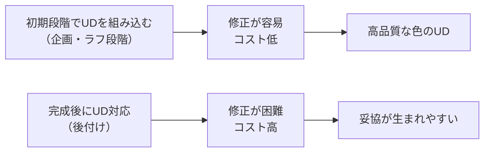

# lesson26: 色のUDを進める手順 — 計画から実施までの5ステップ

## このレッスンで学ぶこと

- UD実現には体系的なプロセスが必要な理由を理解する
- 色のUD設計の5ステップを覚える（現状把握→問題洗い出し→改善案→シミュレーション→実施・評価）
- 各ステップで何をするかを理解する
- UDは継続的な改善サイクルであることを理解する
- 設計の初期段階から組み込むメリットを知る

::: info この3レッスンの位置づけ
[lesson25](/lessons/lesson25/) で学んだ色の機能的役割を踏まえ、実際にUDを実現するための「**進め方（プロセス）**」を本レッスンで学びます。続く [lesson27](/lessons/lesson27/) で**チェックに使うツール**、[lesson28](/lessons/lesson28/) で**具体的な設計と修正のポイント**を学び、3レッスンで色のUD実践の全体像を押さえます。
:::

## 「良い意図」だけでは足りない理由

「色覚特性のある人のために配慮したい」という思いを持っている人は増えています。しかし、善意や意識だけでは、具体的な成果につながらないことがほとんどです。

この理由は、**色のUDを実現するには、意識だけでなく具体的な手順（プロセス）が必要**だからです。「なんとなく目立つ色にした」「明るい色を使った」といった感覚的な判断では、意図せず見えにくい組み合わせを選んでしまうことがあります。

一方、体系的なプロセスに沿って進めれば、問題を見落とすリスクが大きく下がります。このレッスンでは、色のUD設計を実践するための**5つのステップ**を順番に学んでいきます。

::: info なぜプロセスが必要か
人間は自分の見え方が「標準」だと思い込みがちです。C型（一般的な色覚）の人が「これで問題ない」と判断しても、P型・D型・T型の人や高齢者には見えにくい配色になっていることがあります。プロセスに沿って確認することで、この「見え方の思い込み」を補えます。
:::

## 色のUD設計の5ステップ

ステップ5の後、「継続改善」として再びステップ1に戻ります。UDは一方通行の手順ではなく、**サイクルとして繰り返す**ことが本来の姿です。

## ステップ1：現状把握

最初のステップは、現在使っている色の状態を把握することです。「問題が潜んでいる」という前提で、現状を客観的に整理します。

### 何をするか

- **現在使っている色の組み合わせを一覧化する**: 資料・ウェブサイト・製品パッケージ・サイン・グラフなど、色を使っているすべての要素をリストアップします
- **色に依存した情報伝達がないか確認する**: 「赤は重要、黒は通常」「グラフの赤線と緑線を見比べる」など、色だけで意味を伝えている箇所を洗い出します
- **対象ユーザーのプロファイルを把握する**: 高齢者向けか、一般向けか、子ども向けか。ターゲット層によって注意すべき色覚の特性が異なります

::: tip 一覧化のコツ
資料を印刷してすべてのページをチェックするか、デジタルならスクリーンショットを撮って一枚ずつ確認します。「普段目にしているのに気づいていなかった」問題点が見えてくることがよくあります。
:::

## ステップ2：問題点の洗い出し

現状を把握したら、次に具体的な問題点を特定します。「何が見えにくいか」を明らかにするステップです。

### 何をするか

- **混同色線に近い色の組み合わせを特定する**: P型・D型に混同されやすい「赤と緑」「赤とオレンジ」「緑と茶色」などの組み合わせが使われていないか確認します
- **明度差が不足している箇所を特定する**: 色相が違っていても明度（明るさ）が似ていると、グレースケール（白黒）変換で区別できなくなります
- **色だけで伝えている情報を特定する**: 凡例、警告マーク、区別の手がかりが「色のみ」になっている箇所を見つけます

| チェック項目 | 具体例 |
|------------|--------|
| 赤×緑の組み合わせ | グラフの2系統、信号の赤と青緑 |
| 明度差の不足 | 似た明るさの2色で隣接している箇所 |
| 色のみの情報伝達 | 赤字だけで「重要」を示している |
| 青系の識別 | 高齢者向け資料での青・紫系の使用 |

::: warning 「きれいな配色」が問題を隠すことも
デザイン的に洗練されていて見た目が良い配色でも、色覚特性のある人や高齢者には見えにくい場合があります。見た目の美しさと情報伝達の確実さは、別々に評価する必要があります。
:::

## ステップ3：改善案の策定

問題点が明らかになったら、具体的な改善案を複数考えます。1つに絞らず、**複数の案を並べて比較**することが重要です。

### 何をするか

- **代替配色の提案**: 明度差を確保する、色相を大きく変えるなど、色そのものの変更案を検討します
- **色以外の手がかりの追加**: テキストラベル、形の違い、パターン（ハッチング）など、色に頼らない情報伝達を加えます
- **複数の改善案を並べて比較する**: 「案A：色を変える」「案B：マーカーを追加する」「案C：両方」のように比較表を作ると意思決定がしやすくなります

::: info 「改善案は複数出す」理由
1つの改善案しか作らないと、それが本当に最善かどうか判断できません。また、ブランドカラーの変更が難しい場合など、制約がある状況では「色以外の手がかり追加」という別のアプローチが現実的な解決策になります。
:::

## ステップ4：シミュレーション・確認

改善案を決めたら、実際に適用する前に**必ずシミュレーションで確認**します。自分の目で「P型にはこう見える」「高齢者にはこう見える」を確かめます。

### 何をするか

- **色覚シミュレーターで確認する**: P型・D型・T型の見え方をシミュレーションします（具体的なツールはlesson27で詳しく解説）
- **白黒コピーでのチェック**: グレースケール変換後も情報が伝わるかを確認します。白黒印刷環境でも読めることは、アクセシビリティの基本です
- **実際の当事者にフィードバックを求める**: シミュレーターはあくまで近似です。可能であれば、色覚特性のある人や高齢者に実際に見てもらい、意見をもらうことが最も確実です

::: warning シミュレーターを過信しない
シミュレーターは「P型の見え方に近い状態」を再現しますが、実際の当事者の見え方と完全には一致しません。あくまで「問題を見つけるための道具」として使い、最終的には当事者の声を大切にしましょう。
:::

## ステップ5：実施・評価

シミュレーションで問題がないことを確認したら、実際に改善案を適用します。そして適用後も評価を続けます。

### 何をするか

- **改善案を適用する**: デザインファイル・印刷物・ウェブサイトなどに変更を反映します
- **実際の使用環境での評価**: モニターの設定、印刷の色再現、屋外のサインなど、実際の使用環境で確認します。デザインソフト上では問題なくても、実際の媒体で見えにくくなることがあります
- **継続的な見直し**: 使用を続ける中で新たな問題が見つかることもあります。定期的に見直すプロセスを組み込みます

::: tip 実施前後で確認したい成功基準チェックリスト
完璧な数値目標を追うのではなく、以下の現実的な観点を満たせているかを確認しましょう。

- □ グレースケール変換しても要素どうしを区別できる
- □ コントラスト比がWCAG AA（4.5:1以上）を満たす
- □ シミュレーターでP型・D型・T型のいずれでも区別できる
- □ 色以外の手がかり（形・テキスト・パターン）がある

すべてを一度に満たせなくても、満たせた項目を増やしていく姿勢が大切です。
:::

## UDプロセスを実践するための3つの考え方

### 考え方1：継続的改善

UDは「一度やれば終わり」ではありません。社会や技術は変化し、デザインも更新されます。そのたびにプロセスを繰り返すことが、継続的なUDの実践につながります。

### 考え方2：設計の初期段階から組み込む

後付けでUDに対応しようとすると、コストと手間が大きくなります。デザインの初期段階（企画・ラフ段階）からUD視点を取り入れることで、修正が容易になり、品質も上がります。

### 考え方3：完璧を目指さず、改善を積み重ねる

「完璧なUD」を一度に実現しようとすると、ハードルが高くなりすぎて着手できなくなりがちです。まずは「明らかな問題点を1つ解決する」という小さな改善から始め、継続的に積み重ねていく姿勢が大切です。

::: tip 小さな改善から始める
「グラフの赤と緑を、赤とオレンジ寄りの色に変えた」「重要な文字を太字にも変えた」といった小さな改善でも、確実に多くの人にとって見やすくなります。完璧を待つより、できることから始めましょう。
:::

## キーワード

| 用語 | 説明 |
|------|------|
| UD設計プロセス | 現状把握→問題洗い出し→改善案策定→シミュレーション→実施・評価の5ステップ |
| 現状把握 | 使用中の色の一覧化と、色依存の情報伝達箇所の確認 |
| 混同色線 | 色覚特性のある人が同じ色として認識してしまう色を結ぶ直線（色度図上） |
| 明度差の確認 | グレースケール変換で区別できるかを確認する方法 |
| 色以外の手がかり | テキストラベル・形・パターン（ハッチング）など、色に頼らない情報伝達手段 |
| 継続的改善 | UD設計は一度で終わらず、使用しながら改善を繰り返すプロセス |
| 後付け対応のコスト | 完成後にUDを加えようとすると修正が難しくなる。初期段階での取り込みが重要 |

## 試験のポイント

- 色のUD設計の**5ステップの順番と内容**を正確に覚える：現状把握→問題洗い出し→改善案策定→シミュレーション→実施・評価
- ステップ5の後は**継続的改善としてステップ1に戻る**（一方通行ではなくサイクル）
- **「完璧を目指すより改善を積み重ねる」**という姿勢がUDの基本
- シミュレーターでの確認だけでなく、**当事者へのフィードバック**が最終的に重要
- 設計の**初期段階からUDを組み込む**ことでコストが下がる（後付け対応は難しい）
- **白黒コピーでのチェック**は明度差確認の最も簡単な方法
- 改善案は**複数作って比較する**ことが、より良い結果につながる
