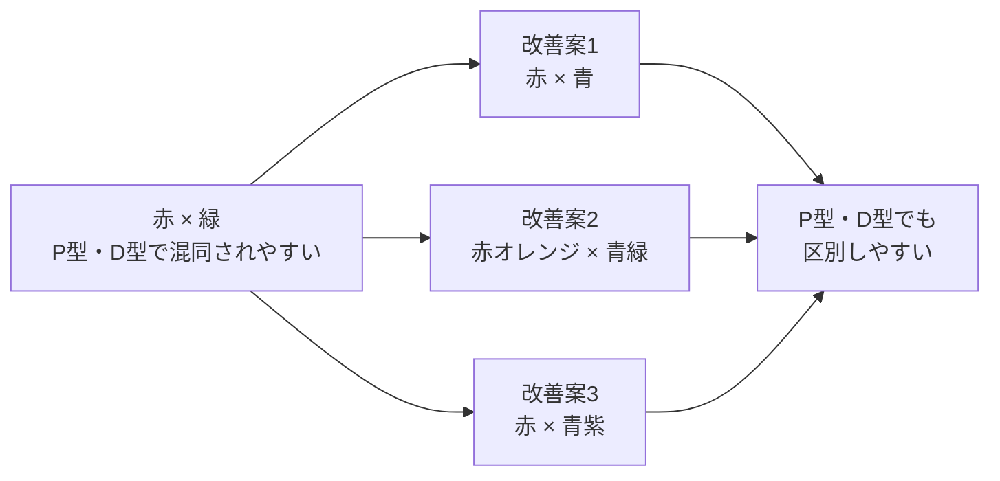
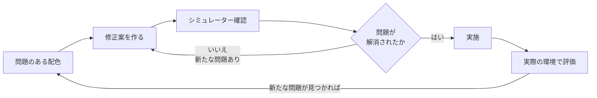

# lesson26: 配色の修正 — 見えにくい配色を改善する具体的な手法

## このレッスンで学ぶこと

- 見えにくい配色を「見やすい配色」に変えるための基本アプローチを理解する
- 色相・明度・彩度を変える3つの修正方向を覚える
- 色の変更が難しい場合に「色以外の手がかり」を追加する手法を学ぶ
- 赤×緑グラフ・赤字資料・青紫UIなど、よくある問題事例の改善例を知る
- 改善後のシミュレーション確認がなぜ必要かを理解する

## 改善の考え方：問題のある配色を見やすい配色に変える

「見えにくい配色があると分かった」次のステップは、具体的に**何をどう変えるか**を決めることです。配色の修正には大きく分けて「色そのものを変える」アプローチと「色以外の手がかりを加える」アプローチがあります。

::: info 修正の方向性は2つ
**方向性A：色を変える**（色相・明度・彩度の変更）
**方向性B：色以外を加える**（テキスト・形・パターンの追加）

制約がある場合（ブランドカラーの変更が難しい等）は方向性Bが現実的な選択肢になります。
:::

## 基本アプローチ1：色相を変える

**色相（どんな色か）を変えることで、混同されやすい組み合わせを解消**できます。

P型（1型）・D型（2型）に混同されやすい代表的な組み合わせは「赤と緑」です。赤と緑は色相環で離れた関係にありますが、その色相差はP型・D型には認識されにくいため混同されます（[lesson21](/lessons/lesson21/)参照）。この組み合わせを解消するには、次のような方向性で色相を変えます。

- **赤と緑 → 赤（または赤オレンジ）と青（または青緑）**: 赤はそのまま、緑を青系に変えることで、P型・D型でも明確に区別できます
- **赤と緑 → 赤オレンジと青緑**: 両方の色相を変えることで、色相の差がさらに広がります

### 注意点

色相を変えるだけで解決できることも多いですが、**変更後も必ずシミュレーターで確認**することが必要です。意図せず別の問題を作ってしまうことがあるためです。

## 基本アプローチ2：明度を変える

**明度（明るさ）の差が不足している場合**、グレースケール変換（白黒）すると2つの色が同じ濃さに見えてしまいます。

この問題には、**一方の色の明度を大きく変える**ことで対処します。

| 修正前 | 修正後 |
|--------|--------|
| 中明度の青と中明度の紫 | 明るい青（高明度）と暗い紫（低明度） |
| 似た濃さの灰色2色 | 白に近い灰色と黒に近い灰色 |
| 中明度の緑と中明度の茶色 | 明るい緑（高明度）と暗い茶色（低明度） |

::: tip 明度差の目安
明度差の確認には、グレースケール変換が最も直感的です。白黒に変換して区別できれば、色覚特性や高齢者にとっても概ね識別しやすい組み合わせといえます。明度差が十分あるかどうかは、数値（明度値の差）より実際の白黒確認が信頼性が高いです。
:::

## 基本アプローチ3：彩度を変える

色相だけを変えても、似た色相帯に集まる場合があります。そのような場合は**一方の彩度を下げてグレーに近づける**ことで、明度差に近い効果を生み出せます。

たとえば、青と青紫の区別をしたい場合：

- **青を鮮やかな青（高彩度）のまま** → 識別のキーが「色相の違い」
- **青紫の彩度を下げてグレーがかった青紫に** → 「彩度の違い」が加わり識別しやすくなる

## 基本アプローチ4：色以外の要素を追加する

**どうしても色の変更が難しい場合**（ブランドカラーの制約・既存印刷物の大量在庫・システムの制限など）、色に加えて別の識別手段を追加します。

| 追加できる手がかり | 具体例 |
|------------------|--------|
| テキストラベル | グラフの線に「製品A」「製品B」と直接ラベルを付ける |
| 形・マーカー | 折れ線グラフに○マーカーと△マーカーを付ける |
| パターン | 棒グラフにハッチング（斜線・点）を加える |
| 太字・強調 | 重要箇所を太字や下線で強調し、赤字だけに頼らない |
| アイコン | 警告には🔴や「!」記号を文字に加える |
| 線種の違い | 折れ線グラフで実線・破線・点線を使い分ける |

## 具体的な修正例

### 例1：赤と緑の折れ線グラフ

**問題**: グラフの2系統を赤と緑の線で区別している。P型・D型には両方の線が同じ色（茶色がかった色）に見え、データの区別ができない。

**修正案A（色相変更）**: 赤はそのまま保ち、緑を「青みの強い色（例：#007A9F）」に変更する。色相が大きく離れるため、P型・D型でも識別しやすくなる。

**修正案B（形の追加）**: 赤の折れ線に○マーカーを、緑の折れ線に△マーカーを追加する。色が区別できなくても形で識別できる。

**修正案C（線種の変更）**: 赤の折れ線を太い実線に、緑の折れ線を破線に変更する。白黒印刷でも区別できる。

::: tip 最も確実なのは「複数の手がかりの組み合わせ」
修正案A（色相変更）+修正案B（形の追加）を組み合わせれば、色覚特性のある人にも高齢者にも、また白黒印刷環境にも対応できます。可能な場合は複数の手がかりを組み合わせましょう。
:::

### 例2：「重要」を赤文字で示す資料

**問題**: 資料の重要箇所が「赤い文字」のみで強調されている。P型・D型の人には赤い文字が黒い文字と同化して見え、どこが重要なのかが分からない。

**修正案A（強調を追加）**: 赤文字に加えて**太字（Bold）**にする。文字の太さの違いで識別できるようになる。

**修正案B（背景を追加）**: 赤文字に加えて**黄色の背景マーカー**を付ける。背景と文字のコントラストで強調が伝わる。

**修正案C（記号を追加）**: 重要箇所の先頭に「★」や「【重要】」というテキストラベルを付ける。

::: warning 「赤字だけ」は最も避けるべきパターン
色覚特性のある人だけでなく、白黒印刷・グレースケール表示でも赤字の強調は消えてしまいます。「赤字で重要を示す」習慣は、UD視点で見直すべき最優先の改善点です。
:::

### 例3：青と青紫の2色で区別したUI要素

**問題**: ボタンやアイコンを「青」と「青紫」の2色で区別しているUI。T型（S錐体の異常）には青と紫が混同されやすく、高齢者にも青系は全体的に見えにくい。

**修正案A（明度差を拡大）**: 青のボタンを明るい青（高明度）に、青紫のボタンを濃い紫（低明度）に変更する。明度差が生まれることで、色相の区別に頼らなくても識別できる。

**修正案B（テキストラベルを必ず付ける）**: 色に頼らず、ボタンには必ず「保存」「キャンセル」などのテキストラベルを付ける。UIにおけるテキストラベルの付与は、色のUD実践の基本です。

## 改善時の注意事項

### 変更後も必ずシミュレーション確認

色を変えると、意図せず新しい問題が生まれることがあります。たとえば「赤と緑を赤と青に変えたら、今度は青が高齢者に見えにくくなった」というケースです。**修正案を適用したら、必ず再度シミュレーターと白黒変換で確認**してください。

### ブランドカラーが変更できない場合

企業のブランドカラーや公式の色は、勝手に変更できないことがほとんどです。この場合は**「色を変える」ではなく「色以外の手がかりを追加する」**アプローチが現実的です。

同じ赤でも、テキストラベル・太字・形の追加によって、多くの場合は識別を大幅に改善できます。

### 完璧を目指すより改善を積み重ねる

「完璧なUD配色」を一度に実現しようとすると、ハードルが高くなりすぎます。**現時点でできる最善の改善を実施し、継続的に見直す**姿勢が重要です。

## キーワード

| 用語 | 説明 |
|------|------|
| 色相の変更 | 混同されやすい色同士（赤×緑等）の色相を大きく離す修正手法 |
| 明度差の確保 | グレースケール変換後も区別できるよう、2色の明度差を大きくする修正手法 |
| 彩度の変更 | 一方の色の彩度を下げてグレーに近づけることで識別性を高める修正手法 |
| 色以外の手がかり | テキストラベル・形・マーカー・線種・パターンなど、色に依存しない識別手段 |
| マーカー（データポイント） | 折れ線グラフの各点に付ける○△□などの形記号。色以外で系統を区別できる |
| ハッチング | 棒グラフなどに付ける斜線・点・格子のパターン。白黒印刷でも識別可能 |
| ブランドカラーの制約 | 企業・組織の公式色は変更が難しい。その場合は色以外の手がかり追加が有効 |

## 試験のポイント

- 配色改善の基本アプローチは**4つ**：①色相を変える ②明度を変える ③彩度を変える ④色以外の手がかりを追加する
- **赤と緑の折れ線グラフ**はP型・D型への配慮が必要な最もよくある問題事例
- 修正案は複数作り、**シミュレーター確認後に実施する**
- **「赤字だけで重要を示す」**はUD視点で最も避けるべきパターンのひとつ
- 色変更が難しい場合は**テキストラベル・形・パターンの追加**が現実的な解決策
- 修正後も**新たな問題が生まれることがある**ため、変更後の再確認は必須
- **完璧より改善の積み重ね**という姿勢がUDの基本
- 「**複数の手がかりを組み合わせる**」ことで、より多くの人に届くデザインになる
