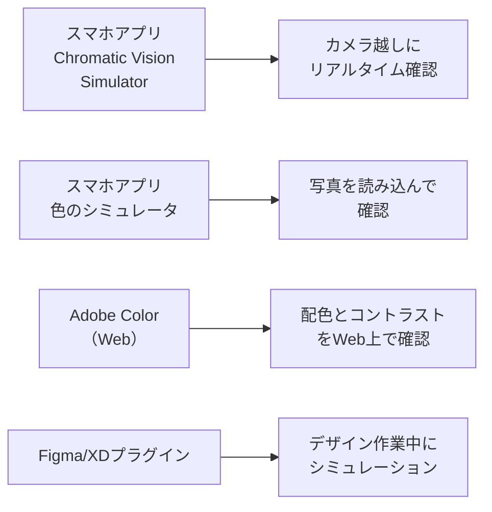

# lesson27: シミュレーションツール — 色覚特性の見え方を確認する

## このレッスンで学ぶこと

- 色覚シミュレーションが必要な理由と目的を理解する
- 代表的なシミュレーションツールの種類と特徴を知る
- シミュレーション結果の正しい解釈の仕方を学ぶ
- 職場・学校でのシミュレーション活用の実践方法を把握する
- コントラスト比の基準（WCAG）の考え方を理解する

::: info この3レッスンの位置づけ
[lesson26](/lessons/lesson26/) で学んだ5ステップのうち、本レッスンでは「**チェックの方法**」に焦点を当てます。シミュレーションツールやコントラスト比の確認方法を身につけ、続く [lesson28](/lessons/lesson28/) の具体的な設計と修正のポイントへ進みます。
:::

## なぜシミュレーションが必要か

C型（一般的な色覚）の人が色のUDを実践するうえで、最大の障壁の1つは「P型やD型の人の見え方が想像しにくい」ことです。

「この赤と緑は十分区別できる」と思っていても、P型・D型の人には同じ色に見えていることがあります。自分の見え方が「標準」だという思い込みは、誰にでも自然に生まれます。

**色覚シミュレーションツールを使うと、C型の人が「P型にはこう見える」を自分の目で確認**できます。これにより、問題のある配色を事前に発見して改善できます。

::: info 「体験」することの意味
シミュレーターで見え方を体験することは、当事者への共感を生む効果もあります。「この見え方では確かにグラフの区別ができない」と実感することで、UDへの取り組みがより具体的で真摯なものになります。
:::

::: warning 大原則：シミュレーターは近似、最終確認は当事者
シミュレーターはあくまで見え方を「近似的に再現」する道具です。実際の見え方とは差があります。問題を見つける入口として使い、最終的には色覚特性のある人や高齢者に確認してもらうことが重要です。この原則はレッスンの最後でもう一度確認します。
:::

## 代表的なシミュレーションツール

ツールは目的別に選びます。下の表で「何を確認したいか」から選ぶと迷いません。

| 用途 | ツールの種類 | 代表例 |
|------|------------|--------|
| その場でリアルタイムに確認したい | スマホアプリ | Chromatic Vision Simulator |
| 既存画像や配色を設計段階で確認したい | Webサービス・デザインソフト | Adobe Color、Figmaプラグイン |
| コントラスト比を数値で確認したい | コントラストチェッカー | WebAIM Contrast Checker |

### スマートフォンアプリ（その場でリアルタイム確認）

**1. Chromatic Vision Simulator（iOS / Android）**

最も広く知られたシミュレーションアプリの1つです。スマートフォンのカメラを通して、リアルタイムでP型・D型・T型の見え方をシミュレーションできます。

- カメラ越しに目の前のものをそのまま確認できる
- P型（1型）・D型（2型）・T型（3型）に対応
- 実際のポスターや資料を見ながらその場で確認できる

**2. 色のシミュレータ（iOS）**

写真をアプリに読み込んでシミュレーションを適用するアプリです。過去に作成した資料の画像ファイルを読み込んで確認するのに便利です。

### Webサービス・デスクトップツール（配色設計・数値確認）

**3. Adobe Color（Web）**

Adobeが提供するWebサービスです。ブラウザ上で色を入力・選択し、色覚特性のシミュレーションと配色チェックができます。WCAG（Webアクセシビリティ指針）に基づくコントラスト比の確認も可能です。

**4. WebAIM Contrast Checker（Web）**

2色のコントラスト比を数値で確認できるWebツールです。テキストと背景色の組み合わせを入力すると、WCAG基準をクリアしているかどうかを即座に判定してくれます。URLは `https://webaim.org/resources/contrastchecker/` です。

**5. Colour Contrast Analyser（デスクトップアプリ）**

Windows・macOS対応のデスクトップアプリです。スクリーン上の任意の色を直接選択してコントラスト比を計測でき、デザインソフトを使わずに確認できる点が便利です。

### デザインソフトの機能

**6. Figma・Adobe XDのプラグイン**

「Color Blind」などのプラグインを使うと、デザイン作業中にそのままシミュレーションを適用できます。デザイン→確認→修正のサイクルを1つのツール内で完結できます。

**7. Photoshop・Illustrator（校正設定）**

「表示」メニュー→「校正設定」からP型（1型色覚）・D型（2型色覚）の見え方を確認できます。デザイン制作者が使い慣れたツール内で確認できるため、実際の作業フローに組み込みやすいです。

::: tip 試験によく出るツール
試験では特定のツール名よりも「なぜシミュレーションが必要か」「シミュレーションの限界」「当事者へのヒアリングの重要性」といった概念が問われることが多いです。ツール名は参考として覚えておく程度で十分です。
:::

## コントラスト比の基準

シミュレーションと並んで重要な確認項目が**コントラスト比**です。コントラスト比とは、2つの色の明度差を数値で表したものです。

### WCAG（ウェブコンテンツアクセシビリティガイドライン）の基準

WCAGでは、18ポイント未満（および太字14ポイント未満）を「標準テキスト」、18ポイント以上（または太字14ポイント以上）を「大きなテキスト」として扱います。

| 対象 | WCAG AA | WCAG AAA |
|------|---------|----------|
| 標準テキスト（18ポイント未満、太字14ポイント未満） | **4.5:1以上** | 7:1以上 |
| 大きなテキスト（18ポイント以上、または太字14ポイント以上） | **3:1以上** | 4.5:1以上 |
| UIコンポーネント・グラフィック要素 | **3:1以上** | — |

::: warning コントラスト比で覚えるべき数値
試験では「**標準テキストは4.5:1以上**」「**大きなテキストや図形要素は3:1以上**」が目安として問われることがあります。この2つの数値はしっかり覚えましょう。
:::

コントラスト比は**白（最大）:黒（最大）= 21:1**が最大値で、**同じ色では1:1**になります。数値が大きいほど見やすい組み合わせです。

## シミュレーション結果の正しい解釈

### シミュレーターはあくまで「近似」

シミュレーターが再現するのは、色覚特性のある人の見え方を「モデル化」したものです。実際の当事者の見え方と完全には一致しません。理由は以下のとおりです。

- P型・D型の中にも個人差がある（色覚特性の度合いは人それぞれ）
- 画面の設定（明るさ・色温度）によって見え方が変わる
- 光源の種類（蛍光灯・LED・自然光）によっても見え方が異なる

### 当事者へのヒアリングが最終確認

「シミュレーターで問題なかったから大丈夫」という判断は危険です。シミュレーターが問題を見落とすこともあれば、逆にシミュレーターで見えにくそうでも実際には識別できることもあります。

**可能であれば、色覚特性のある人や高齢者に実際に確認してもらうことが最も確実**です。

::: warning もう一度：シミュレーターは近似、最終確認は当事者
冒頭の大原則を再確認します。シミュレーターは近似であり、最終的な見え方の判断は当事者の確認に委ねます。設計プロセス全体の流れは[lesson26](/lessons/lesson26/)も参照してください。
:::

## 確認のチェックリスト

シミュレーションする際は、以下のチェックリストを参考にしてください。

| チェック項目 | 確認方法 |
|------------|---------|
| □ P型シミュレーションで色の区別ができるか | Chromatic Vision Simulator等 |
| □ D型シミュレーションで色の区別ができるか | 同上 |
| □ グレースケール変換後も情報が伝わるか | Photoshopのグレースケール変換・白黒印刷 |
| □ コントラスト比が基準以上か | WebAIM Contrast Checker等 |
| □ 色以外の手がかりがあるか（形・テキスト・パターン） | 目視確認 |
| □ T型・高齢者の見え方も問題ないか | シミュレーター・関係者ヒアリング |

## 職場・学校での実践

シミュレーションは「専門家だけがするもの」ではありません。普段の業務や学習の中で手軽に取り入れられます。

### 職場での実践

- **資料提出前のチェックプロセスに組み込む**: グラフや図表を含む資料は、シミュレーターで一度確認してから提出する習慣をつくります
- **白黒印刷でのチェックを習慣化**: カラープリンターがなくても、白黒印刷で明度差の確認ができます。これをルーティンにするだけで多くの問題を防げます
- **社内共有テンプレートのUD化**: よく使うプレゼンテンプレートやレポートフォーマットをUD対応にすることで、毎回確認する手間を省けます

### 学校・教育現場での実践

- **教材の作成時にシミュレーター確認**: 色分けした図やグラフを含む教材は事前に確認します
- **テスト・プリントの赤字依存を減らす**: 重要箇所には赤+太字を併用します

::: info プレゼンの直前チェック
「プレゼン資料をスマホのChromatic Vision Simulatorで映してみる」だけで、P型・D型の人への見えやすさを数十秒で確認できます。会議や授業の前の習慣として取り入れやすい方法です。
:::

## キーワード

| 用語 | 説明 |
|------|------|
| 色覚シミュレーター | P型・D型・T型などの色覚特性の見え方を再現するツール（アプリ・Webサービス等） |
| Chromatic Vision Simulator | カメラ越しにリアルタイムでP型・D型・T型の見え方を確認できるスマホアプリ |
| Adobe Color | Adobeのwebサービス。配色チェックと色覚シミュレーションが可能 |
| WebAIM Contrast Checker | テキストと背景のコントラスト比をWCAG基準で確認できるWebツール |
| コントラスト比 | 2色の明度差を数値化したもの。21:1が最大（白と黒）、1:1が最小（同色） |
| WCAG | Web Content Accessibility Guidelines。コントラスト比の基準として広く参照される |
| 4.5:1 | WCAGにおける標準テキストの最低コントラスト比の基準値（AA） |
| 3:1 | 大きなテキスト・UIコンポーネントの最低コントラスト比の基準値（AA） |

## 試験のポイント

- シミュレーションが必要な理由：「**C型の人がP型・D型の見え方を自分で体験できる**」から
- シミュレーターの限界：あくまで**近似**であり、個人差がある。**当事者へのヒアリングが最終確認**として重要
- コントラスト比の基準：**標準テキストは4.5:1以上**（AA）、**大きなテキスト・図形要素は3:1以上**（AA）
- 確認すべき項目：P型・D型のシミュレーション、**グレースケール変換**（白黒確認）、コントラスト比、**色以外の手がかりの有無**
- Photoshop・Illustratorには**校正設定**としてP型・D型シミュレーション機能が内蔵されている
- 白黒印刷での確認は、コストをかけずにできる最も手軽な明度差チェック
- 「シミュレーターで問題ない＝OK」ではなく、**当事者の声を聞くことが最終確認**
