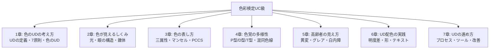
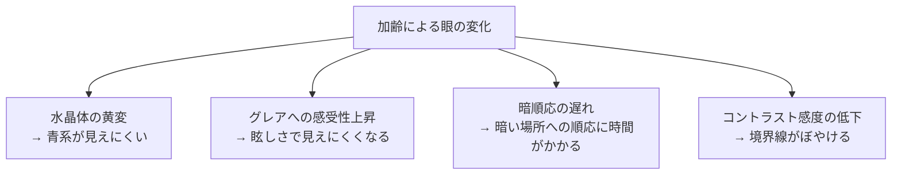

# lesson27: まとめ — 試験直前チェックリストと全体の振り返り

## このレッスンで学ぶこと

- lesson01〜lesson27で学んだ全内容を体系的に振り返る
- 各章の重要ポイントを整理して試験に備える
- 頻出の問われ方（定義・数値・用語）を最終確認する
- 試験に向けた自己チェックで理解度を確認する
- 「色のUD」を実践できる人材としての基礎を固める

---

## 全体の構造の振り返り

lesson01から27まで、色彩検定UC級の内容を7つの大きなテーマで学んできました。

---

## 章別・重要ポイント総まとめ

### 第1章のポイント：色のUDの考え方

UD（ユニバーサルデザイン）の根本的な考え方を理解することが出発点です。

- **UDの定義**：「年齢・性別・障害の有無を問わず、最初からできるだけ多くの人が使いやすいよう設計されたデザイン」（ロン・メイスが1980年代に提唱）
- **バリアフリーとの違い**：バリアフリーは「後付けで障壁を除去」、UDは「最初から包括的に設計」
- **色のUDの定義**：「色覚の多様性に配慮した、誰もが見やすい色使い」
- **機能的役割**：誘目性（注目させる）・視認性（見やすさ）・可読性（読みやすさ）・識別性（区別のしやすさ）
- **第4原則（認知できる情報）**：色のUDと最も関係が深いUD7原則

::: tip 第1章の最重要ポイント
「UDとバリアフリーの違い」と「色のUDの定義」は毎回試験に出ると考えて暗記してください。
:::

---

### 第2章のポイント：色が見えるしくみ

光と眼の仕組みを理解することで、なぜ色覚特性が生まれるかが分かります。

- **可視光線の範囲**：380〜780nm（ナノメートル）
- **錐体（すいたい）**：色覚を担う視細胞。網膜の中心付近（中心窩）に集中。明るい場所で働く
- **桿体（かんたい）**：明暗を感じる視細胞。網膜の周辺部に多い。暗い場所でも働く
- **S錐体（短波長）・M錐体（中波長）・L錐体（長波長）**の3種類が色覚を担う
- **プルキニェ現象**：明るさが変わると色の見え方が変化する現象（暗くなると青系が相対的に明るく見える）

| 錐体の種類 | 対応する波長 | 異常があると |
|-----------|------------|------------|
| L錐体（長波長） | 赤〜橙系 | P型（1型2色覚） |
| M錐体（中波長） | 緑系 | D型（2型2色覚） |
| S錐体（短波長） | 青系 | T型（3型2色覚） |

---

### 第3章のポイント：色の表し方

色を正確に表現するための表色系を学びます。

- **色の三属性**：色相（どんな色か）・明度（明るさ）・彩度（鮮やかさ）
- **マンセル記法**：`H V/C`の形式（例：`5R 4/14` → 5Rという色相、明度4、彩度14）
- **純色**：最も彩度が高い色
- **清色**：純色に白または黒を混ぜた色。白を混ぜた「明清色」、黒を混ぜた「暗清色」
- **濁色**：純色にグレー（白+黒）を混ぜた色。彩度が下がり濁った印象
- **PCCSのトーン**：色相と明度・彩度を組み合わせた概念。vivid（鮮やか）・pale（淡い）・deep（深い）・bright（明るい）など

---

### 第4章のポイント：色覚の多様性

試験で最も問われる頻出テーマです。数値と分類を確実に覚えましょう。

- **日本人男性の約5%**（20人に1人）、女性の約0.2%（500人に1人）が色覚特性者
- **P型（1型2色覚）**：L錐体の異常。赤みの知覚が弱い。日本人男性の約1.5%
- **D型（2型2色覚）**：M錐体の異常。緑みの知覚が弱い。日本人男性の約3.5%（最も多い）
- **T型（3型2色覚）**：S錐体の異常。青みの知覚が弱い。日本人男性の約0.003%と少ない
- **P型・D型が混同しやすい色**：赤と緑、赤とオレンジ、緑と茶色、赤と黒
- **T型が混同しやすい色**：青と黄、青と紫
- **混同色線**：色度図上で、特定の色覚特性の人が「同じ色」として知覚してしまう色を結んだ直線

::: warning 試験に出る数値
- 日本人男性の**約5%**（P型＋D型がほとんど）
- T型は**約0.003%**（非常に少ない）
これらは混同しやすいので、P型・D型（5%）とT型（0.003%）の数値をセットで覚えましょう。
:::

---

### 第5章のポイント：高齢者の見え方

加齢による見え方の変化は、色のUDにおいて色覚特性と並んで重要なテーマです。

- **水晶体の黄変**：加齢で水晶体が黄みがかる → **短波長（青系）の透過率が低下** → 青が見えにくくなる
- **グレア（グレア感）**：強すぎる光による眩しさ・見えにくさ。高齢者は瞳孔の調節機能が低下しているため、光の散乱がより強くなる
- **暗順応の遅れ**：明るい場所から暗い場所に移った際、眼が順応するのに時間がかかる。若者より数倍〜数十倍の時間が必要になることもある
- **コントラスト感度の低下**：境界線のぼやけや、似た明るさの色の区別が難しくなる
- **高齢者に避けるべき配色**：低明度の青（見えにくい）、極端に小さい文字、低コントラストの組み合わせ

---

### 第6章のポイント：UD配色の実践

実際に「どうすれば見やすくなるか」の具体的な手法を学ぶ章です。

- **明度差が最重要**：色相が違っていても明度差がなければ区別しにくい。白黒変換で確認
- **色だけで情報を区別しない**：形・テキスト・パターンを加えることが基本
- **避けるべき組み合わせ**：赤と緑（P型・D型NG）、低明度の青系（高齢者NG）、同明度の色の組み合わせ
- **コントラスト比の基準**：標準テキストは4.5:1以上、大きなテキスト・図形要素は3:1以上（WCAG AA基準）
- **配色改善の4アプローチ**：①色相変更 ②明度変更 ③彩度変更 ④色以外の手がかり追加

---

### 第7章のポイント：UDの進め方

UD設計を現場で実践するためのプロセスとツールの章です。

- **UD設計の5ステップ**：現状把握 → 問題洗い出し → 改善案策定 → シミュレーション確認 → 実施・評価（→繰り返し）
- **シミュレーションの目的**：C型の人がP型・D型の見え方を自分で体験して問題を発見する
- **シミュレーターの限界**：あくまで近似。**当事者へのヒアリングが最終確認**として必要
- **設計初期段階からの取り込み**：後付け対応はコスト高。初期から組み込むほど修正が容易
- **継続的改善**：UDは一度やれば終わりではなく、サイクルとして繰り返す

---

## 試験直前チェックリスト

::: tip 試験直前に確認したい25項目
以下の質問にすべて答えられれば合格圏内です。答えられない項目は該当レッスンに戻りましょう。

**UD・色のUDの基礎（第1章）**
1. ユニバーサルデザインとバリアフリーの違いを1文で説明できるか
2. UDを提唱したのは誰か、どこの大学か、いつ頃か
3. 色のUDの定義を言えるか（「色覚の多様性に配慮した…」）
4. 色の機能的役割4種（誘目性・視認性・可読性・識別性）をそれぞれ定義できるか
5. 色のUDと最も関係の深いUD7原則は何番か

**色が見えるしくみ（第2章）**

6. 可視光線の波長範囲（nm）を言えるか
7. 錐体と桿体の違い（機能・活性条件・場所）を説明できるか
8. S錐体・M錐体・L錐体がそれぞれどの波長域に対応するか
9. プルキニェ現象とは何か、どんな場面で起こるか

**色の表し方（第3章）**

10. 色相・明度・彩度を定義できるか
11. マンセルの記法「5R 4/14」を読み解けるか（H V/Cの意味）
12. 純色・明清色・暗清色・濁色の違いを説明できるか
13. PCCSのトーン名（vivid、bright、pale、deep等）の特徴を言えるか

**色覚の多様性（第4章）**

14. 日本人男性の色覚特性者の割合は何%か
15. P型とD型でそれぞれどの錐体が異常か
16. P型とD型が混同しやすい色の組み合わせを3つ以上挙げられるか
17. T型が混同しやすい色は何と何か
18. 混同色線とは何か説明できるか

**高齢者の見え方（第5章）**

19. 水晶体の黄変でどの波長の光が見えにくくなるか
20. グレアとは何か、高齢者がグレアに弱い理由を説明できるか
21. 暗順応の遅れとは何か説明できるか

**配色の実践・UDの進め方（第6・7章）**

22. 明度差を確認する最も簡単な方法は何か
23. 避けるべき色の組み合わせを3つ以上挙げられるか
24. コントラスト比の基準（標準テキスト・大きなテキスト）を言えるか
25. UD設計の5ステップを順番に言えるか
:::

---

## 混同しやすい用語の整理

試験では似た用語を区別できるかどうかが問われます。以下をしっかり区別しましょう。

| よく混同する組 | 違いのポイント |
|-------------|-------------|
| UD vs バリアフリー | UD=最初から設計、BF=後付け対応 |
| 錐体 vs 桿体 | 錐体=色覚・明るい場所、桿体=明暗・暗い場所 |
| P型 vs D型 | P型=L錐体の異常、D型=M錐体の異常（どちらも赤緑系が混同） |
| 明清色 vs 暗清色 | 明清色=純色+白、暗清色=純色+黒 |
| 誘目性 vs 視認性 | 誘目性=注目させる力、視認性=遠くからの見やすさ |
| 水晶体の黄変 vs グレア | 黄変=青系が見えにくい、グレア=強光による眩しさ |
| シミュレーター確認 vs 当事者ヒアリング | 前者は近似、後者が最終確認として重要 |

---

## 色のUD実践者として

27のレッスンを通じて学んだ内容は、試験に合格するための知識にとどまりません。職場・学校・日常生活の中で、**今日から実践できる力**です。

::: info これからの実践へ
- プレゼン資料を作るとき → 赤緑グラフを避け、形・ラベルを加える
- 資料を提出するとき → 白黒印刷でチェックする
- デザインを確認するとき → シミュレーターで見え方を確認する
- 誰かが「見えにくい」と感じていたら → その声をUD改善の出発点にする

「良い意図」と「正しい知識」と「具体的な手順」の3つが揃ったとき、色のUDは現実のものになります。
:::

---

## キーワード

| 用語 | 説明 |
|------|------|
| ユニバーサルデザイン（UD） | 年齢・障害の有無を問わず最初からすべての人が使えるよう設計すること |
| 色のUD | 色覚の多様性に配慮した、誰もが見やすい色使い |
| 可視光線 | 人間の目で見える光の範囲（380〜780nm） |
| 錐体（S/M/L） | 色覚を担う視細胞。短・中・長波長に対応する3種類がある |
| P型・D型・T型 | L・M・S錐体の異常による色覚特性の分類 |
| 水晶体の黄変 | 加齢で水晶体が黄くなり、青系（短波長）が見えにくくなる現象 |
| 混同色線 | 色度図上で、特定の色覚特性者が同色に見えてしまう色を結ぶ直線 |
| コントラスト比 | 2色の明度差を数値化したもの。標準テキストは4.5:1以上が推奨 |
| UD設計の5ステップ | 現状把握→問題洗い出し→改善案策定→シミュレーション→実施・評価のサイクル |
| 継続的改善 | UDは一度で完成せず、使いながら繰り返し改善するプロセス |

---

## 試験のポイント

- **UDの定義・バリアフリーとの違い**は必ず出題される基本中の基本
- **可視光線の波長範囲（380〜780nm）**は数値で覚える
- **日本人男性の約5%**（P型＋D型）、T型は**約0.003%**という数値を混同しない
- **P型=L錐体、D型=M錐体、T型=S錐体**の対応を確実に覚える
- **水晶体の黄変→青系が見えにくい**（短波長の透過率低下）
- **明度差の確認**は白黒変換（グレースケール）が最も簡単
- **コントラスト比**：標準テキスト4.5:1以上、大きなテキスト・図形要素3:1以上（WCAG AA）
- **UD設計の5ステップ**を順番に言えるようにする
- シミュレーターはあくまで**近似**。**当事者ヒアリングが最終確認**
- 「一度やれば終わり」ではなく**継続的改善がUDの本質**
