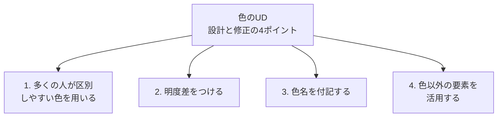
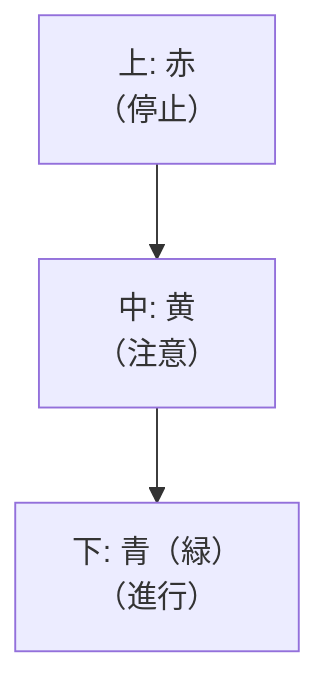
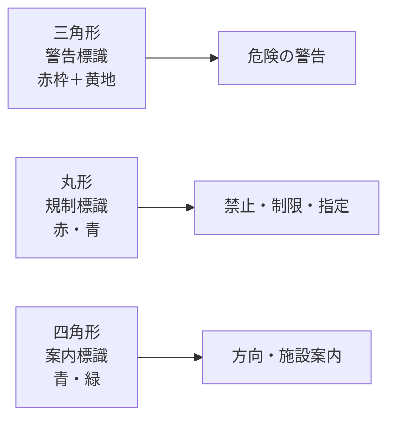

# lesson28: 設計と修正のポイント — 4つの原則と改善事例

## このレッスンで学ぶこと

- 色のUD設計・修正の4つのポイントを理解する
- カラーユニバーサルデザイン推奨配色セット20色の役割を覚える
- 明度差を確認する方法（グレースケール変換・WCAG比）を身につける
- 改善事例（道路標識・グラフ・路線図・信号機など）から実践パターンを学ぶ

::: infoこの3レッスンの位置づけ
[lesson26](/lessons/lesson26/) で学んだ進め方（5ステップ）、[lesson27](/lessons/lesson27/) で学んだチェック方法（シミュレーション・コントラスト比）を踏まえ、本レッスンでは実際の設計と修正で押さえるべき**4つのポイント**と、**具体的な改善事例**を学びます。第6章（色のUDの進め方）の総まとめでもあります。
:::

## 色のUD設計・修正の全体像

色のUDを実現するための設計と修正のポイントは、次の4つに整理できます。[lesson25](/lessons/lesson25/)で確認した色の機能的役割を踏まえ、[lesson26](/lessons/lesson26/)の手順、[lesson27](/lessons/lesson27/)のチェックと組み合わせて使う具体的な指針です。

4つは独立した手段ではなく、組み合わせて使うほど効果が高まります。ブランドカラーなどの制約で1の「色そのもの」を変えられない場面でも、2〜4を重ねれば情報の伝わり方を大きく改善できます。

## ポイント1: 多くの人が区別しやすい色を用いる

最初の選択肢として、**多くの人が見分けやすいことが確認されている色**から選ぶのが基本です。代表的な指針が、NPO法人カラーユニバーサルデザイン機構（CUDO）がまとめた**カラーユニバーサルデザイン推奨配色セット**です。

### 推奨配色セットの構成

| グループ | 色数 | 性格 | 使う場面 |
|---------|------|------|----------|
| **アクセントカラー** | 9 | 高彩度 | 文字・線・マーカーなど**小さい面積** |
| **ベースカラー** | 7 | 高明度・低彩度 | 背景・塗りつぶしなど**広い面積** |
| **無彩色** | 4 | 白・グレー・黒 | コントラスト調整や他色との組み合わせ |

合計 **9 + 7 + 4 = 20色** で構成されています（塗装用の代替色を含めると22色）。アクセントカラー9色は「**赤・黄・緑・青・空色・ピンク・オレンジ・紫・茶**」と覚えます。

### 役割と面積の関係

- **アクセント = 高彩度 × 小面積**: 文字・線・マーカー・アイコンなど、視線を集めたい要素に使う
- **ベース = 高明度・低彩度 × 広面積**: 背景・塗りつぶし・地のように広く敷く要素に使う
- **無彩色 = 締めや調整役**: 文字色・枠線・コントラスト調整に使う

::: tip逆に使うと疲れる配色になる
広い面積に高彩度のアクセントを敷いたり、小さい文字にベースの淡い色を使ったりすると、目が疲れたり可読性が落ちたりします。**役割と面積の関係**で覚えると整理しやすくなります。
:::

### ブランドカラーなど制約がある場合

実務ではブランドカラーや既存印刷物の都合で、推奨配色セットからそのまま選べないこともあります。その場合は次のように考えます。

- 推奨配色セットの色に**近い色相・明度**を選び直す
- 推奨配色セットを参照しつつ、ポイント2〜4（明度差・色名付記・色以外の要素）で補強する
- 色覚シミュレーターでの確認（[lesson27](/lessons/lesson27/)）を必ず行う

::: info推奨配色セットの意義
推奨配色セットは「迷ったときに頼れる確実な選択肢」です。20色のなかから選ぶ・近づけるだけで色のUD品質を底上げできます。
:::

## ポイント2: 明度差をつける

色の選択と並んで重要なのが、**色同士の明度差（明暗の差）を十分に確保する**ことです。色覚タイプや加齢によって色相の区別は変化しますが、**明暗の差は多くの人が共通して認識しやすい**手がかりです。

### なぜ明度差が最重要か

- **色覚特性者**: 色相の区別が難しい場合でも、明度（明るさ）の差は感じ取れる
- **高齢者**: 水晶体の黄変やコントラスト感度の低下があっても、大きな明暗差は識別できる
- **色以外の制約**: 白黒印刷・薄暗い場所・小さいサイズなど、色が頼れない状況でも情報が残る

色相差や彩度差は補助的な手がかりです。たとえば赤と緑は色相環で離れた関係にありますが、P型（1型）・D型（2型）にはその色相差が伝わりにくく、明度が近ければほぼ同じ色に見えてしまいます（[lesson13](/lessons/lesson13/)・[lesson14](/lessons/lesson14/)参照）。

### WCAGのコントラスト比基準

Webアクセシビリティ標準である**WCAG（Web Content Accessibility Guidelines）**は、文字と背景のコントラスト比に具体的な数値基準を設けています。

| 基準 | コントラスト比 | 適用範囲 |
|------|---------------|---------|
| 最低限 | **3:1以上** | 大きな文字・図形要素 |
| WCAG AA（推奨） | **4.5:1以上** | 標準テキスト |
| WCAG AAA（高水準） | 7:1以上 | より高いアクセシビリティ |
| 最大値 | **21:1** | 白と黒の組み合わせ |

コントラスト比は「明るい側の相対輝度 ÷ 暗い側の相対輝度」で計算します。**Colour Contrast Analyser**などの無料ツールで計測できます。

### グレースケール変換による確認

明度差の有無は、デザインを**グレースケール（白黒）に変換して区別できるか**で判断するのが最も直感的です。

| 確認方法 | 内容 |
|---------|------|
| モノクロコピー | 印刷物をモノクロでコピーして確認する |
| 写真アプリのモノクロフィルター | スマホで撮影して白黒フィルターをかける |
| 画像編集ソフトのグレースケール変換 | デジタルデータをそのまま白黒化する |

白黒に変換しても要素が区別できれば、明度差は確保できています。同じグレーに溶け込んでしまう要素があれば、明度を調整するか、ポイント3・4で補強します。

::: warning 「色相差が大きい＝見やすい」とは限らない
赤と緑は色相環で離れた関係ですが、P型（1型）・D型（2型）には明度が近いと区別が困難です。色相差だけを根拠にせず、必ず明度差とグレースケール変換で確認しましょう。
:::

## ポイント3: 色名を付記する

色そのもので意味を伝えたい場面では、**色名をテキストで併記する**ことも有効な手段です。「赤」「青」「緑」などの色名が文字で書かれていれば、色の見え方が異なる人にも情報が正確に届きます。

### 色名付記が効く場面

| 場面 | 付記の例 |
|------|---------|
| グラフの凡例 | 色のサンプル横に「赤: 売上」「青: 利益」と明記 |
| 路線図の凡例 | 路線色の横に「赤色: 丸ノ内線」と表記 |
| 商品カタログ | 「カラー: レッド／ネイビー／ベージュ」と文字で示す |
| 衣服のタグ | 色名・型番をテキストで併記 |
| 配線・配管 | 「青: 給水／赤: 給湯」のラベルを貼る |

### 色名を書く位置とサイズ

- 色サンプルの**すぐそば**に配置し、対応関係を明確にする
- 読み取れる**十分な文字サイズ**で書く（小さすぎる凡例は機能しない）
- 色サンプルと文字の**コントラスト比**もWCAG基準を満たすようにする

::: tip色名付記はコストの低い改善
既存のデザインを大きく変えずに、凡例やラベルへ色名を加えるだけで色のUDが大きく向上します。ブランドカラーを保持したまま実施できる代表的な改善策です。
:::

## ポイント4: 色以外の要素を活用する

色に加えて、**色以外の要素（形・パターン・テキスト・位置）**で同じ情報を伝えると、色だけに依存しない強いデザインになります。

### 4つの手法の信頼性

形・パターン・テキスト・位置の4手法は、確実さが同じではありません。

| 優先 | 手法 | 特徴 |
|------|------|------|
| 高 | **テキスト（文字）** | 読めれば誰にでも確実に伝わる |
| ↓ | **形（シェイプ・アイコン）** | 白黒でも区別しやすい |
| ↓ | **パターン（ハッチング）** | 小サイズでは潰れやすい |
| 低 | **位置・順序** | 文脈や並びの理解が前提になる |

迷ったときは**テキスト**を基本に据え、形・パターン・位置を重ねて使うと安定します。

### 手法1: 形（シェイプ・アイコン）

折れ線グラフのマーカー（○△□◆）、アイコン（✓✗⚠ℹ）、道路標識の三角・丸・四角など、形そのものが意味を運びます。グレースケール変換しても形の違いは残ります。

### 手法2: パターン（ハッチング）

棒グラフの塗りや地図のエリアに、斜線・縦縞・横縞・ドット・格子などのパターンを加えます。白黒印刷でも区別できる代表的な手段ですが、**小サイズではパターンが潰れる**ことがあるため、十分な大きさを確保します。

### 手法3: テキスト・ラベル

最も確実な情報伝達手段です。グラフのデータ点に直接「東京」「大阪」と書く、エラー表示に「メールアドレスが正しくありません」と添える、強調を赤文字ではなく**太字**にする、などの工夫が含まれます。

### 手法4: 位置・順序

並び順や配置で意味を伝える手法です。**縦型信号機**は「赤が上・黄が中・青（緑）が下」という位置関係で、色が区別できなくても信号の意味が分かるよう設計されています。

::: warning 「赤字だけで重要を示す」は最優先で見直す
日本のビジネス文書に多い「重要事項を赤文字だけで示す」習慣は、色のUDの観点で最も避けるべきパターンのひとつです。赤文字に**太字・下線・「★」「重要」のラベル**を併用し、色だけに依存しないようにします。
:::

## 色のUD改善事例

ここまでの4ポイントが、実際のデザインでどう適用されるかを事例で確認します。

### 事例1: 道路標識（形＋色＋記号）

道路標識は、形と色を組み合わせた**色のUDの優れた実例**です。

色が区別しにくくても、**形（三角・丸・四角）**で「警告・規制・案内」の種類が判別できます。さらに記号や文字でも内容が伝わるよう設計されています。

### 事例2: グラフ（赤緑系列の改善）

**問題**: 折れ線グラフの2系列を「赤線」と「緑線」だけで区別。P型（1型）・D型（2型）には2本がほぼ同じ色に見え、どちらの系列かが判別できない。

**改善案**:

- **色相の変更**: 緑を青または青緑に変更し、色相を大きく離す（ポイント1）
- **明度差の確保**: 一方を濃く、もう一方を明るくする（ポイント2）
- **色名・系列名のラベル**: 線の端に直接「東京」「大阪」と書く（ポイント3・4）
- **マーカーの追加**: ○と△のマーカーで形でも区別できるようにする（ポイント4）
- **線種の変更**: 実線と破線を使い分ける（ポイント4）

複数の手段を組み合わせれば、白黒印刷・色覚特性・高齢者すべてに対応できます。

### 事例3: 路線図（番号＋色）

電車の路線図では、色のみで多数の路線を区別すると混同が起こりやすくなります。

| 工夫 | 内容 |
|------|------|
| 路線記号の付与 | 「G線」「M線」「E線」などのアルファベット記号 |
| 路線番号 | 駅ナンバリング（G-01、M-02など） |
| 路線名の文字表記 | 「丸ノ内線」「銀座線」を路線色の横に併記 |
| 太さや線種の変化 | 幹線は太く、支線は細くするなど |

東京の地下鉄路線図は、路線色だけでなくアルファベット記号と駅ナンバリングを組み合わせ、色が区別できない人にも路線を特定できる設計になっています。

### 事例4: Webフォームのエラー表示

**問題**: 赤い枠線だけで入力エラーを示す。P型（1型）・D型（2型）には通常状態との区別がつきにくい。

**改善案**:

- 赤い枠線（色）
- ✗アイコン（形）
- 「エラー: メールアドレスが正しくありません」（テキスト）

WCAG 1.4.1「色の使用」では、**色だけで情報を伝えてはいけない**と規定されています。エラーには必ずテキストによる説明を添えることが求められます。

### 事例5: 薬のラベル

薬の見た目は似ているものが多く、色だけで管理すると取り違えの危険があります。医療事故防止の観点からも、色以外の手がかりが必須です。

| 必須の表示 | 内容 |
|----------|------|
| 薬名のテキスト | 色だけでなく薬品名を明記 |
| 用量の明記 | 「1錠」「2錠」「半錠」を文字で表示 |
| 服用時間の明記 | 「朝食後」「就寝前」を文字で明記 |
| 形・サイズの差別化 | 錠剤の形やサイズで区別する |
| バーコード管理 | 色に依存しない機械的な識別 |

### 事例6: 縦型信号機（位置の活用）

積雪地域などで採用される縦型信号機は、上から「赤・黄・青（緑）」の順で固定されています。色の区別が難しい場合でも、**位置**で信号の意味を判断できます。横型信号機でも「右が赤、左が青（緑）」の配置が国際的にほぼ統一されており、位置による手がかりが機能しています。

## キーワード

| 用語 | 説明 |
|------|------|
| カラーユニバーサルデザイン推奨配色セット | NPO法人CUDOが制定した、色覚特性者にも見分けやすい配色パレット。アクセント9色＋ベース7色＋無彩色4色＝合計20色 |
| アクセントカラー | 高彩度。文字・線・マーカーなど小面積に使う9色（赤・黄・緑・青・空色・ピンク・オレンジ・紫・茶） |
| ベースカラー | 高明度・低彩度。背景など広面積に使う7色 |
| 明度差 | 2色の明るさの差。色のUDで最優先に確保すべき手がかり |
| コントラスト比 | 明るい側の輝度と暗い側の輝度の比率。WCAG AAでは標準テキスト4.5:1以上、大きな文字・図形要素3:1以上、最大値は21:1 |
| WCAG | Web Content Accessibility Guidelines。Webアクセシビリティの国際標準規格 |
| グレースケール変換 | デザインを白黒に変換して明度差を確認するテスト手法 |
| 色名付記 | 色サンプルの近くに「赤」「青」などの色名をテキストで併記する手法 |
| ハッチング | 斜線・縦縞・横縞・ドット・格子など、線や点によるパターン塗り分け |
| ピクトグラム | 形（シルエット・絵文字）で意味を伝える記号。言語・色覚に関わらず情報を伝えられる |
| 縦型信号機 | 上から赤・黄・青（緑）の順に並ぶ信号機。位置で意味を伝える色のUD設計の代表例 |
| WCAG 1.4.1 | 「色の使用」規定。色だけで情報を伝えてはいけないというアクセシビリティ基準 |

## 試験のポイント

- 色のUDの設計・修正の4ポイント: **①区別しやすい色を用いる ②明度差をつける ③色名を付記する ④色以外の要素を活用する**
- **カラーユニバーサルデザイン推奨配色セット**はNPO法人CUDO制定の20色（アクセント9・ベース7・無彩色4）
- アクセントカラー9色は「**赤・黄・緑・青・空色・ピンク・オレンジ・紫・茶**」
- **アクセント＝高彩度・小面積**、**ベース＝高明度低彩度・広面積**で覚える
- **明度差が最重要**。色覚特性者・高齢者ともに明暗の差は認識しやすい
- **WCAG AAのコントラスト比**: 標準テキスト **4.5:1以上**、大きな文字・図形要素 **3:1以上**、白と黒の最大は **21:1**
- **グレースケール変換**で区別できれば、明度差は確保されている
- 赤と緑は色相環で離れているが、P型（1型）・D型（2型）には区別が困難（色相差だけを頼りにしない）
- **色名付記**は凡例・ラベルでの基本対応。ブランドカラーを保ったまま改善できる
- 色以外の手法の信頼性は **テキスト ＞ 形 ＞ パターン ＞ 位置** の順
- **道路標識**（三角・丸・四角＋色）、**縦型信号機**（位置）、**路線図**（番号＋色）は頻出の改善事例
- **WCAG 1.4.1**「色の使用」: 色だけで情報を伝えてはいけない（フォームエラー等）
- 「赤字だけで重要を示す」は最優先で見直すべきパターン
